# JAVA 17 EXAM (CHEAT SHEET)

## 1. BUILDING BLOCKS

Canonical `main()` method signature:
- method must be public
- must have a void return type
- an alternate form with the redundant `final`
- method must be static
```java
public static void main(String[] args);
```

#### Order of Initialization
- Fields and instance initializer blocks are run in the order in which they appear in the file
- The constructor runs after all fields and instance initializer blocks have run

#### The primitive types:
`byte` -> `short` -> `int` -> `long` -> `float` -> `double` -> `char`

Signed and Unsigned: `short` and `char`
- You should be aware that `short` and `char` are closely related, as both are stored as integral types with the same 16-bit length.
  The primary difference is that `short` is signed, which means it splits its range across the positive and negative integers.
  Alternatively, `char` is unsigned, which means its range is strictly positive, including 0.

#### Literals and the Underscore Character 
You can add underscores anywhere `int million = 1_000_000`
- except at the beginning of a literal,
- except at the end of a literal,
- except at right before a decimal point, or right after a decimal point.

You can even place multiple underscore characters next to each other, although we don’t recommend it
```java
double notAtStart = _1000.00; // DOES NOT COMPILE
double notAtEnd = 1000.00_; // DOES NOT COMPILE
double notByDecimal = 1000_.00; // DOES NOT COMPILE
double annoyingButLegal = 1_00_0.0_0; // Ugly, but compiles
double reallyUgly = 1__________2; // Also compiles
```

### 1.1 Variables
There are only four rules to remember for legal identifiers:
- Identifiers must begin with a letter, a currency symbol, or a `_` symbol. 
  Currency symbols include dollar `$`, yuan `¥`, euro `€`, and so on.
- Identifiers can include numbers but not start with them.
- A single underscore `_` is not allowed as an identifier.
- You cannot use the same name as a Java reserved word.
  A reserved word is a special word that Java has held aside so that you are not allowed to use it.
  Java is case-sensitive, so you can use versions of the keywords that only differ in case.

The exam will only ask you about ones that are commonly used, such as class and for.

```java
double weight = 10.0, thePrice;                   // (1) Local variables
if (weight < 10.0) thePrice = 20.50;
if (weight > 50.0) thePrice = 399.00;
if (weight >= 10.0) thePrice = weight * 10.0;     // (2) Always executed
System.out.println("The price is: " + thePrice);  // (3) Compile-time error!
```
Variables that are not local variables are defined either as instance variables or as class variables.
Instance and class variables do not require you to initialize them.
As soon as you declare these variables, they are given a default value.

An instance variable - often called a field, is a value defined within a specific instance of an object.
A class variable (aka static) - is one that is defined on the class level and shared among all instances of the class.

#### Local Variables

Local variables do not have a default value and must be initialized before use.
On the exam, be wary of any local variable that is declared but not initialized in a single line.
This is a common place on the exam that could result in a “Does not compile” answer.
Be sure to check to make sure it’s initialized before it’s used on the exam.
A variable declaration requires the type of the variable to be specified in the declaration but the type can be specified by the reserved type name `var`

In following example, the compiler complains that the local variable `importantMessage` used in the println statement may not be initialized. 
If the variable `importantMessage` is set to the value `null`, the program will compile. 
However, a runtime error (`NullPointerException`) will occur when the code is executed because the variable `importantMessage` will not denote any object.

```java
public class VerySmartClass {
  public static void main(String[] args) {
    String importantMessage;                       // Local reference variable
    System.out.println(importantMessage.length()); // Compile-time error!
  }
}
```

#### Lifetime of Variables
The lifetime of a variable — that is, the time a variable is accessible during execution is determined by the context in which it is declared.
- `Instance variables`: members of a class, which are created for each object of the class. In other words, every object of the class will have its own copies of these variables, which are local to the object. 
The values of these variables at any given time constitute the state of the object. Instance variables exist as long as the object they belong to is in use at runtime.
- `Static variables`: members of a class, but which are not created for any specific object of the class, and therefore, belong only to the class. 
They are created when the class is loaded at runtime and exist as long as the class is available at runtime.
- `Local variables`: declared in methods, constructors, and blocks, and created for each execution of the method, constructor, or block. 
After the execution of the method, constructor, or block completes, local variables are no longer accessible.

#### var
- you can only use this feature for local variables.
- local variable type inference `var` works with local variables and not instance variables.
- local variable type inference `var`, the compiler looks only at the line with the declaration.
- While a `var` cannot be initialized with a null value without a type,
  it can be reassigned a null value after it is declared, provided that the underlying data type is a reference type.
- `var` is not a reserved word and allowed to be used as an identifier.
- The type of `var` is known at compile time.
- `var` cannot be used in a multiple-variable assignment `var fall = 2, autumn = 2;`
- Formal parameters in methods and constructors cannot be declared with `var`: `public static void main(var args)`

```java
// Class illustrates invalid use of the restricted type name var.
public class InvalidVar {
  var javaVendor = "Oracle"; // Not allowed in instance variable declaration.
  static var javaVersion = 11; // Not allowed in static variable declaration.
  public static void main(var args) { // Not allowed for method parameters.
    var name; // Not allowed without initialization expression.
    var objRef = null; // Literal null not allowed.
    var x = 10.0, y = 20.0, z = 40; // Not allowed in compound declaration.
    var vowelsOnly = {'a', 'e', 'i', 'o', 'u' }; // Array initializer not allowed
    var attendance = new int[]; // Non-empty dimension required
    var array3Dim = new String[][2][]; // Cannot specify an empty dimension
    var letters[] = new char[]{'a', 'e', 'i', 'o', 'u' }; // var not allowed as element type
    var prompt = prompt + 1; // Self-reference not allowed in initialization expression.
    public static var getPlatformName() { // Not allowed as return type.
      return "JDK";
    }
}
```

#### Garbage Collector
- Garbage collection is never guaranteed to run
- The JVM is free to ignore calls to `System.gc()`
- the purpose of garbage collection is to reclaim used memory.

## 2. OPERATORS

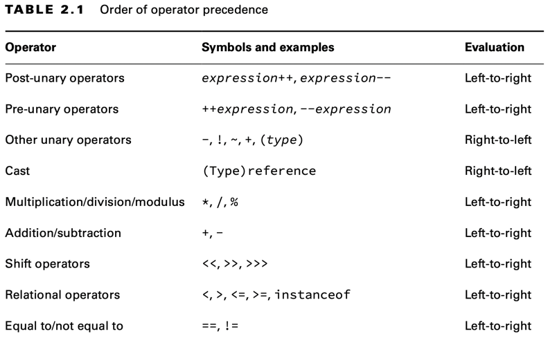
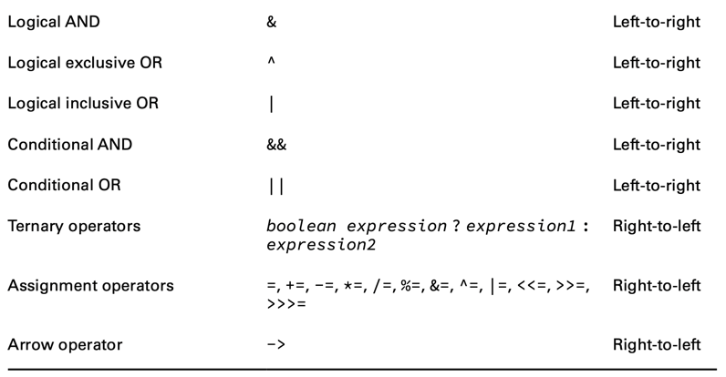

#### Primitive numeric promotion
- If two values have different data types,
  Java will automatically promote one of the values to the larger of the two data types.
- If one of the values is integral and the other is floating-point,
  Java will automatically promote the integral value to the floating-point value’s data type
- Smaller data types (`byte`, `short`, and `char`) are first promoted to int any time they’re used with
  a Java binary arithmetic operator with a variable (as opposed to a value), even if neither of the operands is `int`.
- After all promotion has occurred and the operands have the same data type,
  the resulting value will have the same data type as its promoted operands.

Casting is optional and unnecessary when converting to a larger or widening data type,
but it is required when converting to a smaller or narrowing data type.

Casting primitives is required any time when:
- you are going from a larger numerical data type to a smaller numerical data type,
- you are converting from a floating-point number to an integral value.

#### Variable Increment and Decrement Operators
Variable increment (`++`) and decrement (`--`) operators come in two flavors: prefix and postfix.
These operators cannot be applied to a variable that is declared `final` and that has been initialized, as the side effect would change the value in such a variable.

The prefix increment operator has the following semantics:
```java
i += 1;
result = i;
return result;
```
The postfix increment operator has the following semantics
```java
result = j;
j += 1;
return result;
```

#### Pattern Variables
The type of the pattern variable must be a subtype of the variable on the left side of the
expression. It also cannot be the same type. This rule does not exist for traditional `instanceof` operator expressions, though.

```java
void compareIntegers(Number number) {
  if (number instanceof Integer data) {
    System.out.print(data.compareTo(5));
  }
}
```

```java
Integer value = 123;
if(value instanceof Integer) {}
if(value instanceof Integer data) {} // DOES NOT COMPILE
```

#### Primitive Data Value Equality: ==, !=
The equality operator `==` and the inequality operator `!=` can be used to compare primitive data values, including boolean values. 
Binary numeric promotion may be applied to the non-boolean operands of these equality operators.
```java
int year = 2002;
boolean isEven = year % 2 == 0; // true.
boolean compare = '1' == 1; // false. Binary numeric promotion applied.
boolean test = compare == false; // true.
```
Analogous to the discussion for relational operators, mathematical expressions like `a = b = c` must be written using relational and logical/conditional operators.
Since equality operators have left associativity, the evaluation of the expression `a == b == c` would proceed as follows: `((a == b) == c)`.

#### Object Reference Equality: ==, !=
The equality operator `==` and the inequality operator `!=` can be applied to reference variables to test whether they refer to the same object.
The equality and inequality operators are applied to object references to check whether two references denote the same object. 
The state of the objects that the references denote is not compared.

### 3 MAKING DECISIONS

### 3.1 SWITCH STATEMENT
- `switch` statement is not required to contain any case statements: `switch(month) {}`
- the values in each case statement must be compile-time constant values of the same data type as the switch value.
  This means you can use only literals, enum constants, or final constant variables of the same data type.
- `continue` cannot be used inside a switch statement

```java
switch(month) {
 case 1, 2: System.out.print("January");
}
```

```java
final int getCookies() { return 4; }
void feedAnimals() {
  final int bananas = 1;
  int apples = 2;
  int numberOfAnimals = 3;
  final int cookies = getCookies();
  switch(numberOfAnimals) {
    case bananas:
    case apples: // DOES NOT COMPILE
    case getCookies(): // DOES NOT COMPILE
    case cookies : // DOES NOT COMPILE
    case 3 * 5 :
  }
}
```

The following is a list of all data types supported by switch statements:
- `int` and `Integer`
- `byte` and `Byte`
- `short` and `Short`
- `char` and `Character`
- `String`
- enum values
- `var` (if the type resolves to one of the preceding types)

Note that the type of the selector expression cannot be `boolean`, `long`, or floating point.

All case labels (including the `default` label) are optional and can be defined in any order in the `switch` block

### 3.2 SWITCH EXPRESSION
- we can assign the result of a `switch` expression to a variable result
- switch expressions execute exactly one branch and do not use break statements between case statements.
- all case and default branches must return a data type that is compatible with the assignment
- semicolon is required after each switch expression
- case statements can take multiple values, separated by commas
- all the branches of a `switch` expression that do not throw an exception must return a consistent data type (if the switch expression returns a value).
- if the switch expression returns a value, then every branch that isn’t an expression must yield a value.
- default branch is required unless all cases are covered or no value is returned.
- `break` or a `return` statement is not allowed in a switch expression

```java
int measurement = 10;
int size = switch(measurement) {
  case 5 -> 1;
  case 10 -> (short)2;
  default -> 5;
  case 20 -> "3"; // DOES NOT COMPILE
  case 40 -> 4L; // DOES NOT COMPILE
  case 50 -> null; // DOES NOT COMPILE
};

var name = switch(fish) {
  case 1 -> "Goldfish" // DOES NOT COMPILE (missing semicolon)
  case 2 -> {yield "Trout";}; // DOES NOT COMPILE (extra semicolon)
  ...
 } // DOES NOT COMPILE (missing semicolon)
```

The switch expression with the colon notation must be exhaustive, meaning the case labels, and if necessary the default label, must cover all values of the selector expression type. 
Non-exhaustive switch expressions will result in a compile-time error. The default label is typically used to make the switch expression exhaustive.


### 3.3 LOOPS
- Curly braces `{}` required for block of multiple statements and optional for single statement
- `break` statement transfers the flow of control out to the enclosing statement.
- without a `label` parameter, the `break` statement will terminate the nearest inner loop it is currently in the process
- the optional `label` parameter allows us to break out of a higher-level outer loop
- `continue` statement causes flow to finish the execution of the current loop iteration (ends the current iteration of the loop)
- code placed after `break`, `continue` and `return` in the same block is considered unreachable and will not compile.

##### For loop:
- `for( ; ; )` --> it will be infinite loop that will execute the same statement repeatedly
- All sections in the `for(;;)` header are optional
- the semicolons separating the three sections are required, as `for( )` without any semicolons will not compile.
- You can declare multiple elements in a `for` loop, but the data type must be listed only once `for(int i=0, j=3; ...)`
- The variables in the initialization block must all be of the same type:
- All variables declared in the initialization section are local variables in the `for(;;)` statement

  `for(long y = 0, int z = 4; x < 5; x++) // DOES NOT COMPILE`

Declaration statements cannot be mixed with expression statements in the initialization section, as is the case at (5) in the following example. 
Factoring out the variable declaration, as at (6), leaves a legal comma-separated list of expression statements.

```java
// (5) Not legal and ugly:
for (int i = 0, System.out.println("This won't do!"); flag; i++) {  // Error!
  // loop body
}

// (6) Legal, but still ugly:
int i;    // Declaration factored out.
for (i = 0, System.out.println("This is legal!"); flag; i++) {      // OK.
  // loop body
}
```


##### For-each loop:
- right side must be an array or collection of items, such as a `List` or a `Set`.
- it supports classes that implement `java.lang.Iterable` 
- Although this includes many of the Collections Framework classes, not all of them implement `java.lang.Iterable`
- The element variable is local to the loop block and is not accessible after the loop terminates. 
  Also, changing the value of the current variable does not change any value in the array

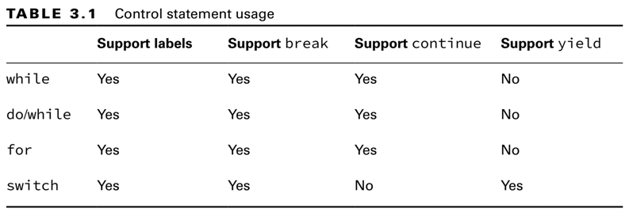

##### while

Since the loop body can be any valid statement, inadvertently terminating each line with the empty statement (;) can give unintended results. 
Always using a block statement as the loop body helps to avoid such problems.

```java
while (noSignOfLife()); // Empty statement as loop body!
  keepLooking();        // Statement not in the loop body.
```

##### do/while loop:
- The variable that is declared within the body of the do/while statement is out of condition scope 
```java
do {
    int snake = 1;
    System.out.print(snake++ + " ");
} while (snake > 1) // The code does not compile
```

##### Labeled statements
- A label is any valid identifier; it always immediately precedes the statement. 
- The scope of a label is the statement prefixed by the label
- A labeled statement is executed as if it were unlabeled, unless it is the break or continue statement.

```java
L1: try {                         // OK. Labeled try-catch-finally block.
  int j = 10, k = 0;
  L1: System.out.println(j/k);    // Not OK. Label L1 redeclared.
} catch (ArithmeticException ae) {
  L2: L3: ae.printStackTrace();   // OK. A statement can have multiple labels
} finally {
  L4: System.out.println("Finally done.");
}
```

##### The break Statement

The break statement comes in two forms: unlabeled and labeled.
```java
break;        // the unlabeled form
break label;  // the labeled form
```

The unlabeled `break` statement terminates loops (for(;;), for(:), while, do-while) and switch statements, and transfers control out of the current context (i.e., the closest enclosing block)
The rest of the statement body is skipped, and execution continues after the enclosing statement.

A labeled `break` statement can be used to terminate any labeled statement that contains the break statement.
Control is then transferred to the statement following the enclosing labeled statement.
In the case of a labeled block, the rest of the block is skipped and execution continues with the statement following the block

```java
out:                      // Label.
{                         // (1) Labeled block.
// ...
if (j == 10) break out;   // (2) Terminate block. Control to (3).
System.out.println(j);    // Rest of the block not executed if j == 10.
// ...
}
// (3) Continue here.
```

#### The continue Statement
Like the break statement, the continue statement comes in two forms: unlabeled and labeled.
```java
continue;         // the unlabeled form
continue label;   // the labeled form
```

The `continue` statement can be used only in a `for(;;)`, `for(:)`, `while`, or `do-while` loop to prematurely stop the current iteration of the loop body and proceed with the next iteration, if possible. 
In the case of the `while` and `do-while` loops, the rest of the loop body is skipped — that is, the current iteration is stopped, with execution continuing with the loop condition. 
In the case of the `for(;;)` loop, the rest of the loop body is skipped, with execution continuing with the update expression

A labeled `continue` statement must occur within a labeled loop that has the same label. 
Execution of the labeled `continue` statement then transfers control to the end of that enclosing labeled loop.

##### Pattern matching 
- Pattern matching with an `if` statement is implemented using the `instanceof` operator.
- Flow scoping means a pattern variable is only accessible if the compiler can discern its type

Do you know what below code example is working?
```java
if (o instanceof Integer bat && bat < 10) // OK
if (o instanceof Integer bat || bat < 10) // ERROR!
```

```java
40: void getFish(Object fish) {
41: if (!(fish instanceof String guppy))
42: System.out.print("Eat!");
43: else if (!(fish instanceof String guppy)) {
44: throw new RuntimeException();
45: }
46: System.out.print("Swim!");
47: }
```
Based on flow scoping, `guppy` is in scope after lines 41–42 if the type is not a `String`.
In this case, line 43 declares a variable `guppy` that is a duplicate of the previously defined local variable defined on line 41. 
If a different variable name was used on line 43, then the code would compile and print `Swim!` at runtime with the specified input.


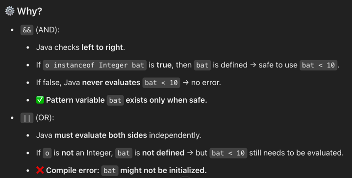

## 4 CORE API

### 4.1 STRING
- is a sequence of characters
- counts from 0 when indexed
- is immutable, or unchangeable

```java
String name = "Fluffy";
String name = new String("Fluffy");
String name = """
                Fluffy""";

System.out.println(1 + 2);          // 3
System.out.println("a" + "b");      // ab
System.out.println("a" + "b" + 3);  // ab3
System.out.println(1 + 2 + "c");    // 3c
System.out.println("c" + 1 + 2);    // c12
System.out.println("c" + null);     // cnull
```

##### Substring:
- first parameter is the index to start with for the returned string (zero-based index)
- optional second parameter is the end index you want to stop at (we said “stop at” rather than “include”)

```java
System.out.println(name.substring(3, 3)); // empty string
System.out.println(name.substring(3, 2)); // exception
System.out.println(name.substring(3, 8)); // exception, cuz string in name variable has 7 characters
```

Removing Whitespace:  
- `String strip()` and `String trim()` - methods remove blank space from the beginning and/or end of a String
- `String stripLeading()` - method removes whitespace from the beginning of the String and leaves it at the end.
- `String stripTrailing()` - method removes whitespace from the end of the String and leaves it at the beginning.

The `strip()` method does everything that `trim()` does, but it supports Unicode
In terms of the exam, whitespace consists of spaces along with the `\t` (tab) and `\n` (newline) characters.

`String indent(int numberSpaces)`
- adds the same number of blank spaces to the beginning of each line if you pass a positive number.
- If you pass a negative number, it tries to remove that number of whitespace characters from the beginning of the line.
- If you pass zero, the indentation will not change.
- it also normalizes whitespace characters:  
  --> line break is added to the end of the string if not already there  
  --> any line breaks are converted to the `\n` format.  
  --> Regardless of whether your operating system uses `\r\n` (Windows) or `\n`(Mac/Unix), Java will standardize on `\n` for you.  

`String stripIndent()`
- It gets rid of all incidental whitespace
- all non-blank lines are shifted left so the same number of whitespace characters are removed from each line and the first character that remains is not blank
- `\r\n` is turned into `\n`
- method does not add a trailing line break if it is missing

`public boolean isEmpty()` 
- check if `String` has length of zero

`public boolean isBlank()` 
- check if `String` contains only whitespace or has length of zero

#### Formatting String
`%s` --> Applies to any type, commonly `String` values.  
`%d` --> Applies to integer values like `int` and `long`.  
`%f` --> Applies to floating-point values like `float` and `double`.  
`%n` --> Inserts a line break using the system-dependent line separator.  

Mixing data types may cause exceptions at runtime - `IllegalFormatConversionException`.

By default, `%f` displays exactly six digits past the decimal.
If you want to display only one digit after the decimal, you can use `%.1f` instead of `%f`.
The `format()` method relies on rounding rather than truncating when shortening numbers
`90.250000` will be displayed as `90.3` (not `90.2`) when passed to `format()` with `%.1f`.

### 4.2 STRING BUILDER
- it changes its own state and returns a reference to itself.
- these four methods work exactly the same as in the `String` class: `charAt`, `substring`, `indexOf`, `replace`
- Know that `substring()` does not change the value of a `StringBuilder`, whereas `append()`, `delete()`, and `insert()` do change it

`StringBuilder sb3 = new StringBuilder(10)` - tells Java that we have some idea of how big the
 eventual value will be and would like the `StringBuilder` to reserve a certain capacity or number of slots

`StringBuilder append(String str)` - adds the parameter to the `StringBuilder` and returns a reference to the current `StringBuilder`

`StringBuilder insert(int offset, String str)` - adds characters to the `StringBuilder` at the requested index and returns a reference to the current `StringBuilder`.

`StringBuilder delete(int startIndex, int endIndex)` - removes characters from the sequence and returns a reference to the current `StringBuilder`

`StringBuilder deleteCharAt(int index)` - method is convenient when you want to delete only one character.

`StringBuilder replace(int startIndex, int endIndex, String newString)` - deletes the characters starting with `startIndex` and ending right before `endIndex`
Then inserts the value `newString` in that position

```java
var name = "a";
var builder = new StringBuilder("a");
System.out.println(name == builder); // DOES NOT COMPILE
```
Remember that `==` is checking for object reference equality. The compiler is smart enough
to know that two references can’t possibly point to the same object when they are completely different types.

```java
var x = "Hello World";
var y = "Hello World";
System.out.println(x == y); // true
```
Remember that a `String` is immutable and literals are pooled. The JVM created only one literal in memory.

```java
var name = "Hello World";
var name2 = new String("Hello World").intern();
System.out.println(name == name2); // true
```
The `intern()` method will use an object in the string pool if one is present.

### 4.3 ARRAYS

- An array is a fixed-size area of memory on the heap that has space for primitives or pointers to objects.
- Arrays are objects
- A position in the array is indicated by a non-negative integer value called the index.
- The size of an array is fixed and cannot be changed after the array has been created.
- The minimum value of `array_size` is `0`; in other words, zero-length arrays can be constructed.
- When the array is constructed, all of its elements are initialized to the default value for element type

Remember -> The type `int` is a primitive; `int[]` is an object.

It is important to understand that the declaration does not actually create an array.
Instead, it simply declares a reference that can refer to an array object.
The `[]` notation can also be specified after a variable name to declare it as an array variable, but then it applies to just that variable.

Arrays declaration:
```java
int[] numAnimals;
int [] numAnimals;
int []numAnimals;
int numAnimals[];
int numAnimals [];

int[][] vars1; // 2D array
int vars2 [][]; // 2D array
int[] vars3[]; // 2D array
int[] vars4 [], space [][]; // a 2D AND a 3D array
```

The array does not allocate space for the `String` objects.
Instead, it allocates space for a reference to where the objects are really stored.

```java
String[] mammals = {"monkey", "chimp", "donkey"};
int counter = mammals.length;
```
Note that there are no parentheses after length since it is not a method.
The length attribute does not consider what is in the array; it only considers how many slots have been allocated.  

These two declarations declare `anIntArray` and `mediumPizzas` to be reference variables that can refer to arrays of `int` values and arrays of `Pizza` objects, respectively. 
The variable `largePizzas` can denote an array of `Pizza` objects, but the variable `oneInteger`cannot denote an array of `int` values — it is a simple variable of the type `int`

```java
int anIntArray[], oneInteger;
Pizza[] mediumPizzas, largePizzas;
```

You must each time define at least the first dimension of array:
```java
int[][] test = new int[][]; // Error: java: array dimension missing
int varka[][] = new int[3][]; // OK
```

#### Anonymous Arrays
Java has another array creation expression, called an anonymous array, which allows the concept of the array creation expression from (1) to be combined with the array initializer from (2), 
so as to create and initialize an array (3)
```java
int[] intArray1 = new int[5];                 // (1)
int[] intArray2 = {3, 5, 2, 8, 6};            // (2)
int[] intArray3 = new int[] {3, 5, 2, 8, 6};  // (3)

int[] daysInMonth;
daysInMonth = {31, 28, 31, 30, 31, 30,31, 31, 30, 31, 30, 31};  // Compile-time error
daysInMonth = new int[] {31, 28, 31, 30, 31, 30, 31, 31, 30, 31, 30, 31}; // OK
```


`Arrays.toString(tempArray)` --> Method for printing values from array  
`Arrays.sort(tempArray)` --> Method for sorting values which are in array  
`Arrays.binarySearch(tempArray, value)` --> Method for searching specific value in array. If no match is found, it negates the position where the element
would need to be inserted and subtracts 1.

#### Arrays comparing - `compare()`
- If both arrays are the same length and have the same values in each spot in the same order, return zero,
- If all the elements are the same but the second array has extra elements at the end, return a negative number,
- If all the elements are the same, but the first array has extra elements at the end, return a positive number,
- If the first element that differs is smaller in the first array, return a negative number,
- If the first element that differs is larger in the first array, return a positive number,

### 4.4 Calculating with Math API

The `min()` and `max()` methods compare two values and return one of them.
```java
public static double min(double a, double b)
public static float min(float a, float b)
public static int min(int a, int b)
public static long min(long a, long b)
// The max() method works the same way, except it returns the larger value.
```

The `round()` method gets rid of the decimal portion of the value, choosing the next higher number if appropriate.
If the fractional part is .5 or higher, we round up.
```java
public static long round(double num)
public static int round(float num)
```

The `ceil()` method takes a double value. If it is a whole number, it returns the same value. 
If it has any fractional value, it rounds up to the next whole number. By contrast, the `floor()` method discards any values after the decimal.
```java
public static double ceil(double num)
public static double floor(double num)
```

Generating random numbers
```java
public static double random()
double num = Math.random();
```


### 4.5 DATES & TIMES

A `LocalDate` contains just a date, a `LocalTime` contains just a time, and a `LocalDateTime` contains both a date and a time. 
All three have private constructors and are created using `LocalDate.now()` or `LocalDate.of()` (or the equivalents for that class)

`var d = new LocalDate(); // DOES NOT COMPILE`  
You are not allowed to construct a date or time object directly

`var d = LocalDate.of(2022, Month.JANUARY, 32) // DateTimeException`  
trick is what happens when you pass invalid numbers to of()

```java
var date = LocalDate.of(2024, Month.JANUARY, 20);
date.plusDays(10);
System.out.println(date); // It prints January 20, 2024
```
Whenever you see immutable types, pay attention to make sure that the return value of a method call isn’t ignored

```java
var date = LocalDate.of(2024, Month.JANUARY, 20);
date = date.plusMinutes(1); // DOES NOT COMPILE
```
LocalDate does not contain time. This means that you cannot add minutes to it

Period is a day or more of time.
```java
var annually = Period.ofYears(1); // every 1 year P1Y
var quarterly = Period.ofMonths(3); // every 3 months P3M
var everyThreeWeeks = Period.ofWeeks(3); // every 3 weeks P21D
var everyOtherDay = Period.ofDays(2); // every 2 days P2D
var everyYearAndAWeek = Period.of(1, 0, 7); // every year and 7 days P1Y7D
var wrong = Period.ofYears(1).ofWeeks(1); // every week P1Y7D
```

Duration, which is intended for smaller units of time.
```java
var daily = Duration.ofDays(1); // PT24H
var hourly = Duration.ofHours(1); // PT1H
var everyMinute = Duration.ofMinutes(1); // PT1M
var everyTenSeconds = Duration.ofSeconds(10); // PT10S
var everyMilli = Duration.ofMillis(1); // PT0.001S
var everyNano = Duration.ofNanos(1); // PT0.000000001S

var daily = Duration.of(1, ChronoUnit.DAYS);
var hourly = Duration.of(1, ChronoUnit.HOURS);
var everyMinute = Duration.of(1, ChronoUnit.MINUTES);
var everyTenSeconds = Duration.of(10, ChronoUnit.SECONDS);
var everyMilli = Duration.of(1, ChronoUnit.MILLIS);
var everyNano = Duration.of(1, ChronoUnit.NANOS);

var one = LocalTime.of(5, 15);
var two = LocalTime.of(6, 30);
var date = LocalDate.of(2016, 1, 20);
System.out.println(ChronoUnit.HOURS.between(one, two)); // 1
System.out.println(ChronoUnit.MINUTES.between(one, two)); // 75
System.out.println(ChronoUnit.MINUTES.between(one, date)); // DateTimeException

var date = LocalDate.of(2022, 5, 25);
var period = Period.ofDays(1);
var days = Duration.ofDays(1);
System.out.println(date.plus(period)); // 2022–05–26
System.out.println(date.plus(days)); // Unsupported unit: Seconds
```

Since we are working with a `LocalDate`, we are required to use `Period`  
`Period`   --> `LocalDate`, `LocalDateTime`, `ZonedDateTime`  
`Duration` --> `LocalDateTime`, `LocalTime`, `ZonedDateTime`

`var now = Instant.now()`  
The `Instant` class represents a specific moment in time in the GMT time zone.

## 5. METHODS

### 5.1 DESIGNING METHODS

#### Access modifiers
`private` - method can be called only from within the same class  
no keyword (package access) - method can be called only from a class in the same package  
`protected` - method can be called only from a class in the same package or a subclass  
`public` - method can be called from anywhere  

#### Optional specifiers 
- while access modifiers and optional specifiers can appear in any order, they must all appear before the return type.
- you can’t declare a method (or class) both final and abstract
- method must have a return type (if no value is returned the void keyword must be used)

#### Method name
- an identifier may only contain letters, numbers, currency symbols, or _.
- first character is not allowed to be a number
- reserved words are not allowed
- the single underscore character is not allowed

```java
public void 2jog() {} // DOES NOT COMPILE
public _() {} // DOES NOT COMPILE   
```

### 5.1 DECLARING VARIABLES

Varargs
- a method can have at most one varargs parameter
- if a method contains a varargs parameter, it must be the last parameter in the list
- you can pass in an array, or you can list the elements of the array

```java
public static void publish(int n, String... data) {}
```

### 5.2 STATIC DATA

`static`
- you can think of a static variable as being a member of the single class object
- exists independently of any instances of that class
- all instances of class must share the same state

```java
Snake s = new Snake();
System.out.println(s.hiss); // s is a Snake
s = null;
System.out.println(s.hiss); // s is still a Snake
```

### 5.3 PASSING DATA AMONG METHODS
- Java is `pass-by-value` language
- an actual parameter is evaluated and its value from the stack is assigned to the corresponding formal parameter.
- copy of the variable is made and the method receives that copy
- assignments made in the method do not affect the caller (The use of this value in the method has no influence on the actual parameter)

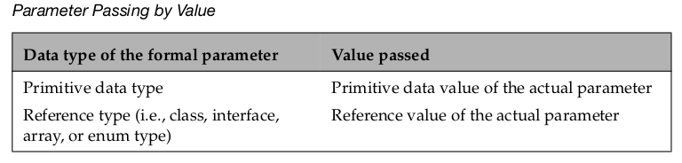

If the actual parameter expression evaluates to a reference value, the resulting reference value on the stack is assigned to the corresponding formal parameter reference at method invocation.
In particular, if an actual parameter is a reference to an object, the reference value stored in the actual parameter is passed.
Consequently, both the actual parameter and the formal parameter are aliases to the object denoted by this reference value during the invocation of the method.
It implies that changes made to the object via the formal parameter will be apparent after the call returns.

### 5.4 OVERLOADING METHODS

Autoboxing and Unboxing Variables
- Autoboxing is the process of converting a primitive into its equivalent wrapper class,
- unboxing is the process of converting a wrapper class into its equivalent primitive

#### Widening and Narrowing Primitive Conversions
Widening primitive conversions are usually done implicitly, whereas narrowing primitive conversions usually require a `cast`.
It is not illegal to use a cast for a widening conversion. However, the compiler will flag any conversion that requires a cast if none has been specified.
Regardless of any loss of magnitude or precision, widening and narrowing primitive conversions never result in a runtime exception.

```java
long year = 2020; // (1) Implicit widening: long <----- int, assigned 2020L
int pi = (int) 3.14; // (2) Narrowing requires cast: int <----- double, assigned 3
```

#### Widening and Narrowing Reference Conversions
The subtype–supertype relationship between reference types determines which conversions are permissible between them.
Widening reference conversions are usually done implicitly, whereas narrowing reference conversions usually require a cast

Widening reference conversions do not require any runtime checks and never result in an exception during execution.
This is not the case for narrowing reference conversions, which require a runtime check and can throw a `ClassCastException` if the conversion is not legal.

```java
Object obj = "Upcast me"; // (1) Widening: Object <----- String
String str = (String) obj; // (2) Narrowing requires cast: String <----- Object
```

While Java will implicitly cast a smaller primitive to a larger type, as well as autobox, it will not do both at the same time.
```java
Long badGorilla = 8; // DOES NOT COMPILE
long goodGorilla = Integer.valueOf(8);
```
Java will cast or autobox the value automatically, but not both at the same time.

## 6. CLASS DESIGN

### 6.1. INHERITANCE
- superclass cannot be marked as a `final`
- Java supports single inheritance, by which a class may inherit from only one direct parent class,
- Java supports multiple levels of inheritance, by which one class may extend another class, which in turn extends another class.
- all classes inherit from a single class: `java.lang.Object`
- Object is the only class that doesn’t have a parent class.
- A subclass cannot override inherited fields of the superclass, but it can hide them

### 6.2 CREATING CLASSES

#### Class modifiers:
`final` - The class may not be extended  
`abstract` - The class is abstract, may contain abstract methods, and requires a concrete subclass to instantiate  
`sealed` - The class may only be extended by a specific list of classes  
`non-sealed` - A subclass of a sealed class permits potentially unnamed subclasses  
`static` - Used for static nested classes defined within a class

#### Accessing the `this` reference
- refers to the current instance of the class
- can be used to access any member of the class, including inherited members.
- can be used in any instance method, constructor, or instance initializer block.
- cannot be used when there is no implicit instance of the class, such as in a static method or static initializer block.
- Accessing `this.variableName` can be performed from any instance method, constructor, or instance initializer,
  (but not from a static method or static initializer)
- Note that the `this` reference cannot be used in a static context, as static code is not executed in the context of any object.

#### Calling the `super` reference
- allows do the reference the version in the parent class instead of the current class
- excludes any members found in the current class

Remember, while 'this' includes current and inherited members, 'super' only includes inherited members.

### 6.3 DECLARING CONSTRUCTORS
- the name of the constructor matches the name of the class
- there is no return type (not even void)
- constructor parameters can be any valid class, array, or primitive type, including generics, but may not include var
- class can have multiple constructors, as long as each constructor has a unique constructor signature
- compiler only inserts the default constructor when no constructors are defined !!!
- If a class defines any constructor, the default constructor is not generated.
- constructors can be called only by writing new before the name of the constructor
- Calling an overloaded constructor with this() may be used only as the first line of a constructor

The first statement of every constructor is a call to a parent constructor using `super()` or another constructor in the class using `this()`.

When Java sees the `new` keyword, it allocates memory for the new object. It then looks for a constructor with a matching signature and calls it.

Java compiler automatically inserts a call to the no-argument constructor `super()`
if you do not explicitly call `this()` or `super()` as the first line of a constructor

#### Private constructor:
Having only private constructors in a class tells the compiler not to provide a default no-argument constructor.
It also prevents other classes from instantiating the class. This is useful when a class has only static methods
or the developer wants to have full control of all calls to create new instances of the class

#### Calling overloaded constructors with this()
- when `this()` is used with parentheses, Java calls another constructor on the same instance of the class
- `this` refers to an instance of the class, while `this()` refers to a constructor call within the class
- `this()` call must be the first statement in the constructor
- Java does not allow cyclic constructor calls
- `this()` can only be called from a constructor in the same class

#### Calling Parent Constructors with super()
- `super` is used to reference members of the parent class, while the second, `super()`, calls a parent constructor.
- calling `super()` can only be used as the first statement of the constructor
- compiler automatically inserts a call to the no-argument constructor `super()` if you do not explicitly call `this()` or `super()` as the first line of a constructor
- `super()` always refers to the most direct parent

### 6.4 Initializing Objects
#### Initializing Classes (Order of initialization)
1. If there is a superclass Y of X, then initialize class Y first.
2. Process all static variable declarations in the order in which they appear in the class. (from parent first)
3. Process all static initializers in the order in which they appear in the class. (from parent first)

#### Initializing final Fields
- final instance variables must be assigned a value
- default value is only applied to a non-final
- `final` variables can be assigned values in the line in which they are declared or in an instance initializer
- final instance fields can also be set in a constructor
- by the time the constructor completes, all final instance variables must be assigned a value exactly once
- can assign a null value to final instance variables as long as they are explicitly set.

```java
public static void bake(final Pizza pizzaToBeBaked) {
  pizzaPrice = pizzaPrice/2.0;    // Not allowed. Compile-time error!
  pizzaPrice.meat = "chicken";    // Allowed
  pizzaPrice = null;              // Not allowed. Compile-time error!
}
```

#### Initializing Instances
1. Initialize class X if it has not been previously initialized.
2. If there is a superclass Y of X, then initialize the instance of Y first.
3. Process all instance variable declarations in the order in which they appear in the class.
4. Process all instance initializers in the order in which they appear in the class.
5. Initialize the constructor, including any overloaded constructors referenced with this().

- A class is initialized at most once by the JVM before it is referenced or used.
- All static final variables must be assigned a value exactly once, either when they are declared or in a static initializer.
- All final fields must be assigned a value exactly once, either when they are declared, in an instance initializer, or in a constructor.
- Non-final static and instance variables defined without a value are assigned a default value based on their type.
- Order of initialization is as follows: variable declarations, then initializers, and finally constructors.

### 6.5 Inheriting Members

#### Overloading
- Overloaded methods have the same method name but a different signature (the method parameters differ)
- Overloaded methods can have different return types

#### Overriding
- method signature is composed of the name of the method and method parameters.
- The method in the child class must have the same signature as the method in the parent class.
- The method in the child class must be at least as accessible as the method in the parent class
  (the subclass cannot reduce the visibility of the parent method)
- The method in the child class may not declare a checked exception
  that is new or broader than the class of any exception declared in the parent class method.
- If the method returns a value, it must be the same or a subtype of the method in the parent class, known as covariant return types.
- you can’t override private methods since they are not inherited,
  but you can redeclare a new method in the child class with the same signature as the method in the parent class.
- the method defined in the child class must be marked as static if it is marked as static in a parent class.
- Java doesn’t allow variables to be overridden (Variables can be hidden)
- final methods cannot be overridden (An attempt to override a final method will result in a compile-time error)
- you cannot hide a static method in a child class if it is marked final
- Overridden instance methods and hidden static methods must have the same signature (the name and method parameters must match),
- overridden and hidden methods can have covariant return types
- An instance method in a subclass cannot override a static method in the superclass. The compiler will flag such an attempt as an error. 
  A static method is class specific and not part of any object, while overriding methods are invoked on behalf of objects of the subclass. 
  However, a static method in a subclass can hide a static method in the superclass, but it cannot hide an instance method in the superclass.

#### Covariant Return Types
A simple test for covariance is the following: given an inherited return type A and an overriding return type B,
can you assign an instance of B to a reference variable for A without a cast? If so, then they are covariant.
This rule applies to primitive types and object types alike.
If one of the return types is void, then they both must be void, as nothing is covariant with void except itself.

```java
// The overridden method in the superclass Light:
public Light makeInstance() { ... } // (3) Instance method

// The overriding method in the subclass TubeLight:
@Override
public TubeLight makeInstance() { ... } // (9) Overriding instance method at (3).
```

Note that the method signatures are the same, but the return type at (9) is a subtype of the return type at (3). 
The method at (9) returns an object of the subtype TubeLight, whereas the method at (3) returns an object of the supertype Light. This is an example of covariant return.
Note that covariant return applies only to reference types, not to primitive types.

### 6.6 Creating abstract classes
- it is a class declared with the abstract modifier that cannot be instantiated directly and may contain abstract methods.
- abstract method is a method declared with the abstract modifier that does not define a body
- only instance methods can be marked abstract within a class, not variables, constructors, or static methods
- An abstract method can only be declared in an abstract class.
- A non-abstract class that extends an abstract class must implement all inherited abstract methods
- abstract method is always declared without a body
- abstract class can extend a non-abstract class and another abstract class
- abstract classes are initialized with constructors in the same way as non-abstract classes
- Java does not permit a class or method to be marked both abstract and final
- abstract method cannot be marked as both abstract and private
- abstract method cannot be marked as both abstract and static

The abstract modifier cannot be placed after the class keyword in a class declaration or after the return type in a method declaration.
```java
public class abstract Bear { // DOES NOT COMPILE
  public int abstract howl(); // DOES NOT COMPILE
}
```

### 6.7 Creating Immutable Objects
Immutable Objects
- an immutable object is one that cannot change state after it is created.

Common strategy for making a class immutable:
1. Mark the class as final or make all of the constructors private.
2. Mark all the instance variables private and final.
3. Don’t define any setter methods.
4. Don’t allow referenced mutable objects to be modified.
5. Use a constructor to set all properties of the object, making a copy if needed.

### 6.8 Static member declarations

#### Static Members in Classes
Static members belong to the class in which they are declared and are not part of any instance of the class.
The class need not be instantiated to access its static members.

Static code inside a class can access a static member in the following three ways:
- By the static member’s simple name
- By using the class name with the static member’s name
- By using an object reference of the static member’s class with the static member’s name

#### Static Fields in Classes
Static fields (also called static variables and class variables) exist only in the class in which they are defined.
When the class is loaded, static fields are initialized to their default values if no explicit initialization is specified.

#### Static Methods in Classes
- Static methods are also known as class methods.
- A `static` method in a class can directly access other static members in the class by their simple name.
- Static method cannot access instance (i.e., non-static) members of the class directly
- Static methods can be overloaded analogous to instance methods
- Static methods in a superclass cannot be overridden in a subclass as instance methods can, but they can be hidden by static methods in a subclass.
- A type parameter of a generic class or interface cannot be used in a static method

## 7 BEYOND CLASSES

### 7.1 Implementing interfaces
Interface
- An interface is an abstract data type that declares a list of abstract methods
  that any class implementing the interface must provide.
- interfaces cannot be marked as final
- interface methods could be private and public only
- interface can extend multiple interfaces
- Java supports inheriting two abstract methods that have compatible method declarations
  By compatible, we mean a method can be written that properly overrides both inherited methods

Inserting Implicit Modifiers
- Interfaces are implicitly abstract
- Interface variables are implicitly public, static, and final.
- Interface methods without a body are implicitly abstract.
- Interface methods without the private modifier are implicitly public.
  (The last rule applies to abstract, default, and static interface methods)

Default Interface Method Definition Rules
1. A default method may be declared only within an interface.
2. A default method must be marked with the default keyword and include a method body.
3. A default method is implicitly public.
4. A default method cannot be marked abstract, final, or static.
5. A default method may be overridden by a class that implements the interface.
6. If a class inherits two or more default methods with the same method signature, then the class must override the method.

Static Interface Method Definition Rules
1. A static method must be marked with the static keyword and include a method body
2. A static method without an access modifier is implicitly public.
3. A static method cannot be marked abstract or final.
4. A static method is not inherited and cannot be accessed in a class implementing the interface without a reference to the interface name

Private Interface Method Definition Rules
1. A private interface method must be marked with the private modifier and include a method body.
2. A private static interface method may be called by any method within the interface definition.
3. A private interface method may only be called by default and other private nonstatic methods within the interface definition.

Tips on exam:
■ Treat abstract, default, and non-static private methods as belonging to an instance of the interface.
■ Treat static methods and variables as belonging to the interface class object.
■ All private interface method types are only accessible within the interface declaration.

### 7.2 Working with enums
- each enum value is initialized only once in the Java Virtual Machine (JVM).
- all enum constructors are implicitly private, with the modifier being optional
- enum constructor will not compile if it contains a public or protected modifier
- The first time we ask for any of the enum values, Java constructs all of the enum values
- enum can even implement an interface
- whether the enum is simple or complex, the list of values always comes first.

### 7.3 Sealing classes
```java
public sealed class Bear permits Kodiak, Panda {}
public final class Kodiak extends Bear {}
public non-sealed class Panda extends Bear {}
```

- `final`: jeżeli chcemy zamknąć hierarchię dziedziczenia,  
- `sealed`: Indicates that a class or interface may only be extended/implemented by named classes or interfaces  
- `permits`: Used with the sealed keyword to list the classes and interfaces allowed  
- `non-sealed`: Applied to a class or interface that extends a sealed class, indicating that it can be extended by unspecified classes


- Sealed classes are commonly declared with the abstract modifier, although this is certainly not required.
- Sealed class needs to be declared (and compiled) in the same package or named module as its direct subclasses
- Every class that directly extends a sealed class must specify exactly one of the following three modifiers:
  final, sealed, or non-sealed !!!
- The permits clause is optional if the sealed class and its direct subclasses are declared
  within the same file or the subclasses are nested within the sealed class.
- While it makes the code easier to read if you omit the permits clause for nested subclasses, you are welcome to name them:
  public sealed class Snake permits Snake.Cobra {
  final class Cobra extends Snake {}
  }

Sealing Interfaces
- the sealed interface must appear in the same package or named module as the classes or interfaces that directly extend or implement it
- the permits list can apply to a class that implements the interface or an interface that extends the interface
- remember that interfaces are implicitly abstract and cannot be marked final
- interfaces that extend a sealed interface can only be marked sealed or non-sealed (they cannot be marked final)

### 7.4 Encapsulating data with records

Members Automatically Added to Records:
- Constructor: A constructor with the parameters in the same order as the record declaration
- Accessor method: One accessor for each field
- equals(): A method to compare two elements that returns true if each field is equal in terms of equals()
- hashCode(): A consistent hashCode() method using all of the fields
- toString(): A toString() implementation that prints each field of the record in a convenient, easy-to-read format


- it is legal to have a record without any fields
- records don’t have setters
- every field is inherently final and cannot be modified after it has been written in the constructor
- in order to “modify” a record, you have to make a new object and copy all of the data you want to preserve.
- just as interfaces are implicitly abstract, records are also implicitly final
- you can’t extend or inherit a record
- also like enums, a record can implement a regular or sealed interface, provided it implements all of the abstract methods

While you can add methods, static fields, and other data types,
you cannot add instance fields outside the record declaration, even if they are private:
public record Crane(int numberEggs, String name) {
private static int type = 10;
public int size; // DOES NOT COMPILE
private boolean friendly; // DOES NOT COMPILE
}

Long constructor:
- it must have all parameters from record declared inside body
- Since each field is final, the constructor must set every field.

Compact constructor:
- special type of constructor used for records to process validation and transformations succinctly.
- It takes no parameters and implicitly sets all fields
- Long constructor is implicitly called at end of compact constructor
- You should also remember that a compact constructor is declared without parentheses
- While compact constructors can modify the constructor parameters, they cannot modify the fields of the record. !!!

Overloaded Constructors
- You can also create overloaded constructors that take a completely different list of parameters.
- The first line of an overloaded constructor must be an explicit call to another constructor via this()
- If there are no other constructors, the long constructor must be called
- you can only transform the data on the first line
  (After the first line, all of the fields will already be assigned and the object is immutable.)

### 7.5 Creating nested classes

All four types of nested classes can now define static variables and methods!

Nested class can come in one of four flavors:

■ Inner class:
- A non-static type defined at the member level of a class (the same level as the methods, instance variables, and constructors)
- Can be declared public, protected, package, or private
- Can extend a class and implement interfaces
- Can be marked abstract or final
- Can access members of the outer class, including private members
- Instantiating an Instance of an Inner Class:
  var home = new Home();
  Room room = home.new Room(); // Create the inner class instance
- Inner classes can have the same variable names as outer classes

■ Static nested class:
- A static type defined at the member level of a class
- it can’t access instance variables or methods declared in the outer class
- static nested class can be instantiated without an instance of the enclosing class
- The enclosing class can refer to the fields and methods of the static nested class.

■ Local class:
- A class defined within a method body
- local class declaration does not exist until the method is invoked (you can create instances only from within the method)
- it does not have an access modifier
- it can be declared final or abstract
- it has access to all fields and methods of the enclosing class
- it can access final and effectively final local variables

■ Anonymous class:
- A special case of a local class that does not have a name
- it must extend an existing class or implement an existing interface
- it is useful when you have a short implementation that will not be used anywhere else
- you can't both implement an interface and extend a class with a anonymous class

### 7.6 Polymorphism

- Polymorphism’s ability to replace methods at runtime via overriding is one of the most important properties of Java
- you can choose to limit polymorphic behavior by marking methods final, which prevents them from being overridden by a subclass.

Java object may be accessed using:  
■ A reference with the same type as the object  
■ A reference that is a superclass of the object  
■ A reference that defines an interface the object implements or inherits

- In Java, all objects are accessed by reference!
- The type of the object determines which properties exist within the object in memory.
- The type of the reference to the object determines which methods and variables are accessible to the Java program.
- Depending on the type of the reference, we may only have access to certain methods

Casting Objects:
0. Casting objects is similar to casting primitives
1. Casting a reference from a subtype to a supertype doesn’t require an explicit cast.
2. Casting a reference from a supertype to a subtype requires an explicit cast.
3. At runtime, an invalid cast of a reference to an incompatible type results in a ClassCastException being thrown.
4. The compiler disallows casts to unrelated types.

The 'instanceof' Operator
- The instanceof operator can be used to check whether an object belongs to a particular class or interface
  and to prevent a ClassCastException at runtime.
- compiler does not allow instanceof to be used with unrelated types


## 8 LAMBDAS AND FUNCTIONAL INTERFACES

### 8.1 Writing lambdas
Lambda syntax omitting optional parts: `a -> a.canHop()`
- A single parameter specified with the name `a`
- The arrow operator `->` to separate the parameter and body
- A body that calls a single method and returns the result of that method
- the parentheses are optional only when there is one parameter, and it doesn’t have a type declared
- The parentheses around the lambda parameters can be omitted only if there is a single parameter and its type is not explicitly stated

Lambda syntax including optional parts: `(Animal a) -> { return a.canHop(); }`
- A single parameter specified with the name a and stating that the type is `Animal`
- The arrow operator `->` to separate the parameter and body
- A body that has one or more lines of code, including a semicolon and a return statement

Valid lambdas that return a boolean:  
```java
() -> true
x -> x.startsWith("test")
(String x) -> x.startsWith("test")
(x, y) -> { return x.startsWith("test"); }
(String x, String y) -> x.startsWith("test")
```

Invalid lambdas that should return a boolean:  
```java
x, y -> x.startsWith("fish") // Missing parentheses on left
x -> { x.startsWith("camel"); } // Missing return on right
x -> { return x.startsWith("giraffe") } // Missing semicolon inside braces
String x -> x.endsWith("eagle") // Missing parentheses on left
```
```java
5: (var x, y) -> "Hello" // DOES NOT COMPILE
6: (var x, Integer y) -> true // DOES NOT COMPILE
7: (String x, var y, Integer z) -> true // DOES NOT COMPILE
8: (Integer x, y) -> "goodbye" // DOES NOT COMPILE
```
Lines 5 needs to remove `var` from `x` or add it to `y`. Next, lines 6 and 7 need to use the type or `var` consistently.
Finally, line 8 needs to remove `Integer` from `x` or add a type to `y`.

- Lambdas work with functional interfaces that have exactly one abstract method
  Your friend Sam can help you remember this because it is officially known as a single abstract method `SAM` rule.
- The `@FunctionalInterface` annotation tells the compiler that you intend for the code to be a functional interface.
  If the interface does not follow the rules for a functional interface, the compiler will give you an error.
  Remember that having exactly one abstract method is what makes it a functional interface, not the annotation.
- If a functional interface includes an abstract method with the same signature as a public method found in Object,
  those methods do not count toward the single abstract method test (`toString()`, `equals(Object)`, `hashCode()`).
- Even though default methods function like abstract methods, in that they can be overridden in a class implementing the interface,
  they are insufficient for satisfying the single abstract method requirement.
- Lambda can access an instance variable, method parameter, or local variable under certain conditions
  Instance variables (and class variables) are always allowed.
- The only thing lambdas cannot access are variables that are not final or effectively final.
  It means, variable cannot be changed after lambda execution

### 8.2 Using method references
Method reference: `LearnToSpeak learner = System.out::println;`
- The `::` operator tells Java to call the `println()` method later
- Remember that `::` is like a lambda, and it is used for deferred execution with a functional interface.

There are four formats for method references:
1. Calling static Methods 
   - Before colon: class name, After colon: method name
     ```java
     Converter methodRef = Math::round;
     Converter lambda = x -> Math.round(x);
     ```

2. Calling Instance Methods on a Particular Object
   - Before colon: instance variable name, After colon: method name
     ```java
     var str = "Zoo";
     StringStart methodRef = str::startsWith;
     StringStart lambda = s -> str.startsWith(s);
     ```

3. Calling Instance Methods on a Parameter
   - Before colon: class name, After colon: method name
     ```java
     StringParameterChecker methodRef = String::isEmpty;
     StringParameterChecker lambda = s -> s.isEmpty();
     ```

    Since the functional interface takes two parameters, Java has to figure out what they represent.
    The first one will always be the instance of the object for instance methods. Any others are to be method parameters
    ```java
    StringTwoParameterChecker methodRef = String::startsWith;
    StringTwoParameterChecker lambda = (s, p) -> s.startsWith(p);
    ```

4. Calling Constructors
   - Before colon: class name, After colon: "new"
     ```java
     EmptyStringCreator methodRef = String::new;
     EmptyStringCreator lambda = () -> new String();
     ```

    A constructor reference is a special type of method reference that uses new instead of a method and instantiates an object.

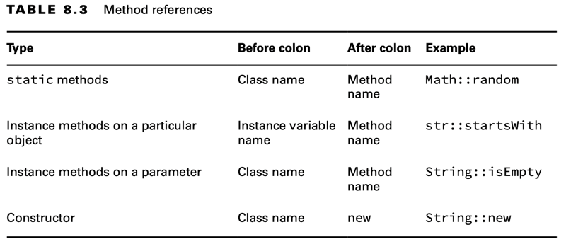

# 8.3 Functional interfaces
For the exam you need to memorize this table: TABLE 8.4
You need to know the table really well.
It’s really important to know the number of parameters, types, return value,
and method name for each of the functional interfaces.

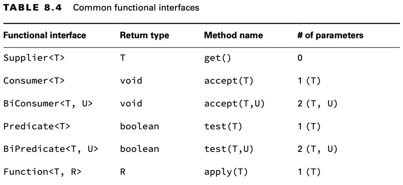
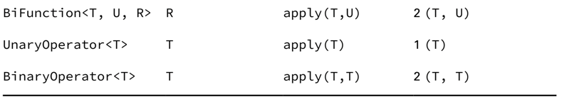

By definition, all functional interfaces have a single abstract method. This doesn’t mean they can have only one method, though. 
Several of the common functional interfaces provide a number of helpful default interface methods.
Table 8.5 shows the convenience methods on the built-in functional interfaces that you need to know for the exam

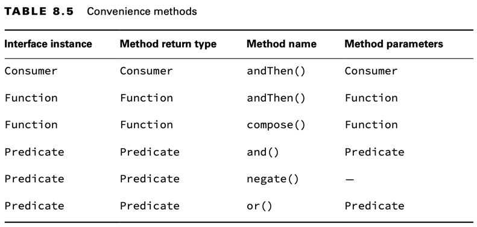

Table 8.6 contains all Functional Interfaces for primitives

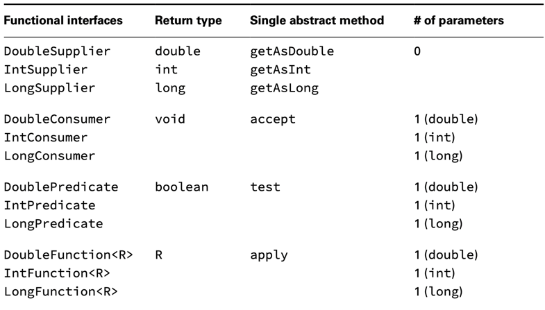
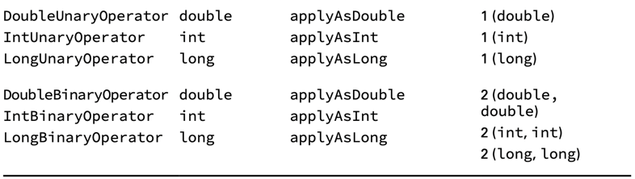

Most of the functional interfaces are for `double`, `int`, and `long`. Table 8.6 shows the
equivalent of Table 8.4 for these primitives. You probably won’t be surprised that you have
to memorize it. Luckily, you’ve memorized Table 8.4 by now and can apply what you’ve learned to Table 8.6.

There are a few things to notice that are different between Table 8.4 and Table 8.6:
- Generics are gone from some of the interfaces, and instead the type name tells us what
primitive type is involved. In other cases, such as IntFunction, only the return type
generic is needed because we’re converting a primitive int into an object.
- The single abstract method is often renamed when a primitive type is returned.

In addition to Table 8.4 equivalents, some interfaces are specific to primitives. Table 8.7
lists these.
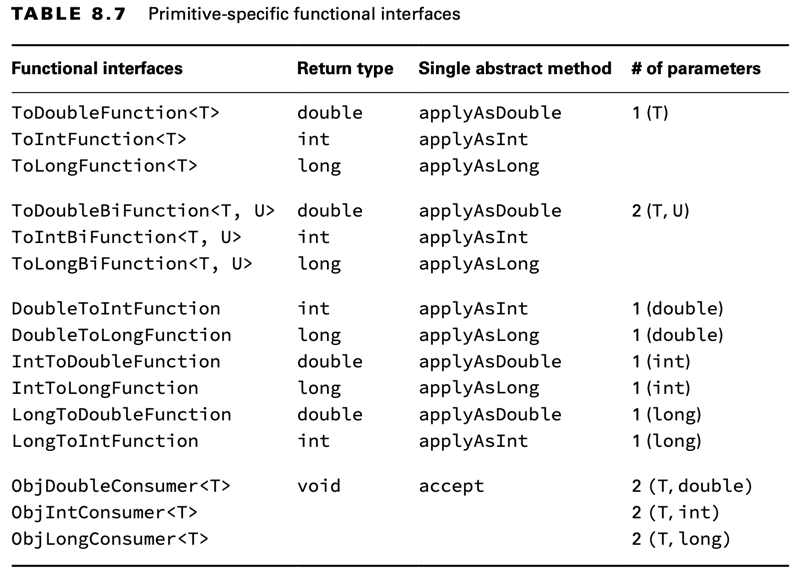

- By definition, all functional interfaces have a single abstract method
- Several of the common functional interfaces provide a number of helpful default interface methods
- Other interface method types (default, private, static, and private static) do not count toward
  the single abstract method count, nor do any public methods with signatures found in Object.

#### Supplier
- is used when you want to generate or supply values without taking any input
#### Consumer
- when you want to do something with a parameter but not return anything
#### BiConsumer
- when you want to do something with two parameters but not return anything
#### Predicate
- is often used when filtering or matching
- returns a boolean primitive and not a Boolean object
#### BiPredicate
- is often used when filtering or matching, but takes two parameters
- returns a boolean primitive and not a Boolean object
#### Function
- is responsible for turning one parameter into a value of a potentially different type and returning it
#### BiFunction
- is responsible for turning two parameters into a value and returning it.
#### UnaryOperator
- extends Function
- require all type parameters to be the same type
- transforms parameter value into one of the same type
#### BinaryOperator
- extends BiFunction
- require all type parameters to be the same type
- merges two values into one of the same type
#### BooleanSupplier
- it is the only functional interface for boolean
#### Functional Interfaces for double, int, and long
- generics are gone from some of the interfaces, and instead the type name tells us what primitive type is involved
- In other cases, only the return type generic is needed because we’re converting a primitive int into an object.
- The single abstract method is often renamed when a primitive type is returned.


## 9. COLLECTIONS AND GENERICS

### 9.1 COMMON COLLECTIONS API 

- A collection is a group of objects contained in a single object.
- The Java Collections Framework is a set of classes in java.util for storing collections
- diamond operator `<>` is a shorthand notation that allows you to omit the generic type from the right side of a statement

<br/>

```java
public boolean add(E element) {}
```
- method inserts a new element into the Collection and returns whether it was successful.
- the boolean return value tells us whether element was added

```java
public boolean remove(Object object) {}
```
- method removes a single matching value in the Collection and returns whether it was successful.
- the boolean return value tells us whether a match was removed

```java
public void clear() {}
```
- method provides an easy way to discard all elements of the Collection

```java
public boolean contains(Object object) {}
```
- method checks whether a certain value is in the Collection
- The `contains()` method calls `equals()` on elements of the ArrayList to see whether there are any matches.

```java
public boolean removeIf(Predicate<? super E> filter) {}
```
- method removes all elements that match a condition
- we can specify what should be deleted using a block of code or even a method reference

```java
public void forEach(Consumer<? super T> action) {}
```
- method that you can call on a Collection instead of writing a loop
- uses Consumer that takes a single parameter and doesn’t return anything.

```java
boolean equals(Object object) {}
```
- you can compare two Collections to compare the type and contents
- `ArrayList` checks order, while `HashSet `does not

<br />

### 9.2 LIST INTERFACE

- ordered collection of elements that allows duplicate entries
- elements in a list can be accessed by an int index

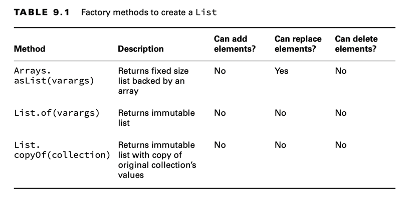

#### ArrayList
- it is like a resizable array. When elements are added, the `ArrayList` automatically grows.
  When you aren’t sure which collection to use, use an `ArrayList`
- can look up any element in constant time.
  Adding or removing an element is slower than accessing an element.
  It is good choice when you are reading more often than (or the same amount as) writing to the ArrayList
- three constructors that you need to know for the exam:  
  `new ArrayList<String>()` --> create an empty `ArrayList` containing all the defaults  
  `new ArrayList<String>(list1)` --> tells Java that we want to make a copy of another LinkedList  
  `new ArrayList<String>(10)` --> create an `ArrayList` containing a specific number of slots, but again not to assign any  

```java
var list = new ArrayList<>();
```
Believe it or not, this does compile. The type of the var is `ArrayList<Object>`
Since there isn’t a type in the diamond operator, Java has to assume the most generic option it can.
Adding a `String` to the list is fine. You can add any subclass of `Object`.
However, in the loop, we need to use the `Object` type rather than `String`:
```java
var list = new ArrayList<>();
list.add("a");
for (String s: list) { } // DOES NOT COMPILE
```

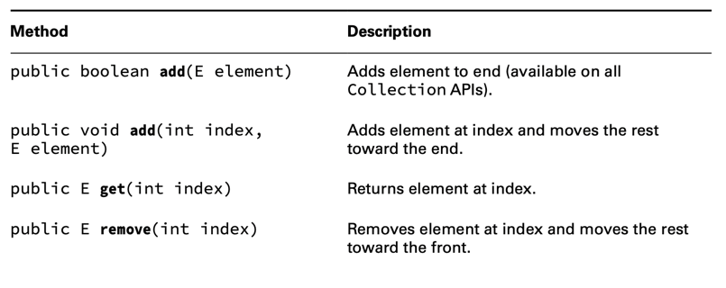
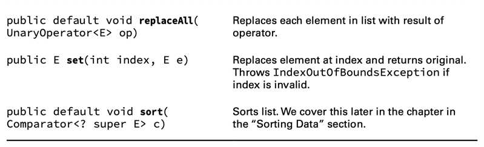

The following statements demonstrate most of these methods for working with a List:
```java
List<String> list = new ArrayList<>();
list.add("SD"); // [SD]
list.add(0, "NY"); // [NY,SD]
list.set(1, "FL"); // [NY,FL]
System.out.println(list.get(0)); // NY
list.remove("NY"); // [FL]
list.remove(0); // []
list.set(0, "?"); // IndexOutOfBoundsException
```

#### LinkedList
- implements both `List` and `Deque`
- has additional methods to facilitate adding or removing from the beginning and/or end of the list
- you can access, add to, and remove from the beginning and end of the list in constant time
- trade-off is that dealing with an arbitrary index takes linear time
- good choice when you’ll be using it as `Deque`
- two constructors that you need to know for the exam:  
  `new LinkedList<String>()` --> create an empty `LinkedList` containing all the defaults  
  `new LinkedList<String>(linked1)` --> tells Java that we want to make a copy of another `LinkedList`  

Methods `remove()` gets tricky when you have an `Integer` type
- when you passing primitives `int x` then you are requesting deletion of the element at index x
- when you passing object `Integer x`, then you

#### Converting from List to an Array
- The advantage of specifying a size of 0 for the parameter is that Java will create a new array of the proper size for the return value
- If you like, you can suggest a larger array to be used instead
- If the `List` fits in that array, it will be returned. Otherwise, a new array will be created
- Also, notice that line 18 clears the original `List`. This does not affect either array.
  The array is a newly created object with no relationship to the original `List`. It is simply a copy


### 9.3 SET INTERFACE
- collection that does not allow duplicate entries
- you can create an immutable `Set` in one line or make a copy of an existing one: `Set.of('z', 'o', 'o')` or `Set.copyOf(letters)`
- The `add()` methods should be straightforward. They return true unless the `Integer` is already in the set.

#### HashSet
- stores its elements in a hash table which means the keys are a hash and the values are an `Object`
- uses the `hashCode()` method of the objects to retrieve them more efficiently
- adding elements and checking whether an element is in the set both have constant time
- trade-off is that you lose the order in which you inserted the elements

#### TreeSet
- stores its elements in a sorted tree structure
- the set is always in sorted order
- trade-off is that adding and checking whether an element exists takes longer than with a `HashSet`, especially as the tree grows larger

### 9.4 QUEUE and DEQUE INTERFACES
- collection that orders its elements in a specific order for processing
- it is a FIFO (first-in, first-out) queue
- use a `Queue` when elements are added and removed in a specific order
- `Deque` (double-ended queue), often pronounced “deck” is different from a regular queue in that you can insert and remove elements from both the front (head) and back (tail)
- In addition to FIFO queues, there are LIFO (last-in, first-out) queues, which are commonly referred to as stacks. You always add to or remove from the top of the stack to avoid a mess. Luckily, we can use the same double-ended queue implementations
- It is really important to determine if it is being used as a FIFO queue, a LIFO stack, or a double-ended queue.
- To review, a FIFO queue is like a line of people. You get on in the back and off in the front. LIFO stack is like a stack of plates. You  put the plate on the top and take it off the top. A double-ended queue uses both ends.

There are three pieces of functionality and versions of the methods that throw an exception or use the return type, such as null, for all information. We’ve bolded the ones that throw an exception when something goes wrong, like trying to read from an empty `Queue`.

Queue methods:
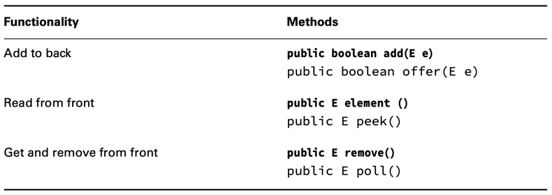

Deque methods:
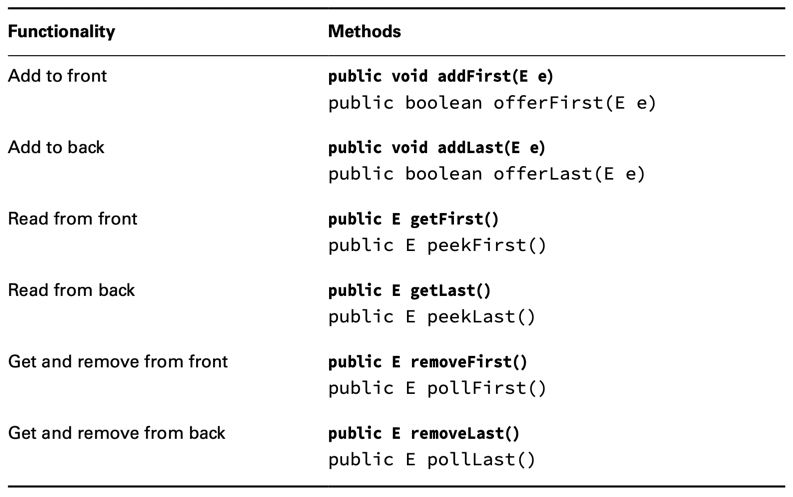
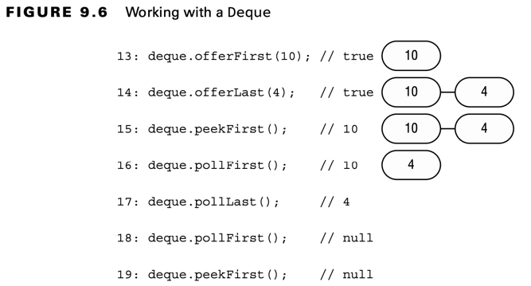

Using a deque as stack:
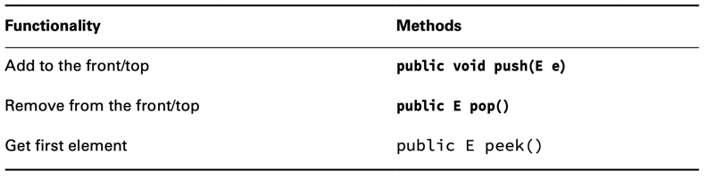

#### ArrayDeque
- Double-ended queue

#### LinkedList
- in addition to being a list, it is a Deque
- it implements both the List and Deque interfaces
- trade-off is that it isn’t as efficient as a “pure” queue

### 9.5 MAP INTERFACE
- collection that maps keys to values, with no duplicate keys allowed
- elements in a map are key/value pairs
- `Map` doesn’t implement the `Collection` interface

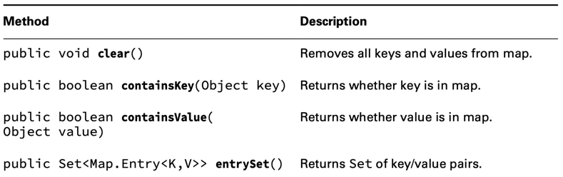
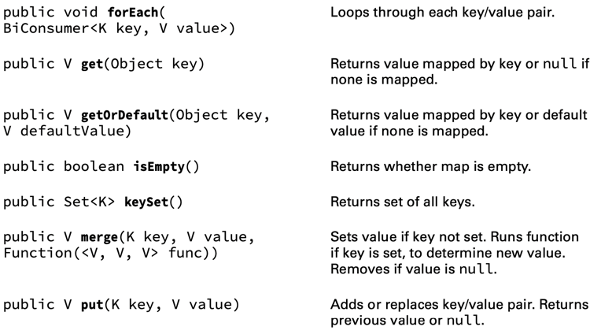
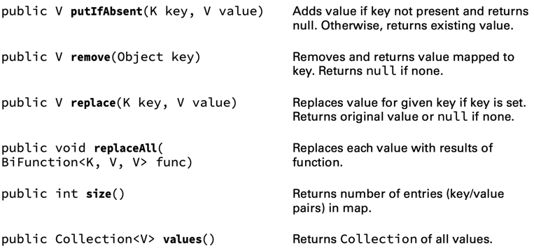

#### HashMap
- stores the keys in a hash table
- uses the `hashCode()` method of the keys to retrieve their values more efficiently
- adding elements and retrieving the element by key both have constant time
- trade-off is that you lose the order in which you inserted the elements

#### TreeMap
- stores the keys in a sorted tree structure
- the keys are always in sorted order
- trade-off is that adding and checking whether a key is present takes longer as the tree grows larger

#### Merging Data
- The `merge()` method adds logic of what to choose
- The `merge()` method also has logic for what happens if `null` values or missing keys are involved
- The mapping function is used only when there are two actual values to decide between.
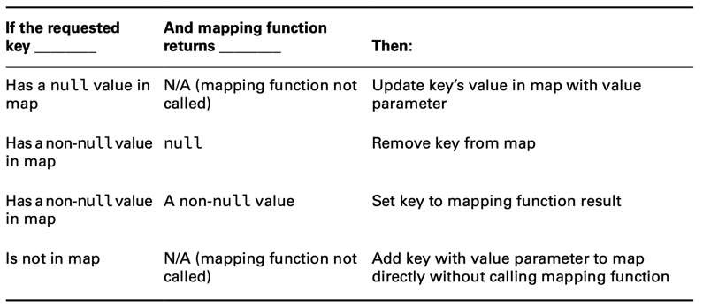

#### Comparing Collection Types
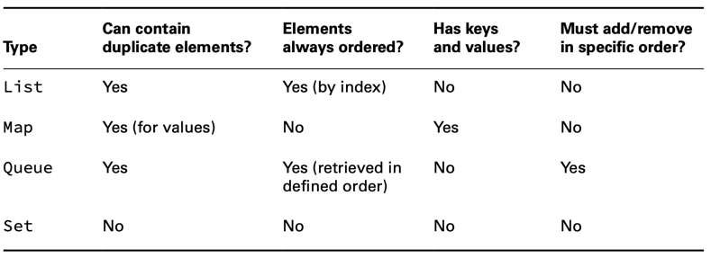
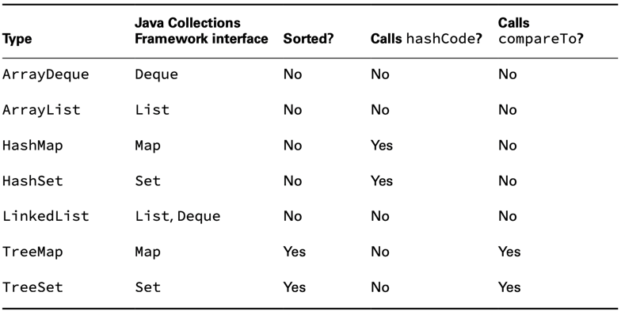

### 9.6 SORTING DATA
- for numbers, it is numerical order
- for `String` objects, order is defined according to the Unicode character mapping
- When working with a `String`: numbers sort before letters, and uppercase letters sort before lowercase letters
- There is not a sort method on `Set` or `Map`. Both of those types are unordered

#### Comparable
```java
public interface Comparable<T> {
 int compareTo(T o);
}
```

- The Comparable interface has only one method
- Any object can be Comparable
- method is declared on the object that is being compared, and it takes one parameter
- The number 0 is returned when the current object is equivalent to the argument to `compareTo()`.
- A negative number (less than 0) is returned when the current object is smaller than the argument to `compareTo()`.
- A positive number (greater than 0) is returned when the current object is larger than the argument to `compareTo()`.
- Remember that `id - a.id` sorts in ascending order, and `a.id - id` sorts in descending order.
- The `Collections.sort()` method uses the `compareTo()` method to sort
- You should keep `compareTo()` and `equals()` consistent:
  - The `compareTo()` method returns 0 if two objects are equal, while your `equals()` method returns true if two objects are equal
  - A natural ordering that uses `compareTo()` is said to be consistent with `equals()` if, and only if, `x.equals(y)` is true whenever `x.compareTo(y)` equals 0.
  - `x.equals(y)` must be false whenever `x.compareTo(y)` is not 0

#### Comparator
- Comparable can be used without an import statement `java.lang`, while Comparator cannot `java.util`
- A negative number is returned if the first argument is smaller, zero if they are equal, and a positive number otherwise
- The `compare()` method can be declared in any code, and it takes two parameters
- is a functional interface since there is only one abstract method to implement
- we can rewrite the Comparator using a lambda expression

#### Comparing Comparable and Comparator


#### Comparing Multiple Fields
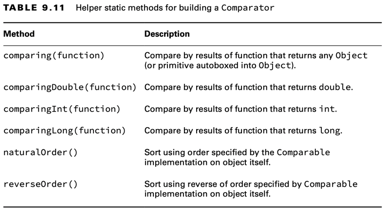
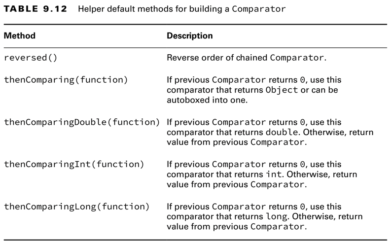

#### Binary Search
- binarySearch is a method in Java used to find the position of a specific element in a sorted array or list.
- It works based on the divide-and-conquer principle.
- The input array or list must be sorted in ascending order (natural order) or by a specified comparator.
- If the array/list is unsorted, the result is undefined.
- Return Values:
  - If the key is found: index of the key.
  - If the key is not found: `-insertion_point-1`, insertion_points is index where the key would be inserted to maintain the order.
  - If duplicates exist, there is no guarantee which occurrence will be returned.
  - Empty Array or List: `−1`

### 9.7 WORKING WITH GENERICS
- Specifying a generic type allows the compiler to enforce proper use of the generic type
- This process of removing the generics syntax from your code is referred to as type erasure.
  Type erasure allows your code to be compatible with older versions of Java that do not contain generics
- To create a class with a generic parameter, you need to add `<T>` after the class name

###### Example 1
Only one of these two methods is allowed in a class because type erasure will reduce both sets of arguments to `List input`:
```java
public class LongTailAnimal {
  protected void chew(List<Object> input) {}
  protected void chew(List<Double> input) {} // DOES NOT COMPILE
}
```

For the same reason, you also can’t overload a generic method from a parent class.
```java
public class LongTailAnimal {
  protected void chew(List<Object> input) {}
}

public class Anteater extends LongTailAnimal {
  protected void chew(List<Double> input) {} // DOES NOT COMPILE
}
```
Both of these examples fail to compile because of type erasure. In the compiled form, the generic type is dropped, and it appears as an invalid overloaded method.

###### Example 2
```java
public class Anteater extends LongTailAnimal {
  protected void chew(List<Object> input) {}
  protected void chew(ArrayList<Double> input) {}
}
```
The first `chew()` method compiles because it uses the same generic type in the overridden method as the one defined in the parent class. The second `chew()` method compiles as well.

However, it is an overloaded method because one of the method arguments is a `List` and the other is an `ArrayList`.
When working with generic methods, it’s important to consider the underlying type.

#### What You Can’t Do with Generic Types?
- Call a constructor: Writing `new T()` is not allowed because at runtime, it would be `new Object()`.
- Create an array of that generic type: This one is the most annoying, but it makes sense because you’d be creating an array of `Object` values.
- Call `instanceof`: This is not allowed because at runtime `List<Integer>` and `List<String>` look` the same to Java, thanks to type erasure.
- Use a primitive type as a generic type parameter: This isn’t a big deal because you can use the wrapper class instead. If you want a type of int, just use `Integer`.
- Create a static variable as a generic type parameter: This is not allowed because the type is linked to the instance of the class. `private static T staticValue`

#### GENERIC METHODS

###### Example 1
The method parameter is the generic type `T`. Before the return type, we declare the formal type parameter of `<T>`. In the `ship()` method, we show how you can use the generic parameter in the return type, `Crate<T>`, for the method.
```java
public class Handler {
  public static <T> void prepare(T t) {
    System.out.println("Preparing " + t);
  }
 public static <T> Crate<T> ship(T t) {
   System.out.println("Shipping " + t);
   return new Crate<T>();
 }
}
```

###### Example 2
```java
2: public class More {
3:   public static <T> void sink(T t) { }
4:   public static <T> T identity(T t) { return t; }
5:   public static T noGood(T t) { return t; } // DOES NOT COMPILE
6: }
```
Line 3 shows the formal parameter type immediately before the return type of void.  
Line 4 shows the return type being the formal parameter type.  It looks weird, but it is correct.  
Line 5 omits the formal parameter type and therefore does not compile.

###### Example 3
When you have a method declare a generic parameter type, it is independent of the class generics.
Take a look at this class that declares a generic `T` at both levels:
```java
1: public class TrickyCrate<T> {
2:   public <T> T tricky(T t) {
3:     return t;
4:   }
5: }

10: public static String crateName() {
11:   TrickyCrate<Robot> crate = new TrickyCrate<>();
12:   return crate.tricky("bot");
13: }
```
Clearly, “T is for tricky.”  
On line 1, `T` is `Robot` because that is what gets referenced when constructing a `Crate`.
On line 2, `T` is `String` because that is what is passed to the method.

#### BOUNDING GENERIC TYPES
- wildcard generic type is an unknown generic type represented with a question mark `?`
- there is an important note to consider. We know that `Object` is the supertype of all Java classes. However, a collection of `Object` is not the supertype of any collection.
- empty diamond operator is allowed only on the right side

For example, a `List<Object>` is not the supertype of `List<String>`, and assigning a variable of type `List<Object>` to a variable of type `List<String>` will cause a compiler error.
This is to prevent possible conflicts that can happen if we add heterogeneous types to the same collection.
The same rule applies to any collection of a type and its subtypes.

##### Unbounded wildcard
- Syntax: `?`
- Example: `List<?> a = new ArrayList<String>()`
- unbounded wildcard represents any data type
- unbounded generics are immutable
- use `?` when you want to specify that any type is okay with you

##### Wildcard with upper bound
- Syntax: `? extends type`
- Example: `List<? extends Exception> a = new ArrayList<RuntimeException>()`
- it says that any class that extends Exception or Exception itself can be used as the formal parameter type
- upper-bounded generics are immutable

##### Wildcard with lower bound:
- Syntax: `? super type`
- Example: `List<? super Exception> a = new ArrayList<Object>()`

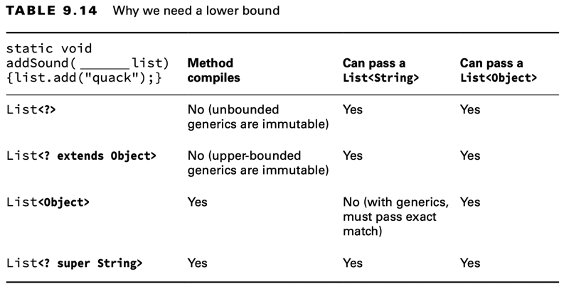

## 10. STREAMS

In Java, the streams we have been talking about are represented by the `Stream<T>` interface,
defined in the `java.util.stream` package.

### 10.1 Returning an Optional
- An `Optional` is created using a factory. You can either request an empty `Optional` or pass a value for the `Optional` to wrap. 
- Think of an `Optional` as a box that might have something in it or might instead be empty

`Optional opt = Optional.ofNullable(value);`  
If value is `null`, `opt` is assigned the empty `Optional`. Otherwise, we wrap the value.

`opt.ifPresent(System.out::println);`  
Using `ifPresent()` better expresses our intent. We want something done if a value is present.  
You can think of it as an if statement with no else.

Table 10.1 summarizes most of the instance methods on `Optional` that you need to know for the exam.
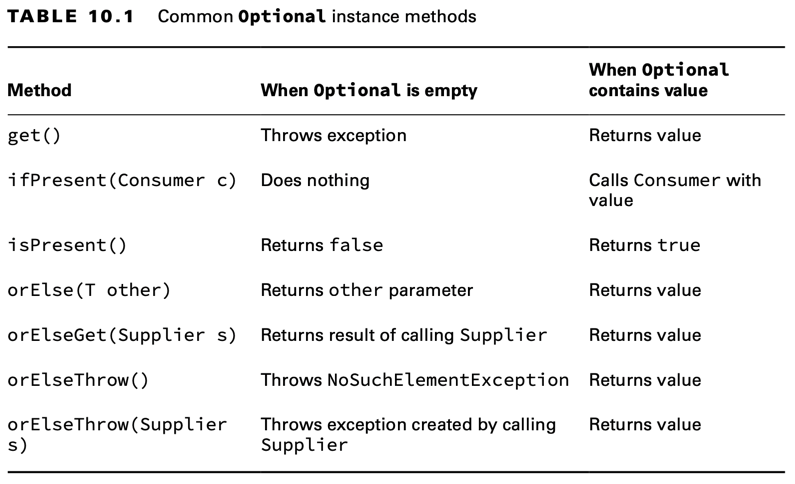

### 10.2 Using Streams
1. **Source**: Where the stream comes from.
2. **Intermediate operations**: Transforms the stream into another one. There can be as few
or as many intermediate operations as you’d like. Since streams use lazy evaluation, the
intermediate operations do not run until the terminal operation runs.
3. **Terminal operation**: Produces a result. Since streams can be used only once, the stream is
no longer valid after a terminal operation completes.

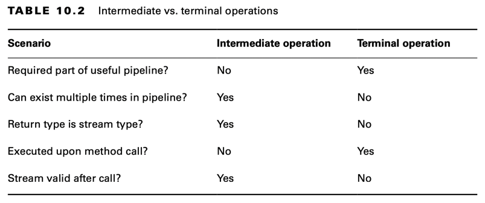

Creating Finite Streams
```java
11: Stream<String> empty = Stream.empty(); // count = 0
12: Stream<Integer> singleElement = Stream.of(1); // count = 1
13: Stream<Integer> fromArray = Stream.of(1, 2, 3); // count = 3
14: var list = List.of("a", "b", "c");
15: Stream<String> fromList = list.stream();
```

Creating Infinite Streams
```java
17: Stream<Double> randoms = Stream.generate(Math::random);
18: Stream<Integer> oddNumbers = Stream.iterate(1, n -> n + 2);
```
Line 17 generates a stream of random numbers. 
If you call `randoms.forEach(System.out::println)`, the program will print random numbers until you kill it.  
Line 18 gives you more control. The `iterate()` method takes a seed or starting value as the first parameter. 
This is the first element that will be part of the stream. The other parameter
is a lambda expression that is passed the previous value and generates the next value

What if you wanted just odd numbers less than 100? There’s an overloaded version of `iterate()` that helps.
This method takes three parameters. Notice how they are separated by commas (,) just
like in all other methods. The exam may try to trick you by using semicolons since it is similar to a for loop. 
Similar to a for loop, you have to take care that you aren’t accidentally creating an infinite stream.
```java
19: Stream<Integer> oddNumberUnder100 = Stream.iterate(
20: 1, // seed
21: n -> n < 100, // Predicate to specify when done
22: n -> n + 2); // UnaryOperator to get next value
```

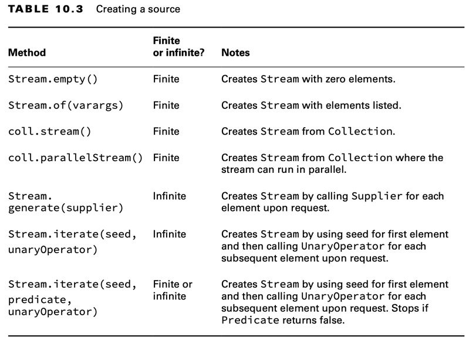

### 10.3 Common Terminal Operations
You can perform a terminal operation without any intermediate operations but not the other
way around. This is why we talk about terminal operations first. `Reductions` are a special
type of terminal operation where all the contents of the stream are combined into a single
primitive or `Object`. For example, you might have an `int` or a `Collection`.

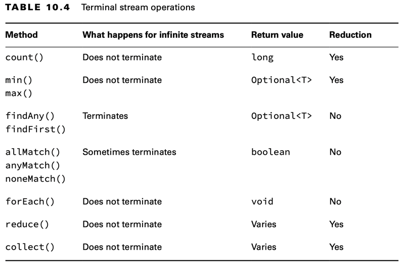

#### Counting
- The `count()` method determines the number of elements in a finite stream.
- For an infinite stream, it never terminates.
- is a reduction because it looks at each element in the stream and returns a single value
```java
Stream<String> s = Stream.of("monkey", "gorilla", "bonobo");
System.out.println(s.count()); // 3
```

#### Finding the Minimum and Maximum
- The `min()` and `max()` methods allow you to pass a custom comparator and find the smallest or largest value in a finite stream according to that sort order.
- `min()` and `max()` hang on an infinite stream because they cannot be sure that a smaller or larger value isn’t coming later in the stream. 
- Both methods are reductions because they return a single value after looking at the entire stream
```java
public Optional<T> min(Comparator<? super T> comparator)
public Optional<T> max(Comparator<? super T> comparator)
```
```java
Stream<String> s = Stream.of("monkey", "ape", "bonobo");
Optional<String> min = s.min((s1, s2) -> s1.length()-s2.length());
min.ifPresent(System.out::println); // ape

Optional<?> minEmpty = Stream.empty().min((s1, s2) -> 0);
System.out.println(minEmpty.isPresent()); // false
```

#### Finding a Value
- The `findAny()` and `findFirst()` methods return an element of the stream unless the stream is empty
- If the stream is empty, they return an empty `Optional`.
```java
public Optional<T> findAny()
public Optional<T> findFirst()
```

```java
Stream<String> s = Stream.of("monkey", "gorilla", "bonobo");
Stream<String> infinite = Stream.generate(() -> "chimp");
s.findAny().ifPresent(System.out::println); // monkey (usually)
infinite.findAny().ifPresent(System.out::println); // chimp
```

### Matching
- `The allMatch()`, `anyMatch()`, and `noneMatch()` methods search a stream and return information about how the stream pertains to the predicate
- These may or may not terminate for infinite streams. It depends on the data. 
- Like the find methods, they are not reductions because they do not necessarily look at all the elements.
- On the infinite stream, one match is found, so the call terminates. 
- If we called `allMatch()`, it would run until we killed the program
- Remember that `allMatch()`, `anyMatch()`, and `noneMatch()` return a boolean.

```java
public boolean anyMatch(Predicate <? super T> predicate)
public boolean allMatch(Predicate <? super T> predicate)
public boolean noneMatch(Predicate <? super T> predicate)
```

```java
var list = List.of("monkey", "2", "chimp");
Stream<String> infinite = Stream.generate(() -> "chimp");
Predicate<String> pred = x -> Character.isLetter(x.charAt(0));
System.out.println(list.stream().anyMatch(pred)); // true
System.out.println(list.stream().allMatch(pred)); // false
System.out.println(list.stream().noneMatch(pred)); // false
System.out.println(infinite.anyMatch(pred)); // true
```

#### Iterating
- calling `forEach()` on an infinite stream does not terminate
- Since there is no return value, it is not a reduction.
- Remember that you can call `forEach()` directly on a `Collection` or on a `Stream`.

```java
public void forEach(Consumer<? super T> action)
```

```java
Stream<String> s = Stream.of("Monkey", "Gorilla", "Bonobo");
s.forEach(System.out::print); // MonkeyGorillaBonobo
```

#### Reducing
- The `reduce()` method combines a stream into a single object.
- It is a reduction, which means it processes all elements.

```java
public T reduce(T identity, BinaryOperator<T> accumulator)
public Optional<T> reduce(BinaryOperator<T> accumulator)
public <U> U reduce(U identity,
 BiFunction<U,? super T,U> accumulator,
 BinaryOperator<U> combiner)
```

- The most common way of doing a **reduction** is to start with an initial value and keep merging it with the next value
- The **identity** is the initial value of the reduction
- The **accumulator** combines the current result with the current value in the stream

In many cases, the identity isn’t really necessary, so Java lets us omit it. When you don’t specify an identity, an
`Optional` is returned because there might not be any data. There are three choices for what is in the `Optional`:
- If the stream is empty, an empty `Optional` is returned.
- If the stream has one element, it is returned.
- If the stream has multiple elements, the accumulator is applied to combine them.

The following illustrates each of these scenarios:
```java
BinaryOperator<Integer> op = (a, b) -> a * b;
Stream<Integer> empty = Stream.empty();
Stream<Integer> oneElement = Stream.of(3);
Stream<Integer> threeElements = Stream.of(3, 5, 6);

empty.reduce(op).ifPresent(System.out::println); // no output
oneElement.reduce(op).ifPresent(System.out::println); // 3
threeElements.reduce(op).ifPresent(System.out::println); // 90
```

The third method signature is used when we are dealing with different types. It allows
Java to create intermediate reductions and then combine them at the end.

```java
Stream<String> stream = Stream.of("w", "o", "l", "f!");
int length = stream.reduce(0, (i, s) -> i+s.length(), (a, b) -> a+b);
System.out.println(length); // 5
```
- The first parameter `0` is the value for the initializer. If we had an empty stream, this would be the answer
- The second parameter is the accumulator. Unlike the accumulators you saw previously, this one handles mixed data types.
- The third parameter is called the combiner, which combines any intermediate totals. In this case, `a` and `b` are both `Integer` values

#### Collecting
- The `collect()` method is a special type of reduction called a mutable reduction
- It is more efficient than a regular reduction because we use the same mutable object while accumulating
- Common mutable objects include StringBuilder and ArrayList

```java
public <R> R collect(Supplier<R> supplier,
 BiConsumer<R, ? super T> accumulator,
 BiConsumer<R, R> combiner)
  
public <R,A> R collect(Collector<? super T, A,R> collector)
```

#### Example 1
```java
Stream<String> stream = Stream.of("w", "o", "l", "f");
StringBuilder word = stream.collect(
StringBuilder::new,
StringBuilder::append,
StringBuilder::append);
System.out.println(word); // wolf
```
- The first parameter is the supplier, which creates the object that will store the results as we collect data. In this case, it constructs a new StringBuilder
- The second parameter is the accumulator, which is a `BiConsumer` that takes two parameters and doesn’t return anything. It is responsible for adding one more element to the data collection.
  In this example, it appends the next String to the StringBuilder
- The final parameter is the combiner, which is another `BiConsumer`. It is responsible for taking two data collections and merging them.

#### Example 2
```java
Stream<String> stream = Stream.of("w", "o", "l", "f");
TreeSet<String> set = stream.collect(
 TreeSet::new,
 TreeSet::add,
 TreeSet::addAll);
System.out.println(set); // [f, l, o, w]
```
- The supplier creates an empty `TreeSet`.
- The accumulator adds a single `String` from the `Stream` to the `TreeSet`.
- The combiner adds all the elements of one `TreeSet` to another in case the operations were done in parallel and need to be merged.

This approach also makes the code easier to read because it is more expressive. It could rewrite the previous example as follows:
```java
Stream<String> stream = Stream.of("w", "o", "l", "f");
TreeSet<String> set =
 stream.collect(Collectors.toCollection(TreeSet::new));
System.out.println(set); // [f, l, o, w]
```

### 10.4 Using Common Intermediate Operations

#### Filtering
- The `filter()` method returns a `Stream` with elements that match a given expression.

```java
public Stream<T> filter(Predicate<? super T> predicate)
```
```java
Stream<String> s = Stream.of("monkey", "gorilla", "bonobo");
s.filter(x -> x.startsWith("m"))
 .forEach(System.out::print); // monkey
```

#### Removing Duplicates
- The `distinct()` method returns a stream with duplicate values removed.
- The duplicates do not need to be adjacent to be removed

```java
public Stream<T> distinct()
```
```java
Stream<String> s = Stream.of("duck", "duck", "duck", "goose");
s.distinct()
 .forEach(System.out::print); // duckgoose
```

#### Restricting by Position
- The `limit()` and `skip()` methods can make a `Stream` smaller, or `limit()` could make a finite stream out of an infinite stream.

```java
public Stream<T> limit(long maxSize)
public Stream<T> skip(long n)
```

```java
Stream<Integer> s = Stream.iterate(1, n -> n + 1);
s.skip(5)
 .limit(2)
 .forEach(System.out::print); // 67
```
1. code creates an infinite stream of numbers counting from 1
2. The `skip()` operation returns an infinite stream starting with the numbers counting from 6, since it skips the first five elements
3. The `limit()` call takes the first two of those
4. Now we have a finite stream with two elements, which we can then print with the `forEach()` method

#### Mapping
- The `map()` method creates a one-to-one mapping from the elements in the stream to the elements of the next step in the stream.
- It uses the lambda expression to figure out the type passed to that function and the one returned. 
- The return type is the stream that is returned

```java
public <R> Stream<R> map(Function<? super T, ? extends R> mapper)
```

```java
Stream<String> s = Stream.of("monkey", "gorilla", "bonobo");
s.map(String::length)
 .forEach(System.out::print); // 676
```

#### Using flatMap
- The flatMap() method takes each element in the stream and makes any elements it contains top-level elements in a single stream
- This is helpful when you want to remove empty elements from a stream or combine a stream of lists

```java
public <R> Stream<R> flatMap(
 Function<? super T, ? extends Stream<? extends R>> mapper)
```
- You aren’t expected to be able to read this
- This gibberish basically says that it returns a `Stream` of the type that the function contains at a lower level. Don’t worry about the signature. It’s a headache.
- What you should understand is the example

```java
List<String> zero = List.of();
var one = List.of("Bonobo");
var two = List.of("Mama Gorilla", "Baby Gorilla");
Stream<List<String>> animals = Stream.of(zero, one, two);
animals.flatMap(m -> m.stream())
.forEach(System.out::println);

// Here’s the output:
// Bonobo
// Mama Gorilla
// Baby Gorilla
```
As you can see, it removed the empty list completely and changed all elements of each list to be at the top level of the stream.


#### Sorting
- `The sorted()` method returns a stream with the elements sorted. Just like sorting arrays, Java uses natural ordering unless we specify a comparator

```java
public Stream<T> sorted()
public Stream<T> sorted(Comparator<? super T> comparator)
```

```java
Stream<String> s = Stream.of("brown-", "bear-");
s.sorted()
 .forEach(System.out::print); // bear-brown
```

We can optionally use a Comparator implementation via a method or a lambda. In this
example, we are using a method:
```java
Stream<String> s = Stream.of("brown bear-", "grizzly-");
s.sorted(Comparator.reverseOrder())
 .forEach(System.out::print); // grizzly-brown bear
```

Tricky example:
```java
Stream<String> s = Stream.of("brown bear-", "grizzly-");
s.sorted(Comparator::reverseOrder); // DOES NOT COMPILE
```
Take a look at the second `sorted()` method signature again. 
It takes a `Comparator`, which is a functional interface that takes two parameters and returns an `int`. 
However, `Comparator::reverseOrder` doesn’t do that. Because `reverseOrder()` takes no arguments and returns a value, the method reference is equivalent to
`() -> Comparator.reverseOrder()`, which is really a `Supplier<Comparator>`. This is not compatible with `sorted()`. 
We bring this up to remind you that you really do need to know method references well.

#### Taking a Peek
- The `peek()` method is our final intermediate operation. It is useful for debugging because it allows us to perform a stream operation without changing the stream.
- Think of `peek()` as an intermediate version of forEach() that returns the original stream to you.
- The most common use for `peek()` is to output the contents of the stream as it goes by

```java
public Stream<T> peek(Consumer<? super T> action)
```

```java
var stream = Stream.of("black bear", "brown bear", "grizzly");
long count = stream.filter(s -> s.startsWith("g"))
 .peek(System.out::println).count(); // grizzly
System.out.println(count); // 1
```

In a stream, `peek()` looks at each element that goes through that part of the stream pipeline. 
It’s like having a worker take notes on how a particular step of the process is doing.

### 10.5 Putting Together the Pipeline

What do you think the following does?
```java
Stream.generate(() -> "Elsa")
 .filter(n -> n.length() == 4)
 .sorted()
 .limit(2)
 .forEach(System.out::println);
```
It hangs until you kill the program, or it throws an exception after running out of memory. 
The foreperson has instructed `sorted() to wait until everything to sort is present.
That never happens because there is an infinite stream

What about this example?
```java
Stream.generate(() -> "Elsa")
.filter(n -> n.length() == 4)
.limit(2)
.sorted()
.forEach(System.out::println);
```
This one prints `Elsa` twice. The filter lets elements through, and `limit()` stops the earlier operations after two elements. 
Now `sorted()` can sort because we have a finite list

Finally, what do you think this does?
```java
Stream.generate(() -> "Olaf Lazisson")
.filter(n -> n.length() == 4)
.limit(2)
.sorted()
.forEach(System.out::println);
```
This one hangs as well until we kill the program. The filter doesn’t allow anything through, so `limit()` never sees two elements. 
This means we have to keep waiting and hope that they show up

On the exam, you might see long or complex pipelines as answer choices. 
If this happens, focus on the differences between the answers. Those will be your clues to the correct answer. 
This approach will also save you time by not having to study the whole pipeline on each option.

### 10.6 Working with Primitive Streams

When you see the word stream on the exam, pay attention to the case.
With a capital `S` or in code, `Stream` is the name of a class that contains an `Object` type. 
With a lowercase `s`, a stream is a concept that might be a `Stream`, `DoubleStream`, `IntStream`, or `LongStream`.

Here are the three types of primitive streams:
- `IntStream`: Used for the primitive types `int`, `short`, `byte`, and `char`
- `LongStream`: Used for the primitive type `long`
- `DoubleStream`: Used for the primitive types `double` and `float`

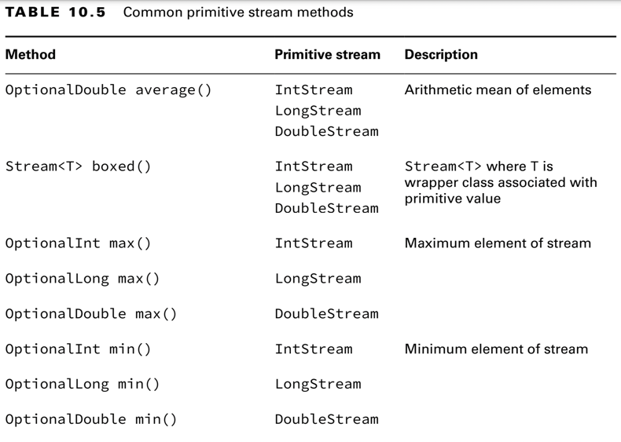
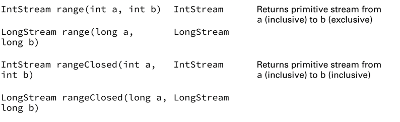
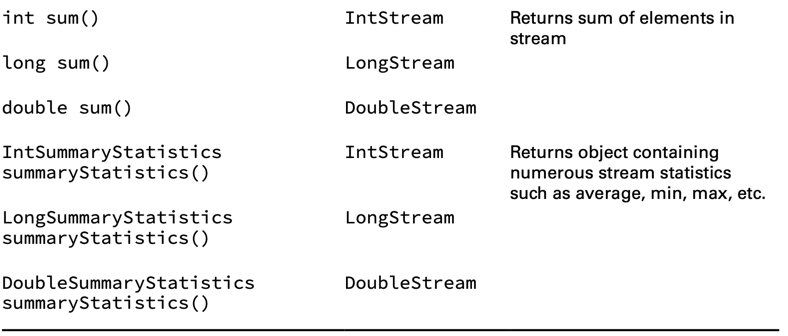

Table 10.5 shows some of the methods that are unique to primitive streams. 
Notice that we don’t include methods in the table like `empty()` that you already know from the `Stream` interface.

Some of the methods for creating a primitive stream are equivalent to how we created the source for a regular `Stream`. 
You can create an empty stream with this:
```java
DoubleStream empty = DoubleStream.empty();
```
Another way is to use the `of()` factory method from a single value or by using the varargs overload.
```java
DoubleStream varargs = DoubleStream.of(1.0, 1.1, 1.2);
```

This code does print out the numbers 1–5. However, it is a lot of code to do something so simple. 
Java provides a method that can generate a range of numbers

```java
IntStream range = IntStream.range(1, 6);
range.forEach(System.out::print); // 12345
```
If we wanted numbers 1–5, why did we pass 1–6? The first parameter to the `range()` method is inclusive, which means it includes the number. 
The second parameter to the `range()` method is exclusive, which means it stops right before that number. However, it still could be clearer. 
We want the numbers 1–5 inclusive. Luckily, there’s another method, `rangeClosed()`, which is inclusive on both parameters.
```java
IntStream rangeClosed = IntStream.rangeClosed(1, 5);
rangeClosed.forEach(System.out::print); // 12345
```

#### Mapping Streams
You do have to memorize **Table 10.6** and **Table 10.7**. It’s not as hard as it might seem.
There are patterns in the names if you remember a few rules. 

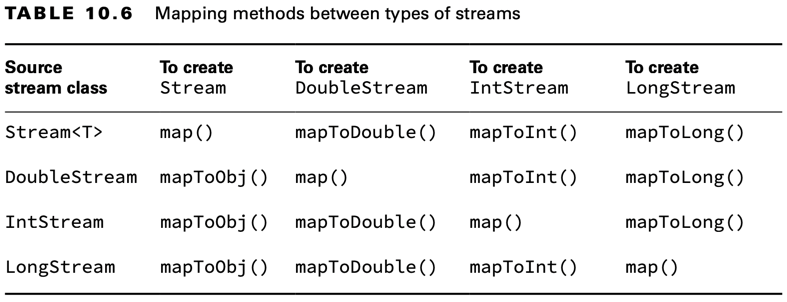
For **Table 10.6**, mapping to the same type you started with is just called `map()`. When returning an object stream, the method is `mapToObj()`. 
Beyond that, it’s the name of the primitive type in the map method name.

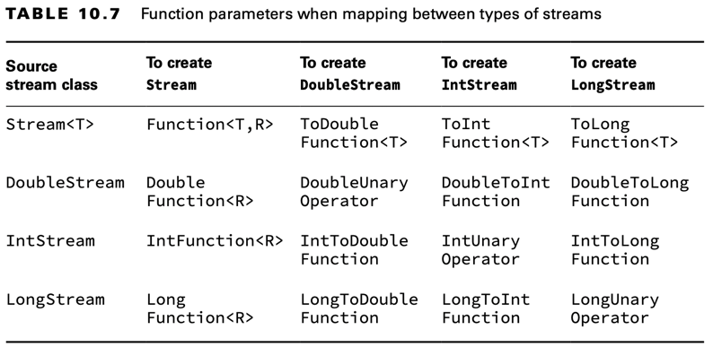
For **Table 10.7**, you can start by thinking about the source and target types. When
the target type is an object, you drop the `To` from the name. 
When the mapping is to the same type you started with, you use a unary operator instead of a function for the primitive streams.

We can use `flatMap()` approach on primitive streams as well. It works the same way as on a regular Stream, except the method name is different. Here’s an example:
```java
var integerList = new ArrayList<Integer>();
IntStream ints = integerList.stream()
 .flatMapToInt(x -> IntStream.of(x));
DoubleStream doubles = integerList.stream()
 .flatMapToDouble(x -> DoubleStream.of(x));
LongStream longs = integerList.stream()
 .flatMapToLong(x -> LongStream.of(x));
```

Additionally, you can create a `Stream` from a primitive stream. These methods show two ways of accomplishing this:
```java
private static Stream<Integer> mapping(IntStream stream) {
  return stream.mapToObj(x -> x);
}
private static Stream<Integer> boxing(IntStream stream) {
  return stream.boxed();
}
```
The first one uses the `mapToObj()` method we saw earlier. The second one is more succinct. 
It does not require a mapping function because all it does is autobox each primitive to the corresponding wrapper object. 
The `boxed()` method exists on all three types of primitive streams.

#### Using Optional with Primitive Streams

```java
var stream = IntStream.rangeClosed(1,10);
OptionalDouble optional = stream.average();

optional.ifPresent(System.out::println); // 5.5
System.out.println(optional.getAsDouble()); // 5.5
System.out.println(optional.orElseGet(() -> Double.NaN)); // 5.5
```

The return type is not the Optional you have become accustomed to using. It is a new type called `OptionalDouble`.
Why do we have a separate type, you might wonder? Why not just use `Optional<Double>`? 
The difference is that `OptionalDouble` is for a primitive and `Optional<Double>` is for the `Double` wrapper class. 
Working with the primitive optional class looks similar to working with the `Optional` class itself.

The only noticeable difference is that we called `getAsDouble()` rather than `get()`.
This makes it clear that we are working with a primitive. Also, `orElseGet()` takes a `DoubleSupplier` instead of a `Supplier`

As with the primitive streams, there are three type-specific classes for primitives.
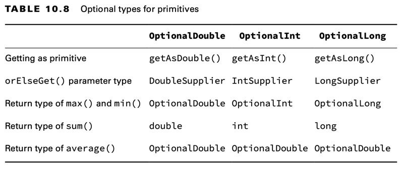

```java
5: LongStream longs = LongStream.of(5, 10);
6: long sum = longs.sum();
7: System.out.println(sum); // 15
8: DoubleStream doubles = DoubleStream.generate(() -> Math.PI);
9: OptionalDouble min = doubles.min(); // runs infinitely
```

#### Summarizing Statistics
We can’t run two terminal operations against the same stream. 
Luckily, this is a common problem, and the primitive streams solve it for us with summary statistics. 
**Statistic** is just a big word for a number that was calculated from data.

```java
private static int range(IntStream ints) {
  IntSummaryStatistics stats = ints.summaryStatistics();
  if (stats.getCount() == 0) throw new RuntimeException();
  return stats.getMax()-stats.getMin();
}
```

Summary statistics include the following:
- `getCount()`: Returns a `long` representing the number of values.
- `getAverage()`: Returns a `double` representing the average. If the stream is empty, returns 0.
- `getSum()`: Returns the sum as a `double` for `DoubleSummaryStream` and long for`IntSummaryStream` and `LongSummaryStream`.
- `getMin()`: Returns the smallest number (minimum) as a `double`, `int`, or `long`, depending on the type of the stream. If the stream is empty, returns the largest numeric value based on the type.
- `getMax()`: Returns the largest number (maximum) as a `double`, `int`, or `long` depending on the type of the stream. If the stream is empty, returns the smallest numeric value based on the type.

### 10.7 Working with Advanced Stream Pipeline Concepts

#### Using a Spliterator
The characteristics of a `Spliterator` depend on the underlying data source. A `Collection` data source is a basic `Spliterator`. 
By contrast, when using a `Stream` data source, the `Spliterator` can be parallel or even infinite. 
The `Stream` itself is executed lazily rather than when the `Spliterator` is created.

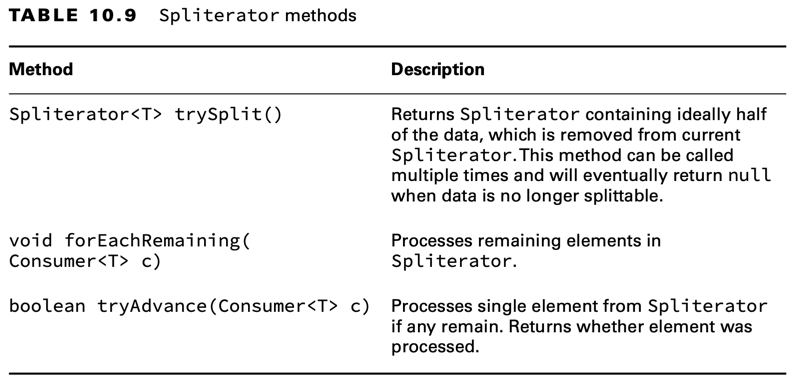

```java
12: var stream = List.of("bird-", "bunny-", "cat-", "dog-", "fish-", "lamb-", "mouse-");
14: Spliterator<String> originalBagOfFood = stream.spliterator();
15: Spliterator<String> emmasBag = originalBagOfFood.trySplit();
16: emmasBag.forEachRemaining(System.out::print); // bird-bunny-cat17:
18: Spliterator<String> jillsBag = originalBagOfFood.trySplit();
19: jillsBag.tryAdvance(System.out::print); // dog20: jillsBag.forEachRemaining(System.out::print); // fish21:
22: originalBagOfFood.forEachRemaining(System.out::print); // lamb-mouse
```

#### Collecting Results
- These collectors are available via static methods on the `Collectors` class
- It is important to pass the `Collector` to the collect method. It exists to help collect elements. A `Collector` doesn’t do anything on its own.
- The exam creators like asking about `groupingBy()` and `partitioningBy()`
- Returning the same value passed into a lambda is a common operation, so Java provides a method for it. You can rewrite `s -> s` as `Function.identity()`.
- The `groupingBy()` collector tells `collect()` that it should group all the elements of the stream into a `Map`.
  The function determines the keys in the `Map`. Each value in the `Map` is a `List` of all entries that match that key.
- Note that the function you call in `groupingBy()` cannot return null. It does not allow null keys.
- Partitioning is a special case of grouping. With partitioning, there are only two possible groups: `true` and `false`. Partitioning is like splitting a list into two parts.

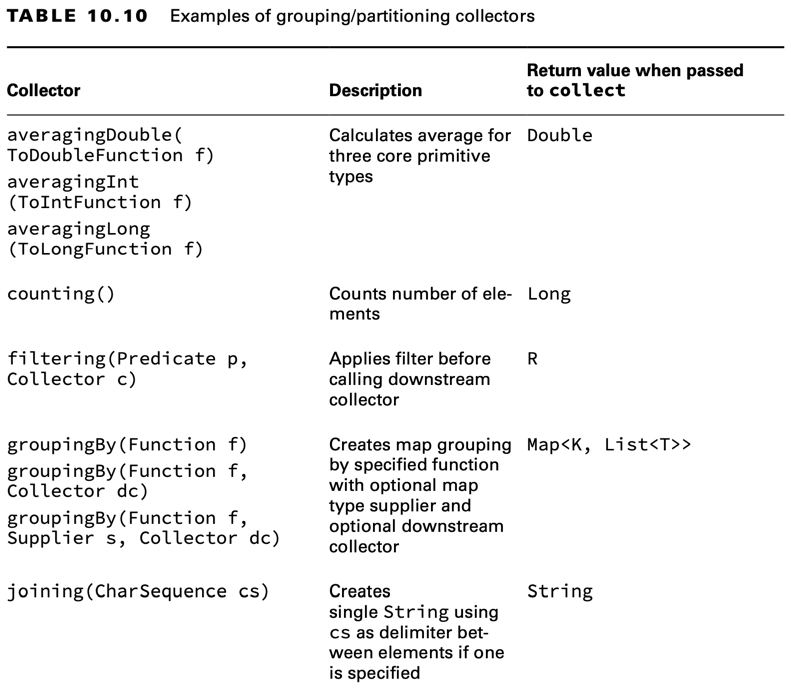
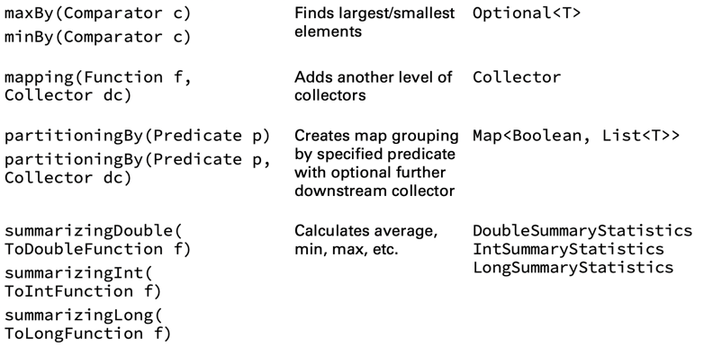
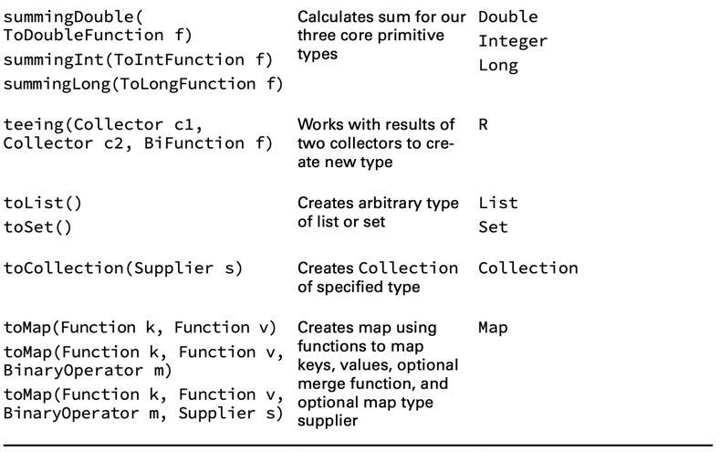

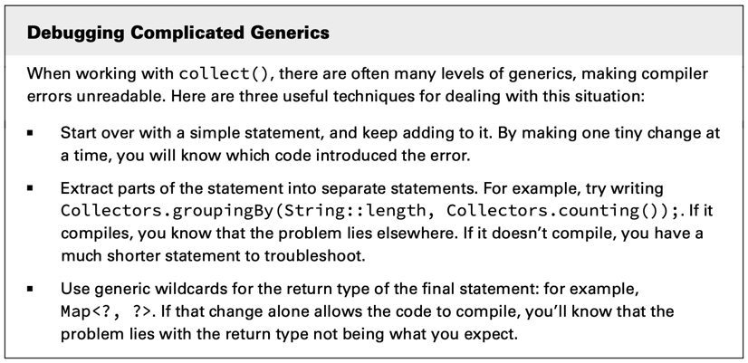

#### Mapping
- there is a `mapping()` collector that lets us go down a level and add another collector.
- `mapping()` takes two parameters: the function for the value and how to group it further

```java
var ohMy = Stream.of("lions", "tigers", "bears");
Map<Integer, Optional<Character>> map = ohMy.collect(
 Collectors.groupingBy(
 String::length,
 Collectors.mapping(
 s -> s.charAt(0),
 Collectors.minBy((a, b) -> a - b))));
System.out.println(map); // {5=Optional[b], 6=Optional[t]}
```

You might see collectors used with a static import to make the code shorter. 
The exam might even use `var` for the return value and less indentation than we used. This means that you might see something like this:

```java
var ohMy = Stream.of("lions", "tigers", "bears");
var map = ohMy.collect(groupingBy(String::length,
 mapping(s -> s.charAt(0), minBy((a, b) -> a - b))));
System.out.println(map); // {5=Optional[b], 6=Optional[t]}
```

#### Teeing Collectors
- you can use `teeing()` to return multiple values of your own

First, define the return type. We use a record here:
```java
record Separations(String spaceSeparated, String commaSeparated) {}
```

Now we write the stream. As you read, pay attention to the number of `Collectors`:
```java
var list = List.of("x", "y", "z");
Separations result = list.stream()
.collect(Collectors.teeing(
Collectors.joining(" "),
Collectors.joining(","),
(s, c) -> new Separations(s, c)));
System.out.println(result);
```

When executed, the code prints the following:
```java
Separations[spaceSeparated=x y z, commaSeparated=x,y,z]
```
There are three `Collectors` in this code. Two of them are for `joining()` and produce the values we want to return. 
The third is `teeing()`, which combines the results into the single object we want to return.


## 11. Exceptions and Localization

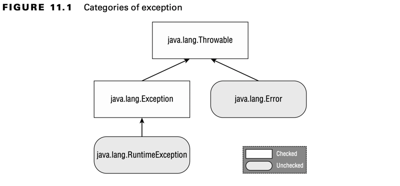

### 11.1 Understanding Exceptions
- Java has a `Throwable` class for all objects that represent these events

#### Checked exception
- an exception that must be declared or handled by the application code where it is thrown
- checked exceptions all inherit `Exception` but not `RuntimeException`
- include any class that inherits `Throwable` but not `Error` or `RuntimeException`, such as a class that directly extends `Throwable`.
- For the exam, you just need to know about checked exceptions that extend `Exception`

#### Unchecked exception
- any exception that does not need to be declared or handled by the application code where it is thrown.
- are often referred to as runtime exceptions, unchecked exceptions include any class that inherits `RuntimeException` or `Error`.

#### Error and Throwable
- `Error` means something went so horribly wrong that your program should not attempt to recover from it.
- These are abnormal conditions that you aren’t likely to encounter and cannot recover from
- For the exam, the only thing you need to know about `Throwable` is that it’s the parent class of all exceptions, including the `Error` class.

Be sure to closely study everything in Table 11.1. For the exam, remember that a `Throwable` is either an `Exception` or an `Error`. 
You should not catch `Throwable` directly in your code

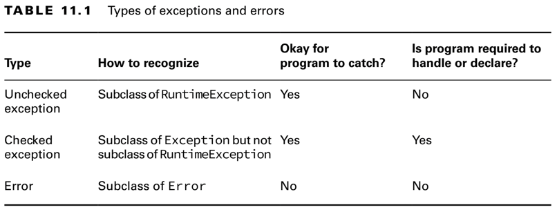

On the exam, some questions have a choice about not compiling and about throwing an exception. 
Pay special attention to code that calls a method on a null reference or that references an invalid array or List index. 
If you spot this, you know the correct answer is that the code throws an exception at runtime.

Anytime you see `throw` or `throws` on the exam, make sure the correct one is being used.
The throw keyword is used as a statement inside a code block to throw a new exception
or rethrow an existing exception, while the throws keyword is used only at the end of a method declaration to indicate what exceptions it supports.

When you see a checked exception declared inside a catch block on the exam, 
make sure the code in the associated try block is capable of throwing the exception or a subclass of the exception. 
If not, the code is unreachable and does not compile. Remember that this rule does not extend to
unchecked exceptions or exceptions declared in a method signature.

```java
class NoMoreCarrotsException extends Exception {}

public class Bunny { 
  public static void main(String[] args) {
    eatCarrot(); // DOES NOT COMPILE
  }
  private static void eatCarrot() throws NoMoreCarrotsException {}
}
```

```java
public void bad() {
  try {
    eatCarrot();
  } catch (NoMoreCarrotsException e) { // DOES NOT COMPILE
    System.out.print("sad rabbit");
  }
}

private void eatCarrot() {}
```

An overridden method may not declare any new or broader checked exceptions than the method it inherits. 
For example, this code isn’t allowed:
```java
class CanNotHopException extends Exception {}

class Hopper { 
  public void hop() {}
}

class Bunny extends Hopper { 
  public void hop() throws CanNotHopException {} // DOES NOT COMPILE
}
```

An overridden method in a subclass is allowed to declare fewer exceptions than the superclass or interface. 
This is legal because callers are already handling them.
```java
class Hopper { 
  public void hop() throws CanNotHopException {}
}

class Bunny extends Hopper { 
  public void hop() {} // This is fine
}
```

### 11.2 Recognizing Exception Classes
- You need to recognize three groups of exception classes for the exam: `RuntimeException`, checked `Exception`, and `Error`
- you’ll need to recognize which type of an exception it is and whether it’s thrown by the Java Virtual Machine (JVM) or by a programmer

#### RuntimeException Classes
- `RuntimeException` and its subclasses are unchecked exceptions that don’t have to be handled or declared.
- They can be thrown by the programmer or the JVM

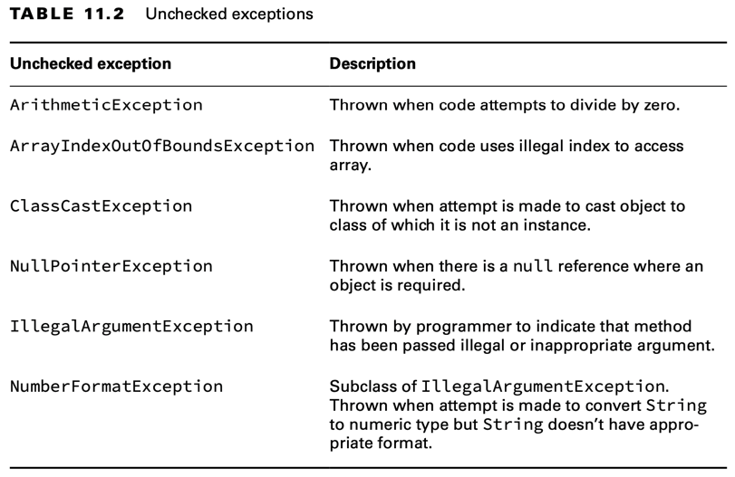

#### Checked Exception Classes
- Checked exceptions have `Exception` in their hierarchy but not `RuntimeException`.
- They must be handled or declared
- You also need to know that `FileNotFoundException` and `NotSerializableException` are subclasses of `IOException`

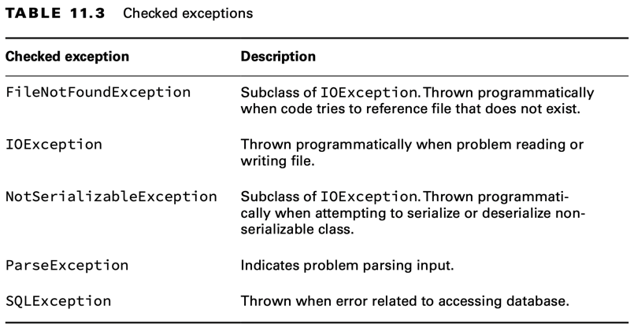

#### Error Classes
- Errors are unchecked exceptions that extend the **Error** class.
- They are thrown by the JVM and should not be handled or declared.
- For the exam, you just need to know that these errors are unchecked and the code is often unable to recover from them

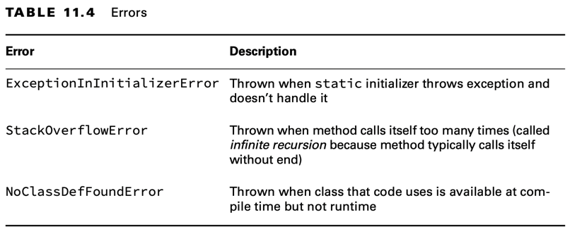

### 11.3 Handling Exceptions
For the exam, you may be given exception classes and need to understand how they function. Here’s how to tackle them. 
First, you must be able to recognize if the exception is a checked or an unchecked exception. 
Second, you need to determine whether any of the exceptions are subclasses of the others.

A rule exists for the order of the catch blocks. Java looks at them in the order they appear.
If it is impossible for one of the catch blocks to be executed, a compiler error about unreachable code occurs. 
For example, this happens when a superclass catch block appears before a subclass catch block. 
Remember, we warned you to pay attention to any subclass exceptions.

If the more specific `ExhibitClosedForLunch` exception is thrown, the first catch block runs. 
If not, Java checks whether the superclass `ExhibitClosed` exception is thrown and catches it. 
This time, the order of the catch blocks does matter. The reverse does not work.

```java
class AnimalsOutForAWalk extends RuntimeException {}
class ExhibitClosed extends RuntimeException {}
class ExhibitClosedForLunch extends ExhibitClosed {}

try {
  seeAnimal();
} catch (ExhibitClosedForLunch e) { // Subclass exception
  System.out.print("try back later");
} catch (ExhibitClosed e) { // Superclass exception
  System.out.print("not today");
}

try {
  seeAnimal();
} catch (ExhibitClosed e) {
  System.out.print("not today");
} catch (ExhibitClosedForLunch e) { // DOES NOT COMPILE
  System.out.print("try back later");
}
```

To review multiple catch blocks, remember that at most one catch block will run, and it will be the first catch block that can handle the exception. 
Also, remember that an exception defined by the catch statement is only in scope for that catch block.
```java
public void visitManatees() {
  try {
  } catch (NumberFormatException e1) {
  System.out.println(e1);
  } catch (IllegalArgumentException e2) {
  System.out.println(e1); // DOES NOT COMPILE
  }
}
```

#### Applying a Multi-catch Block
The exam might try to trick you with invalid syntax. Remember that the exceptions can
be listed in any order within the catch clause. However, the variable name must appear only once and at the end.
```java
catch(Exception1 e | Exception2 e | Exception3 e) // DOES NOT COMPILE
catch(Exception1 e1 | Exception2 e2 | Exception3 e3) // DOES NOT COMPILE
catch(Exception1 | Exception2 | Exception3 e)
```

Java intends multi-catch to be used for exceptions that aren’t related, and it prevents you
from specifying redundant types in a multi-catch
```java
try {
  throw new IOException();
} catch (FileNotFoundException | IOException p) {} // DOES NOT COMPILE
```
Specifying related exceptions in the multi-catch is redundant, and the compiler gives a
message such as this: `The exception FileNotFoundException is already caught by the alternative IOException`
The one difference between multicatch blocks and chaining catch blocks is that order does not matter for a multi-catch block within a single catch expression

#### Adding a finally Block
There are two paths through code with both a `catch` and a `finally`:
- If an exception is thrown, the finally block is run after the catch block. 
- If no exception is thrown, the finally block is run after the try block completes

The `catch` block is not required if `finally` is present. Following example is fine:
```java
try {
  fall();
} finally {
  System.out.println("all better");
}
```

There is one additional rule you should know for finally blocks. 
If a try statement with a finally block is entered, then the finally block will always be executed, regardless of whether the code completes successfully.

```java
12: int goHome() {
13:  try {
14:    // Optionally throw an exception here
15:    System.out.print("1");
16:    return -1;
17:  } catch (Exception e) {
18:    System.out.print("2");
19:    return -2;
20:  } finally {
21:    System.out.print("3");
22:    return -3;
23:  }
24: }
```
If an exception is not thrown on line 14, then line 15 will be executed, printing `1`. Before the method returns, though, the finally block is executed, printing `3`. 
If an exception is thrown, then lines 15 and 16 will be skipped and lines 17–19 will be executed, printing `2`, followed by `3` from the finally block.
While the first value printed may differ, the method always prints 3 last since it’s in the finally block.
What is the return value of the `goHome()` method? In this case, it’s always `-3`. Because the finally block is executed shortly before the method completes, 
it interrupts the return statement from inside both the try and catch blocks.
For the exam, you need to remember that a finally block will always be executed. That said, it may not complete successfully.

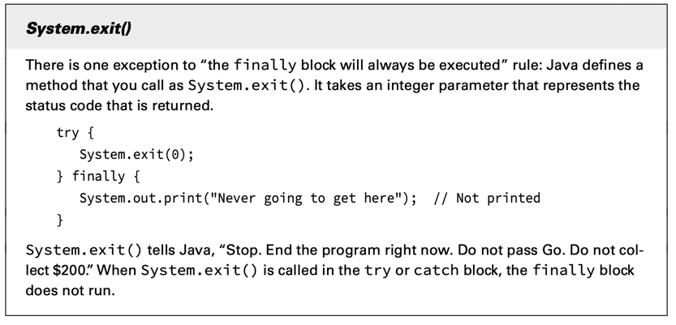

### 11.4 Automating Resource Management

#### Introducing Try-with-Resources
- This feature is also known as automatic resource management, because Java automatically takes care of the closing
- Behind the scenes, the compiler replaces a `try-with-resources` block with a `try` and `finally` block.
- We refer to this “hidden” finally block as an implicit finally block since it is created and used by the compiler automatically
- You can still create a programmer-defined finally block when using a `try-with-resources` statement; just be aware that the implicit one will be called first
- When multiple resources are opened, they are closed in the reverse of the order in which they were created
- For the exam, you need to know that the implicit `finally` block runs before any programmer-coded ones.
- Only classes that implement the `AutoCloseable` interface can be used in a try-with-resources statement.

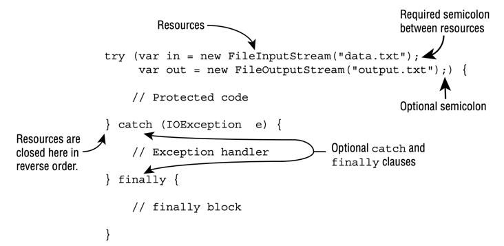
- Each resource must include the data type and be separated by a semicolon `;`. 
- You can declare a resource using `var` as the data type in a try-with-resources statement, since resources are local variables.

Inheriting `AutoCloseable` requires implementing a compatible `close()` method.
```java
interface AutoCloseable {
  public void close() throws Exception;
}
```

The resources created in the try clause are in scope only within the try block. 
This is another way to remember that the implicit finally runs before any catch/finally blocks that you code yourself. 
The implicit close has run already, and the resource is no longer available.

```java
3: try (Scanner s = new Scanner(System.in)) {
4:   s.nextLine();
5: } catch(Exception e) {
6:   s.nextInt(); // DOES NOT COMPILE
7: } finally {
8:   s.nextInt(); // DOES NOT COMPILE
9: }
```
The problem is that `Scanner` has gone out of scope at the end of the try clause. Lines 6 and 8 do not have access to it. 
This is a nice feature. You can’t accidentally use an object that has been closed.

#### Following Order of Operations
For the exam, make sure you understand why the method prints the statements in this order. 
Remember, the resources are closed in the reverse of the order in which they are
declared, and the implicit finally is executed before the programmer-defined finally

#### Applying Effectively Final
While resources are often created in the `try-with-resources` statement, it is possible to declare
them ahead of time, provided they are marked final or effectively final. The syntax uses the
resource name in place of the resource declaration, separated by a semicolon `;`.

**Remember, the test for effectively final is that if we insert the final keyword when the variable is declared, the code still compiles**
If you come across a question on the exam that uses a try-with-resources statement with a variable not declared in the try clause, make sure it is effectively final.

```java
31: var writer = Files.newBufferedWriter(path);
32: try (writer) { // DOES NOT COMPILE
33:   writer.append("Welcome to the zoo!");
34: }
35: writer = null;
```

#### Understanding Suppressed Exceptions
What happens if the try block also throws an exception?
When multiple exceptions are thrown, all but the first are called **suppressed exceptions**.
The idea is that Java treats the first exception as the primary one and tacks on any that come up while automatically closing

```java
1: public class JammedTurkeyCage implements AutoCloseable {
2:   public void close() throws IllegalStateException {
3:     throw new IllegalStateException("Cage door does not close");
4:   }
5:   public static void main(String[] args) {
6:     try (JammedTurkeyCage t = new JammedTurkeyCage()) {
7:       throw new IllegalStateException("Turkeys ran off");
8:     } catch (IllegalStateException e) {
9:       System.out.println("Caught: " + e.getMessage());
10:      for (Throwable t: e.getSuppressed()) 
11:        System.out.println("Suppressed: " + t.getMessage());
12:    }
13: }
```

Line 7 throws the primary exception. At this point, the try clause ends, and Java automatically calls the `close()` method. 
Line 3 of `JammedTurkeyCage` throws an `IllegalStateException`, which is added as a suppressed exception. Then line 8 catches the primary exception. 
Line 9 prints the message for the primary exception. Lines 10 and 11 iterate through any suppressed exceptions and print them. 
The program prints the following:
```
Caught: Turkeys ran off
Suppressed: Cage door does not close
```

Keep in mind that the catch block looks for matches on the primary exception.
```java
5: public static void main(String[] args) {
6:   try (JammedTurkeyCage t = new JammedTurkeyCage()) {
7:     throw new RuntimeException("Turkeys ran off");
8:   } catch (IllegalStateException e) {
9:     System.out.println("caught: " + e.getMessage());
10:  }
11: }
```
Line 7 again throws the primary exception. Java calls the `close()` method and adds a suppressed exception. 
Line 8 would catch the `IllegalStateException`. However, we don’t have one of those. The primary exception is a `RuntimeException`. 
Since this does not match the catch clause, the exception is thrown to the caller. Eventually, the `main()` method would output something like the following:
```
Exception in thread "main" java.lang.RuntimeException: Turkeys ran off
 at JammedTurkeyCage.main(JammedTurkeyCage.java:7)
 Suppressed: java.lang.IllegalStateException:
 Cage door does not close
 at JammedTurkeyCage.close(JammedTurkeyCage.java:3)
 at JammedTurkeyCage.main(JammedTurkeyCage.java:8)
```
Java remembers the suppressed exceptions that go with a primary exception even if we don’t handle them in the code.

If more than two resources throw an exception, the first one to be thrown becomes the primary exception, and the rest are grouped as suppressed exceptions. 
And since resources are closed in the reverse of the order in which they are declared, the primary exception will be on the last declared resource that throws an exception.
Keep in mind that suppressed exceptions apply only to exceptions thrown in the try clause.

### 11.5 Formatting Values

```java
public final String format(double number)
public final String format(long number)
```

Since `NumberFormat` is an interface, we need the concrete `DecimalFormat` class to use it. It includes a constructor that takes a pattern `String`:
```java
public DecimalFormat(String pattern)
```
The patterns can get quite complex. But luckily, for the exam you only need to know about two formatting characters, shown in Table 11.5.
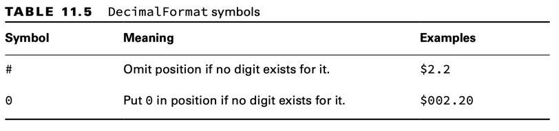
When working with a custom number formatter, the `0` symbol displays the digit as `0`, 
even if it’s not present, while the `#` symbol omits the digit from the start or end of the `String` if it is not present.

```java
12: double d = 1234.567;
13: NumberFormat f1 = new DecimalFormat("###,###,###.0");
14: System.out.println(f1.format(d)); // 1,234.6
15:
16: NumberFormat f2 = new DecimalFormat("000,000,000.00000");
17: System.out.println(f2.format(d)); // 000,001,234.56700
18:
19: NumberFormat f3 = new DecimalFormat("Your Balance $#,###,###.##");
20: System.out.println(f3.format(d)); // Your Balance $1,234.57
```

For the exam, you should be familiar enough with the various symbols that you can look at a date/time `String` and have a good idea of what the output will be. 
Table 11.6 includes the symbols you should be familiar with for the exam
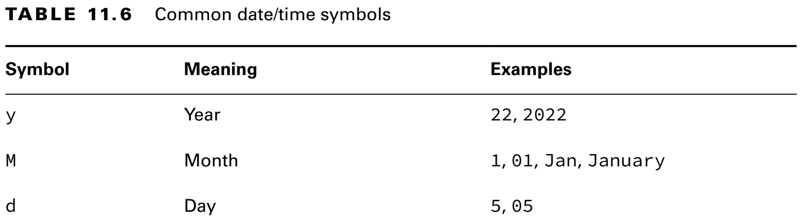
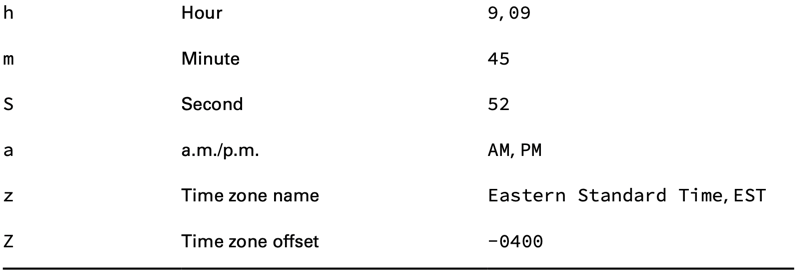

```java
var dt = LocalDateTime.of(2022, Month.OCTOBER, 20, 6, 15, 30);

var formatter1 = DateTimeFormatter.ofPattern("MM/dd/yyyy hh:mm:ss");
System.out.println(dt.format(formatter1)); // 10/20/2022 06:15:30

var formatter2 = DateTimeFormatter.ofPattern("MM_yyyy_-_dd");
System.out.println(dt.format(formatter2)); // 10_2022_-_20

var formatter3 = DateTimeFormatter.ofPattern("h:mm z");
System.out.println(dt.format(formatter3)); // DateTimeException
```

- The first example prints the date, with the month before the day, followed by the time.
- The second example prints the date in a weird format with extra characters that are just displayed as part of the output.
- The third example throws an exception at runtime because the underlying `LocalDateTime` does not have a time zone specified. 
  If `ZonedDateTime` were used instead, the code would complete successfully and print something like 06:15 EDT, depending on the time zone.

As you saw in the previous example, you need to make sure the format `String` is compatible with the underlying date/time type. 
Table 11.7 shows which symbols you can use with each of the date/time objects.

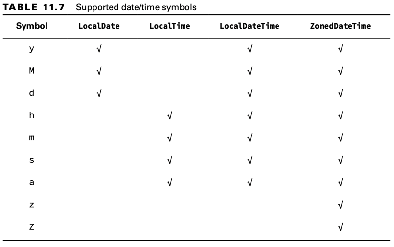

The date/time classes contain a `format()` method that will take a formatter, while the formatter classes contain a `format()` method that will take a date/time value. 
The result is that either of the following is acceptable:
```java
var dateTime = LocalDateTime.of(2022, Month.OCTOBER, 20, 6, 15, 30);
var formatter = DateTimeFormatter.ofPattern("MM/dd/yyyy hh:mm:ss");
System.out.println(dateTime.format(formatter)); // 10/20/2022 06:15:30
System.out.println(formatter.format(dateTime)); // 10/20/2022 06:15:30
```
These statements print the same value at runtime. Which syntax you use is up to you.

Adding Custom Text Values
```java
var f = DateTimeFormatter.ofPattern("MMMM dd, yyyy 'at' hh:mm");
System.out.println(dt.format(f)); // October 20, 2022 at 06:15
```
When creating a custom formatter, any nonsymbol code must be properly escaped using pairs of single quotes `'`

### 11.6 Supporting Internationalization and Localization
**Internationalization** is the process of designing your program so it can be adapted. 
This involves placing strings in a properties file and ensuring that the proper data formatters are used. 

**Localization** means supporting multiple locales or geographic regions. You can think of a locale as being like a language and country pairing. 
Localization includes translating strings to different languages. It also includes outputting dates and numbers in the correct format for that locale.

Notice the format:
First comes the lowercase language code. The language is always required. 
Then comes an underscore followed by the uppercase country code. The country is optional. 
Figure 11.6 shows the two formats for `Locale` objects that you are expected to remember.
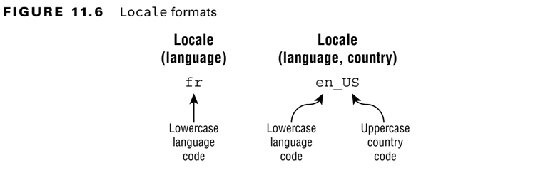

As practice, make sure that you understand why each of these Locale identifiers is invalid:
- `US` // Cannot have country without language
- `enUS` // Missing underscore
- `US_en` // The country and language are reversed
- `EN` // Language must be lowercase 

The corrected versions are `en` and `en_US`.

As a developer, you often need to write code that selects a locale other than the default one. There are three common ways of doing this:
1) use the built-in constants in the `Locale` class, available for some common locales,
  ```java
  System.out.println(Locale.GERMAN); // de
  System.out.println(Locale.GERMANY); // de_DE
  ```
2) use the constructors to create a new object
  ```java
  System.out.println(new Locale("fr")); // fr
  System.out.println(new Locale("hi", "IN")); // hi_IN
  ```
3) builder design pattern
  ```java
  Locale l1 = new Locale.Builder()
        .setLanguage("en")
        .setRegion("US")
        .build();
  ```

#### Localizing Numbers
The first step to formatting or parsing data is the same: obtain an instance of a `NumberFormat`. Table 11.8 shows the available factory methods.
Once you have the `NumberFormat` instance, you can call `format()` to turn a number into a`String`, or you can use `parse()` to turn a `String` into a number

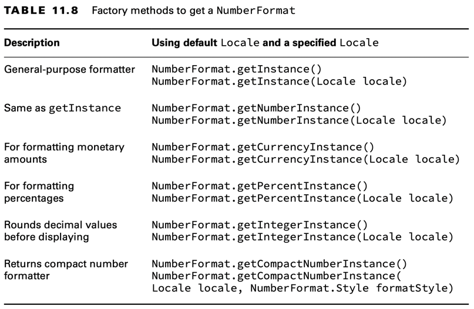

When we format data or currency, we convert it from a structured object or primitive value into a `String`. 
`The NumberFormat.format()` method formats the given number based on the locale associated with the `NumberFormat` object.

```java
int attendeesPerYear = 3_200_000;
int attendeesPerMonth = attendeesPerYear / 12;
var us = NumberFormat.getInstance(Locale.US);
System.out.println(us.format(attendeesPerMonth)); // 266,666

double price = 48;
var myLocale = NumberFormat.getCurrencyInstance();
System.out.println(myLocale.format(price));  // $48.00
```

When we parse data, we convert it from a String to a structured object or primitive value. 
The `NumberFormat.parse()` method accomplishes this and takes the locale into consideration.
```java
String s = "40.45";
var en = NumberFormat.getInstance(Locale.US);
System.out.println(en.parse(s)); // 40.45
var fr = NumberFormat.getInstance(Locale.FRANCE);
System.out.println(fr.parse(s)); // 40
```

#### Formatting with CompactNumberFormat
The second class that inherits `NumberFormat` that you need to know for the exam is `CompactNumberFormat`.
`CompactNumberFormat` is similar to `DecimalFormat`, but it is designed to be used in places where print space may be limited.

```java
var formatters = Stream.of(
 NumberFormat.getCompactNumberInstance(),
 NumberFormat.getCompactNumberInstance(Locale.getDefault(), Style.SHORT),
 NumberFormat.getCompactNumberInstance(Locale.getDefault(), Style.LONG),
 NumberFormat.getNumberInstance());
```

The following summarizes the rules for CompactNumberFormat:
- First it determines the highest range for the number, such as thousand (K), million (M), billion (B), or trillion (T).
- It then returns up to the first three digits of that range, rounding the last digit as needed.
- Finally, it prints an identifier. If `SHORT` is used, a symbol is returned. If `LONG` is used, a space followed by a word is returned.

#### Localizing Dates
Like numbers, date formats can vary by locale. Table 11.9 shows methods used to retrieve an
instance of a DateTimeFormatter using the default locale.


When you call `Locale.setDefault()` with a locale, several display and formatting options are internally selected. 
If you require finer-grained control of the default locale, Java subdivides the underlying formatting options into distinct categories with the `Locale.Category` enum.

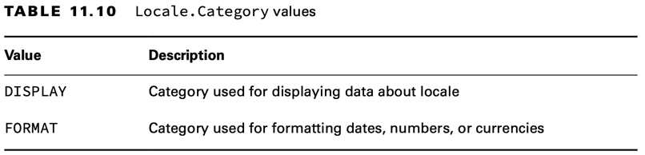

```java
Locale.setDefault(new Locale("en", "US"));

var spain = new Locale("es", "ES");
Locale.setDefault(Category.DISPLAY, spain);
```

### 11.7 Loading Properties with Resource Bundles
A resource bundle contains the locale-specific objects to be used by a program. It is like a map with keys and values. 
The resource bundle is commonly stored in a properties file. A properties file is a text file in a specific format with key/value pairs.

The filenames match the name of our resource bundle, `Zoo`. They are then followed by an underscore `_`, target locale, and `.properties` file extension.
```properties
Zoo_en.properties
hello=Hello
open=The zoo is open
```

```java
var locale = new Locale("en", "US");
var rb = ResourceBundle.getBundle("Zoo", locale);
System.out.println(rb.getString("hello") + ", " + rb.getString("open"));  // // Hello, The zoo is open
```

Since a resource bundle contains key/value pairs, you can even loop through them to list all of the pairs. 
The `ResourceBundle` class provides a `keySet()` method to get a set of all keys.
```java
var us = new Locale("en", "US");
ResourceBundle rb = ResourceBundle.getBundle("Zoo", us);
rb.keySet().stream()
 .map(k -> k + ": " + rb.getString(k))
 .forEach(System.out::println);
```

In your own applications, though, the resource bundles can be stored in a variety of places.
While they can be stored inside the JAR that uses them, doing so is not recommended. 
This approach forces you to rebuild the application JAR any time some text changes. 
One of the benefits of using resource bundles is to decouple the application code from the localespecific text data.
Another approach is to have all of the properties files in a separate properties JAR or folder and load them in the classpath at runtime. 
In this manner, a new language can be added without changing the application JAR.

#### Picking a Resource Bundle
There are two methods for obtaining a resource bundle that you should be familiar with for the exam.
```java
ResourceBundle.getBundle("name");
ResourceBundle.getBundle("name", locale);
```

Java handles the logic of picking the best available resource bundle for a given key. It tries to find the most specific value. 
Table 11.11 shows what Java goes through when asked for resource bundle `Zoo` with the locale `new Locale("fr", "FR")` when the default locale is U.S. English.
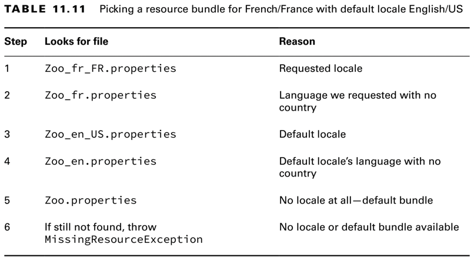

As another way of remembering the order of Table 11.11, learn these steps:
1. Look for the resource bundle for the requested locale, followed by the one for the default locale.
2. For each locale, check the language/country, followed by just the language.
3. Use the default resource bundle if no matching locale can be found.

What is the maximum number of files that Java would need to consider in order to find the appropriate resource bundle with the following code?
```java
Locale.setDefault(new Locale("hi"));
ResourceBundle rb = ResourceBundle.getBundle("Zoo", new Locale("en"));
```

The answer is three. They are listed here:
1. `Zoo_en.properties`
2. `Zoo_hi.properties`
3. `Zoo.properties`

The requested locale is en, so we start with that. Since the en locale does not contain a country, we move on to the default locale, hi. 
Again, there’s no country, so we end with the default bundle

#### Selecting Resource Bundle Values
Java isn’t required to get all of the keys from the same resource bundle. It can get them from any parent of the matching resource bundle. 
A parent resource bundle in the hierarchy just removes components of the name until it gets to the top. Table 11.12 shows how to do this.
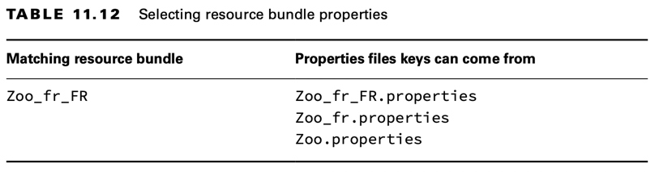

Once a resource bundle has been selected, only properties along a single hierarchy will be used.
What does this mean, exactly? Assume the requested locale is `fr_FR` and the default is `en_US`. 
The JVM will provide data from `en_US` only if there is no matching `fr_FR` or `fr` resource bundle. 
If it finds a `fr_FR` or `fr` resource bundle, then only those bundles, along with the default bundle, will be used.

#### Example 
```properties
Zoo.properties
name=Vancouver Zoo

Zoo_en.properties
hello=Hello
open=is open

Zoo_en_US.properties
name=The Zoo

Zoo_en_CA.properties
visitors=Canada visitors
```

```java
11: Locale.setDefault(new Locale("en", "US"));
12: Locale locale = new Locale("en", "CA");
13: ResourceBundle rb = ResourceBundle.getBundle("Zoo", locale);
14: System.out.print(rb.getString("hello"));
15: System.out.print(". ");
16: System.out.print(rb.getString("name"));
17: System.out.print(" ");
18: System.out.print(rb.getString("open"));
19: System.out.print(" ");
20: System.out.print(rb.getString("visitors"));
```

The program prints the following:  
`Hello. Vancouver Zoo is open Canada visitors`

The default locale is **en_US**, and the requested locale is **en_CA**. First, Java goes through the available resource bundles to find a match. 
It finds one right away with `Zoo_en_CA.properties`. This means the default locale of en_US is irrelevant.
Line 14 doesn’t find a match for the key hello in `Zoo_en_CA.properties`, so it goes up the hierarchy to `Zoo_en.properties`.
Line 16 doesn’t find a match for name in either of the first two properties files, so it has to go all the way to the top of the hierarchy to `Zoo.properties`.
Line 18 has the same experience as line 14, using `Zoo_en.properties`. Finally, line 20 has an easier job of it and finds a matching key in `Zoo_en_CA.properties`
In this example, only three properties files were used: `Zoo_en_CA.properties`,`Zoo_en.properties`, and `Zoo.properties`. 
Even when the property wasn’t found in `en_CA` or en resource bundles, the program preferred using `Zoo.properties` (the default resource bundle) rather than `Zoo_en_US.properties` (the default locale).

What if a property is not found in any resource bundle? Then an exception is thrown. For example, attempting to call `rb.getString("close")` in the previous program results in a `MissingResourceException` at runtime.

#### Formatting Messages
In Java, we can read in the value normally. After that, we can run it through the `MessageFormat` class to substitute the parameters. 
The second parameter to `format()` is a `vararg`, allowing you to specify any number of input values

```properties
helloByName=Hello, {0} and {1}
```

```java
String format = rb.getString("helloByName");
System.out.print(MessageFormat.format(format, "Tammy", "Henry")); // Hello, Tammy and Henry
```

#### Using the Properties Class

If a key were passed that actually existed, both statements would print it. This is commonly referred to as providing a default, or a backup value, for a missing key.

```java
var props = new Properties();
props.setProperty("name", "Our zoo");
props.setProperty("open", "10am");

System.out.println(props.getProperty("camel")); // null
System.out.println(props.getProperty("camel", "Bob")); // Bob
```

The `Properties` class also includes a `get()` method, but only `getProperty()` allows for a default value.
For example, the following call is invalid since get() takes only a single parameter:
```java
props.get("open"); // 10am
props.get("open", "The zoo will be open soon"); // DOES NOT COMPILE
```

## 12 MODULES

### 12.1 Exploring a Module

- A `JAR` (Java Archive) is a `ZIP` file with some extra information, and the extension is `.jar`.
- A module is a group of one or more packages plus a special file called module-info.java

There are a few key differences between a module declaration and a regular Java class declaration:
- The `module-info.java` file must be in the root directory of your module. Regular Java classes should be in packages
- The module declaration must use the keyword `module` instead of `class`, `interface`, or `enum`
- The module name follows the naming rules for package names. It often includes periods `.` in its name. 
  Regular class and package names are not allowed to have dashes `-`. Module names follow the same rule

Before we can run modular code, we need to compile it:
```
javac --module-path mods
 -d feeding
 feeding/zoo/animal/feeding/*.java feeding/module-info.java
```
- the `-d` option specifies the directory to place the class files in
- The end of the command is a list of the `.java` files to compile. You can list the files individually or use a
  wildcard for all `.java` files in a subdirectory
- The new part is `module-path`. This option indicates the location of any custom module files.
  You can think of `module-path` as replacing the `classpath` option when you are working on a modular program.
  The syntax `--module-path` and `-p` are equivalent

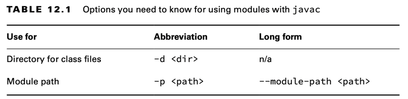

Suppose that we have module named `book.module`. Inside that module is a package named `com.sybex`, which has a class named `OCP` with a `main()` method.
Figure 12.5 shows the syntax for running a module. Pay special attention to the`book.module/com.sybex.OCP` part. 
It is important to remember that you specify the module name followed by a slash `/` followed by the fully qualified class name.

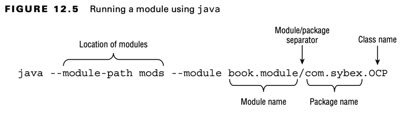

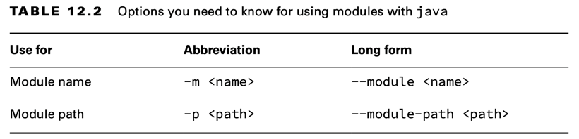

The `exports` directive is used to indicate that a module intends for those packages to be used by Java code outside the module. 
As you might expect, without an `exports` directive, the module is only available to be run from the command line on its own. 
In the following example, we export one package:
```java
1: module zoo.animal.care {
2:   exports zoo.animal.care.medical;
3:   requires zoo.animal.feeding;
4: }
```
Line 1 specifies the name of the module. Line 2 lists the package we are exporting so it can be used by other modules
On line 3, we see a new directive. The `requires` statement specifies that a module is needed. 
The zoo.animal.care module depends on the zoo.animal.feeding module.


#### Exporting a Package

It’s also possible to export a package to a specific module.
From the `zoo.staff` module, nothing has changed. However, no other modules would be allowed to access that package
```java
module zoo.animal.talks {
 exports zoo.animal.talks.content to zoo.staff;
 exports zoo.animal.talks.media;
 exports zoo.animal.talks.schedule;
 requires zoo.animal.feeding;
 requires zoo.animal.care;
}
```

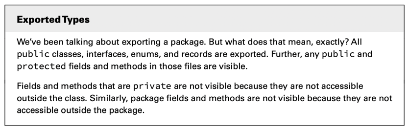

The exports directive essentially gives us more levels of access control. Table 12.3 lists the full access control options

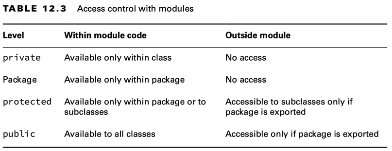


#### Requiring a Module Transitively
There’s also a `requires transitive moduleName`, which means that any module that requires this module will also depend on `moduleName`.

```java
module zoo.animal.talks {
  exports zoo.animal.talks.content to zoo.staff;
  exports zoo.animal.talks.media;
  exports zoo.animal.talks.schedule;
  // no longer needed requires zoo.animal.feeding;
  // no longer needed requires zoo.animal.care;
  requires transitive zoo.animal.care;
}
```

Java doesn’t allow you to repeat the same module in a requires clause. It is redundant and most likely an error in coding. 
Keep in mind that requires transitive is like requires plus some extra behavior.
```java
module bad.module { // WRONG!
 requires zoo.animal.talks;
 requires transitive zoo.animal.talks;
}
```

#### Opening a Package
Java allows callers to inspect and call code at runtime with a technique called reflection.
The `opens` directive is used to enable reflection of a package within a module.

Since reflection can be dangerous, the module system requires developers to explicitly allow reflection 
in the module declaration if they want calling modules to be allowed to use it.
```java
module zoo.animal.talks {
 opens zoo.animal.talks.schedule;
 opens zoo.animal.talks.media to zoo.staff;
}
```
The first example allows any module using this one to use reflection. The second example only gives that privilege to the zoo.staff module.

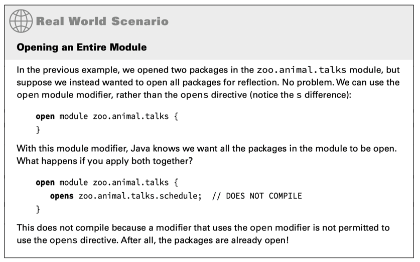

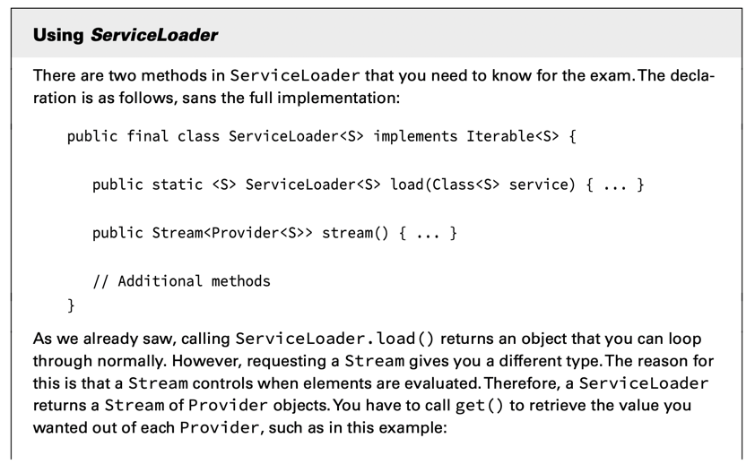

```java
ServiceLoader.load(Tour.class)
 .stream()
 .map(Provider::get)
 .mapToInt(Tour::length)
 .max()
 .ifPresent(System.out::println);
```

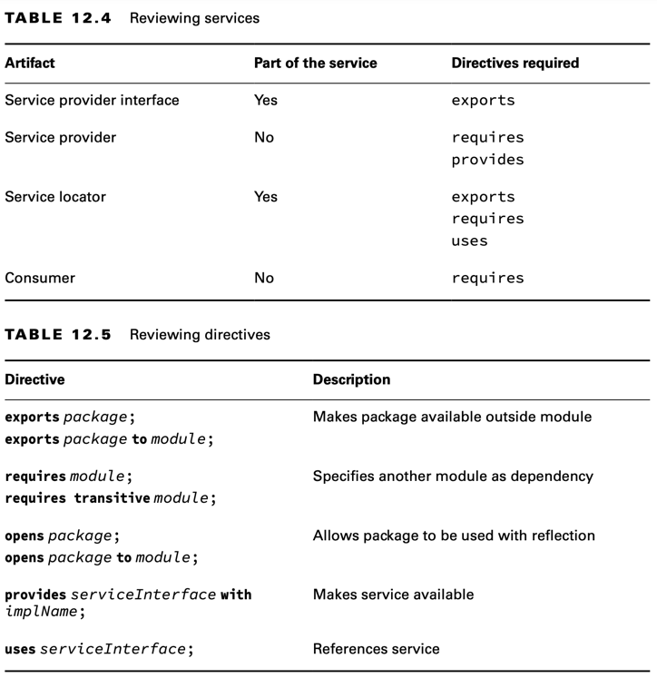

### 12.2 Discovering Modules
The most important module to know is `java.base`. It contains most of the packages you have been learning about for the exam. 
In fact, it is so important that you don’t even have to use the `requires` directive; it is available to all modular applications. 
Your `module-info.java` file will still compile if you explicitly require `java.base`. However, it is redundant, so it’s better to omit it.

For the exam, you need to know that module names begin with `java` for APIs you are likely to use and with `jdk` for APIs that are specific to the JDK. 
Table 12.7 lists all the modules that begin with `java`.

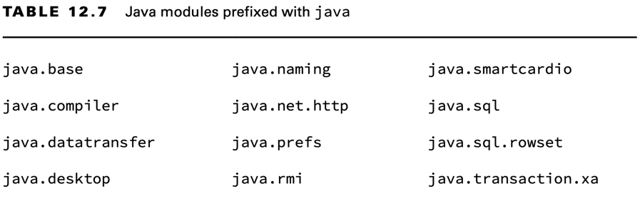
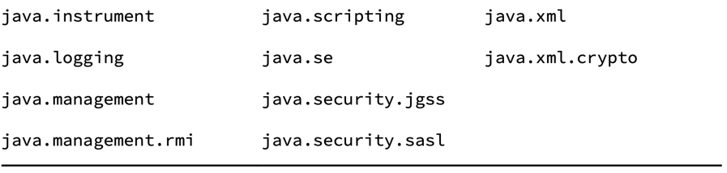

Table 12.8 lists all the modules that begin with `jdk`. We recommend reviewing this right before the exam to increase the chances of them sounding familiar. 
Remember that you don’t have to memorize them.
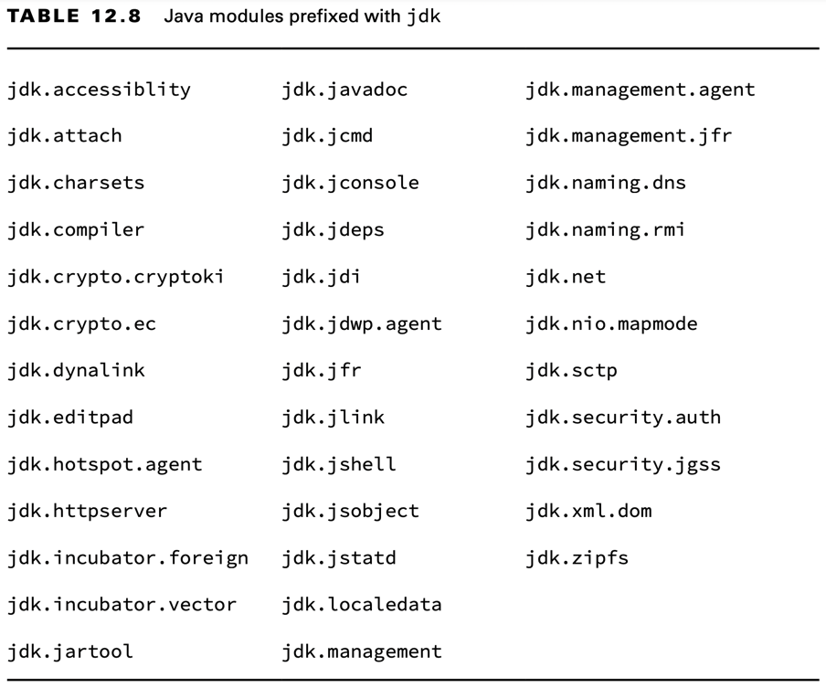


#### Getting Details with java
The `java` command has three module-related options. One describes a module, another lists the available modules, and the third shows the module resolution logic.

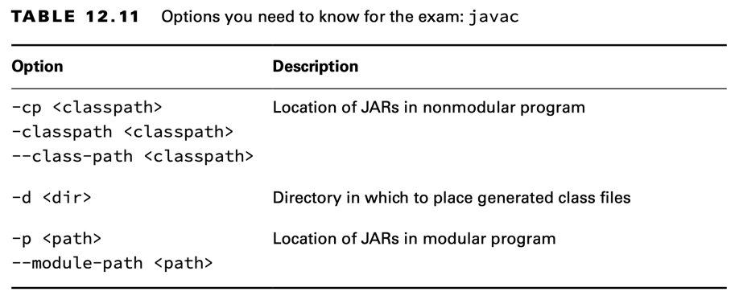
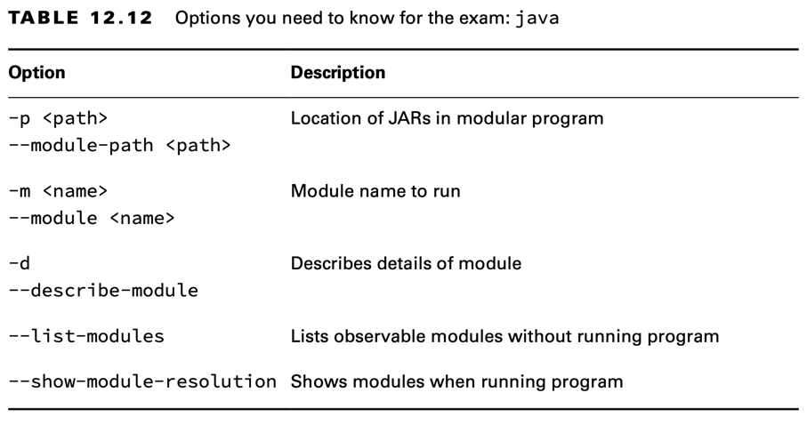
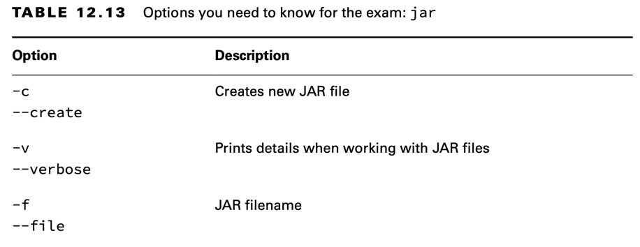
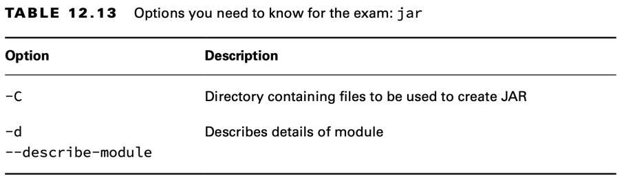
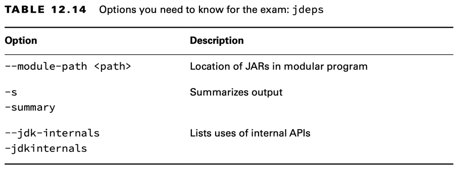
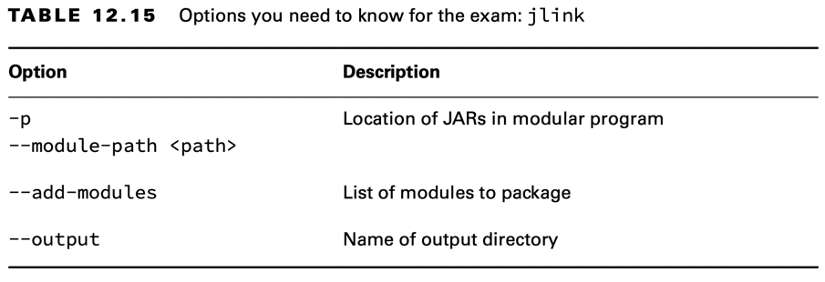


### 12.3 Comparing Types of Modules

#### Named Modules
- A named module is one containing a `module-info.java` file
- this file appears in the root of the JAR alongside one or more packages
- Named modules appear on the module path rather than the classpath.
- As a way of remembering this, a named module has the name inside the `module-info.java` file and is on the module path.

#### Automatic Modules
- appears on the module path but does not contain a `module-info.java` file
- It is simply a regular JAR file that is placed on the module path and gets treated as a module
- As a way of remembering this, Java automatically determines the module name
- The code referencing an automatic module treats it as if there is a `module-info.java` file present. 
- It automatically exports all packages. It also determines the module name.

#### About the MANIFEST.MF File
A JAR file contains a special text file called `META-INF/MANIFEST.MF` that contains information about the JAR. 
It’s been around significantly longer than modules—since the early days of Java and JARs, to be exact.

The manifest contains extra information about the JAR file. For example, it often contains the version of Java used to build the JAR file. 
For command-line programs, the class with the `main()` method is commonly specified
Each line in the manifest is a key/value pair separated by a colon. You can think of the manifest as a map of property names and values

Specifying a single property in the manifest allowed library providers to make things easier for applications that wanted to use their library in a modular application. 
You can think of it as a promise that when the library becomes a named module, it will use the specified module name.

Table 12.16 shows how to apply these rules to two examples where there is no automatic module name specified in the manifest.
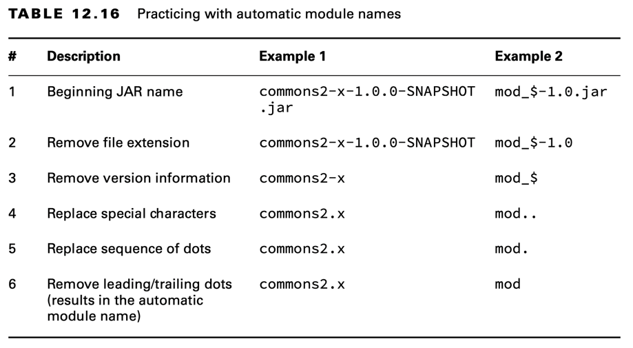

#### Unnamed Modules
- An unnamed module appears on the classpath. 
- Like an automatic module, it is a regular JAR. 
- Unlike an automatic module, it is on the classpath rather than the module path. This means an unnamed module is treated like old code and a second-class citizen to modules
- An unnamed module does not usually contain a `module-info.java` file. If it happens to contain one, that file will be ignored since it is on the classpath
- Unnamed modules do not export any packages to named or automatic modules
- The unnamed module can read from any JARs on the classpath or module path
- You can think of an unnamed module as code that works the way Java worked before modules

A key point to remember is that code on the classpath can access the module path. By contrast, code on the module path is unable to read from the classpath.
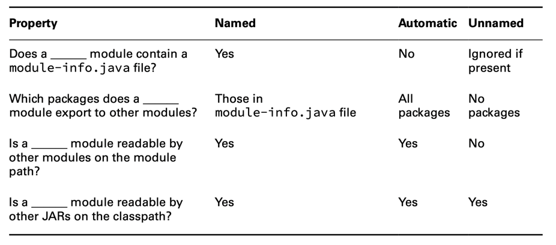


### 12.4 Migrating an Application
This section gives you an overview of strategies for migrating an existing application to use modules


The two most common migration strategies are top-down and bottom-up migration.
Top-down migration starts migrating the module with the most dependencies and places all other modules on the module path. 
Bottom-up migration starts migrating a module with no dependencies and moves one module to the module path at a time. 
Both of these strategies require ensuring that you do not have any cyclic dependencies since the Java Platform Module System will not allow cyclic dependencies to compile.

## 13 CONCURRENCY

### 13.1 Introducing Threads
- `Thread` is the smallest unit of execution that can be scheduled by the operating system
- `Process` is a group of associated threads that execute in the same shared environment
- `Task` is a single unit of work performed by a thread.

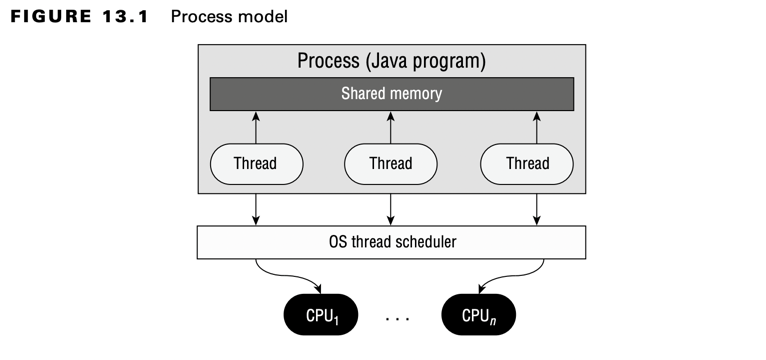

#### Creating a Thread
We can create a `Thread` and its associated task one of two ways in Java:
- Provide a `Runnable` object or lambda expression to the `Thread` constructor.
- Create a class that extends `Thread` and overrides the `run()` method.
  `Runnable` is a functional interface that takes no arguments and returns no data.

```java
@FunctionalInterface public interface Runnable {
 void run();
}

new Thread(() -> System.out.print("Hello")).start();
System.out.print("World");
```

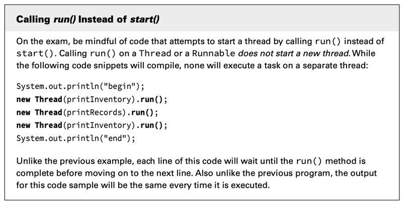

A `system thread` is created by the Java Virtual Machine (JVM) and runs in the background of the application.  
A `user-defined thread` is one created by the application developer to accomplish a specific task.  
A `daemon thread` is one that will not prevent the JVM from exiting when the program finishes. A Java application terminates when the only threads that are running are daemon threads.

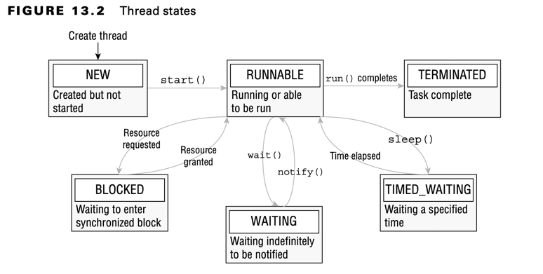

`Polling` is the process of intermittently checking data at some fixed interval.

**Interrupting a Thread**  
- Calling `interrupt()` on a thread in the `TIMED_WAITING` or `WAITING` state causes current thread to become `RUNNABLE` again, triggering an `InterruptedException`.  
- Calling `interrupt()` on a thread already in a `RUNNABLE` state doesn’t change the state. 
  In fact, it only changes the behavior if the thread is periodically checking the `Thread.isInterrupted()` value state.

### 13.2 Creating Threads with the Concurrency API

- `ExecutorService` interface defines services that create and manage threads.
- `Executors` factory class can be used to create instances of the `ExecutorService` object.
- `ExecutorService` interface does not extend the `AutoCloseable` interface, so you cannot use a try-with-resources statement.

#### Shutting Down a Thread Executor
- The shutdown process for a thread executor involves first rejecting any new tasks submitted to the thread executor while continuing to execute any previously submitted tasks.
- If a new task is submitted to the thread executor while it is shutting down, a `RejectedExecutionException` will be thrown.
- For the exam, you should be aware that `shutdown()` does not stop any tasks that have already been submitted to the thread executor

The `ExecutorService` provides a method called `shutdownNow()`, which attempts to stop all running tasks and discards any that have not been started yet. 
It is not guaranteed to succeed because it is possible to create a thread that will never terminate, so any attempt to interrupt it may be ignored.

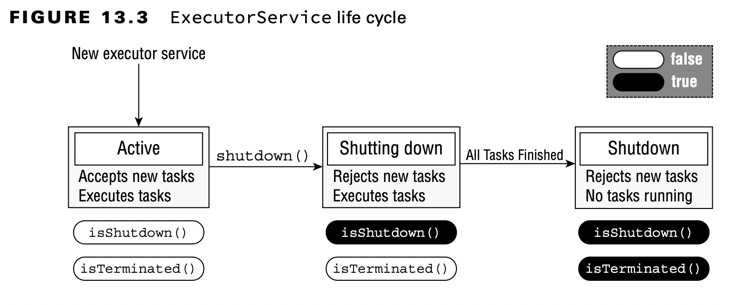

#### Submitting Tasks

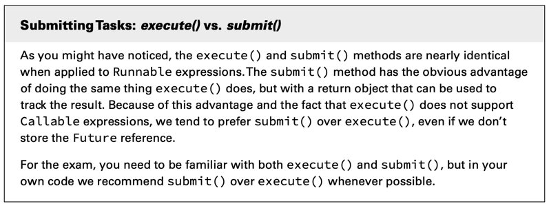
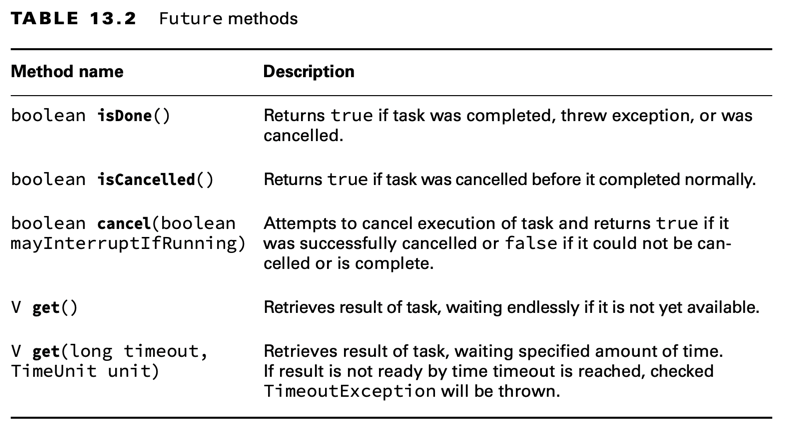

What is the return value of this task? As `Future<V>` is a generic interface, the type `V` is determined by the return type of the `Runnable` method. 
Since the return type of `Runnable.run()` is `void`, the `get()` method always returns null when working with`Runnable` expressions
Unlike `Runnable`, in which the `get()` methods always return `null`, the `get()` methods on a `Future` instance return the matching generic type (which could also be a null value).

Note that if `start()` had been used instead of `run()` (or the stream was parallel), then the output would be indeterminate, and option C would have been correct.

#### Introducing Callable
- The `java.util.concurrent.Callable` functional interface is similar to `Runnable` except that its `call()` method returns a value and can throw a checked exception. T
- The `Callable` interface is often preferable over `Runnable`, since it allows more details to be retrieved easily from the task after it is completed.
- `ExecutorService` includes an overloaded version of the `submit()` method that takes a `Callable` object and returns a generic `Future<T>` instance

```java
@FunctionalInterface public interface Callable<V> {
  V call() throws Exception;
}
```

#### Waiting for All Tasks to Finish
We use the `awaitTermination()` method available for all thread executors. The method waits the specified time to complete all tasks, 
returning sooner if all tasks finish or an `InterruptedException` is detected.

```java
service.awaitTermination(1, TimeUnit.MINUTES);
```

#### Scheduling Tasks
`ScheduledExecutorService`, which is a subinterface of `ExecutorService`, can be used for scheduling a task.
Like `ExecutorService`, we obtain an instance of `ScheduledExecutorService` using a factory method in the `Executors` class.
```java
ScheduledExecutorService service = Executors.newSingleThreadScheduledExecutor();
```
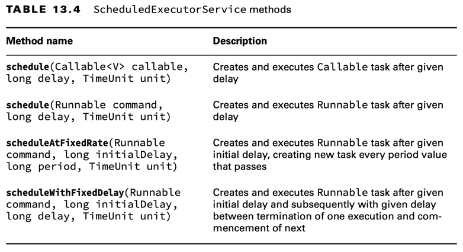
- `ScheduledFuture` interface is identical to the `Future` interface, except that it includes a `getDelay()` method that returns the remaining delay.
- `scheduleAtFixedRate()` method creates a new task and submits it to the executor every period, regardless of whether the previous task finished. 
  It is useful for tasks that need to be run at specific intervals, such as checking the health of the animals once a day. 
  Even if it takes two hours to examine an animal on Monday, this doesn’t mean that Tuesday’s exam should start any later in the day.
- `scheduleWithFixedDelay()` method creates a new task only after the previous task has finished. 
  For example, if a task runs at 12:00 and takes five minutes to finish, with a period between executions of two minutes, the next task will start at 12:07.
  It is useful for processes that you want to happen repeatedly but whose specific time is unimportant.

#### Increasing Concurrency with Pools
A **thread pool** is a group of pre-instantiated reusable threads that are available to perform a set of arbitrary tasks.
The difference between a single-thread and a pooled-thread executor is what happens when a task is already running. 
While a single-thread executor will wait for the thread to become available before running the next task, a pooled-thread executor can execute the next task concurrently. 
If the pool runs out of available threads, the task will be queued by the thread executor and wait to be completed.

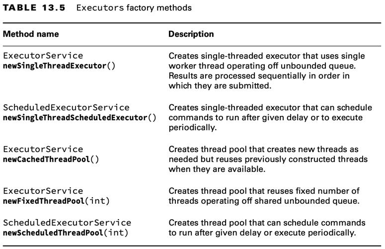

### 13.3 Writing Thread-Safe Code
**Thread-safety** is the property of an object that guarantees safe execution by multiple threads at the same time.

The **volatile** keyword is used to guarantee that access to data within memory is consistent. 
This attribute ensures that only one thread is modifying a variable at one time and that data read among multiple threads is consistent

```java
3: private volatile int sheepCount = 0;
4:   private void incrementAndReport() {
5:   System.out.print((++sheepCount)+" ");
6: }
```
Unfortunately, this code is not thread-safe and could still result in numbers being missed.
The reason this code is not thread-safe is that `++sheepCount` is still two distinct operations. 
Put another way, if the increment operator represents the expression `sheepCount = sheepCount + 1`, then each read and write operation is thread-safe, but the combined operation is not
It is not thread-safe because the operation is not atomic, carrying out two tasks, read and write, that can be interrupted by other threads.

**Atomic** is the property of an operation to be carried out as a single unit of execution without any interference from another thread. 
A thread-safe atomic version of the increment operator would perform the read and write of the variable as a single operation, not allowing any other threads to access the variable during the operation.

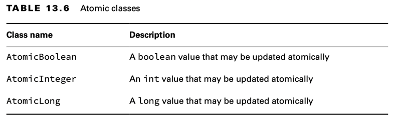
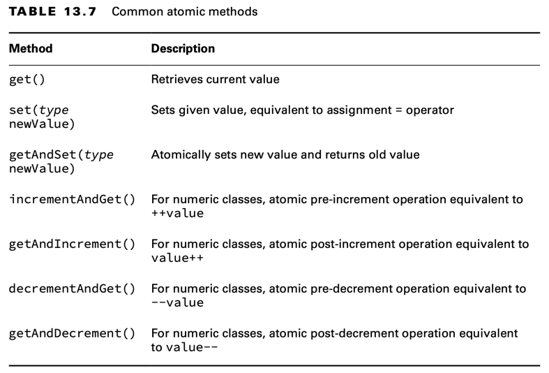

#### Improving Access with synchronized Blocks
While atomic classes are great at protecting a single variable, they aren’t particularly useful if you need to execute a series of commands or call a method. 
For example, we can’t use them to update two atomic variables at the same time.
The most common technique is to use a **monitor** to synchronize access. A **monitor**, also called a **lock**, is a structure that supports **mutual exclusion**, 
which is the property that at most one thread is executing a particular segment of code at a given time. 
```java
synchronized(manager) {
  // Work to be completed by one thread at a time
}
```

This example is referred to as a **synchronized** block. Each thread that arrives will first check if any threads are already running the block. 
If the lock is not available, the thread will transition to a BLOCKED state until it can “acquire the lock.” 
If the lock is available (or the thread already holds the lock), the single thread will enter the block, preventing all other threads from entering. 
Once the thread finishes executing the block, it will release the lock, allowing one of the waiting threads to proceed.

To synchronize access across multiple threads, each thread must have access to the same **Object**. 
If each thread synchronizes on different objects, the code is not thread-safe.
We could have synchronized on any object, as long as it was the same object

#### Synchronizing on Methods
In the previous example, we established our monitor using `synchronized(this)` around the body of the method. 
Java provides a more convenient compiler enhancement for doing so. We can add the synchronized modifier to any instance method to synchronize automatically on the object itself.
For example, the following two method definitions are equivalent:
```java
void sing() {
  synchronized(this) {
    System.out.print("La la la!");
  }
}
synchronized void sing() {
   System.out.print("La la la!");
}
```

We can also apply the synchronized modifier to static methods. What object is used as the monitor when we synchronize on a static method? 
The class object, of course! For example, the following two methods are equivalent for static synchronization:
```java
static void dance() {
  synchronized(SheepManager.class) {
    System.out.print("Time to dance!");
  }
}
static synchronized void dance() {
  System.out.print("Time to dance!");
}
```

A **synchronized** block supports only a limited set of functionality. For example, what if we want to check whether a lock is available and, if it is not, perform some other task? 
Furthermore, if the lock is never available and we synchronize on it, we might wait forever. 
The Concurrency API includes the **Lock** interface, which is conceptually similar to using the synchronized keyword but with a lot more bells and whistles. 
Instead of synchronizing on any `Object`, though, we can “lock” only on an object that implements the `Lock` interface.

#### Applying a ReentrantLock
The `Lock` interface is pretty easy to use. When you need to protect a piece of code from multithreaded processing, create an instance of `Lock` that all threads have access to. 
Each thread then calls `lock()` before it enters the protected code and calls `unlock()` before it exits the protected code.
```java
Lock lock = new ReentrantLock();
try {
  lock.lock();
  // Protected code
} finally {
  lock.unlock();
}
```
The `ReentrantLock` class is a simple **monitor** that implements the `Lock` interface and supports mutual exclusion.
In other words, at most one thread is allowed to hold a lock at any given time.  
While certainly not required, it is a good practice to use a `try/finally` block with `Lock` instances. 
Doing so ensures that any acquired locks are properly released.

The `ReentrantLock` class ensures that once a thread has called `lock()` and obtained the lock, all other threads that call `lock()` will wait until the first thread calls `unlock()`. 
Which thread gets the lock next depends on the parameters used to create the `Lock` object.

The `ReentrantLock` class includes a constructor that takes a single boolean and sets a “fairness” parameter. 
If the parameter is set to `true`, the lock will usually be granted to each thread in the order in which it was requested. 
It is `false` by default when using the no-argument constructor. In practice, you should enable fairness only when ordering is absolutely required, as it could lead to a significant slowdown.

Besides always making sure to release a lock, you also need to be sure that you only release a lock that you have. 
If you attempt to release a lock that you do not have, you will get an exception at runtime.
```java
Lock lock = new ReentrantLock();
lock.unlock(); // IllegalMonitorStateException
```

The `ReentrantLock` class maintains a counter of the number of times a lock has been successfully granted to a thread. 
To release the lock for other threads to use, `unlock()` must be called the same number of times the lock was granted.

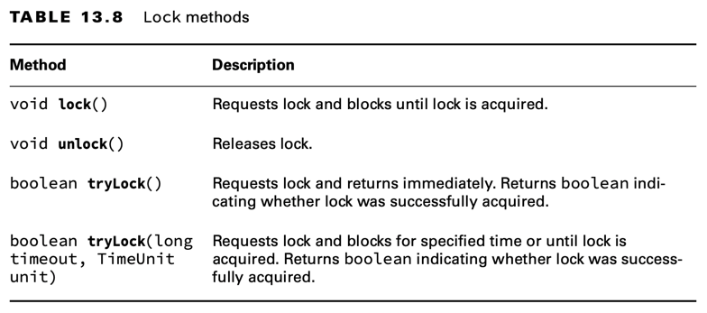

#### tryLock()
- The `tryLock()` method will attempt to acquire a lock and immediately return a boolean result indicating whether the lock was obtained. 
- Unlike the `lock()` method, it does not wait if another thread already holds the lock. It returns immediately, regardless of whether a lock is available.
- Like `lock()`, the `tryLock()` method should be used with a try/finally block. Fortunately, you need to release the lock only if it was successfully acquired.
- It is common to use the output of `tryLock()` in an if statement, so that `unlock()` is called only when the lock is obtained.
- overloaded version of `tryLock(long,TimeUnit)` that acts like a hybrid of `lock()` and `tryLock()`. Like the other two methods, if a lock is available,
  it will immediately return with it. If a lock is unavailable, though, it will wait up to the specified time limit for the lock

It is critical that you release a lock the same number of times it is acquired! For calls with `tryLock()`, you need to call `unlock()` only if the method returned true.

### 13.4 Using Concurrent Collections
- When two threads try to modify the same nonconcurrent collection, the JVM may throw a `ConcurrentModificationException` at runtime
- You should use a concurrent collection class any time you have multiple threads modify a collection outside a synchronized block or method, even if you don’t expect a concurrency problem

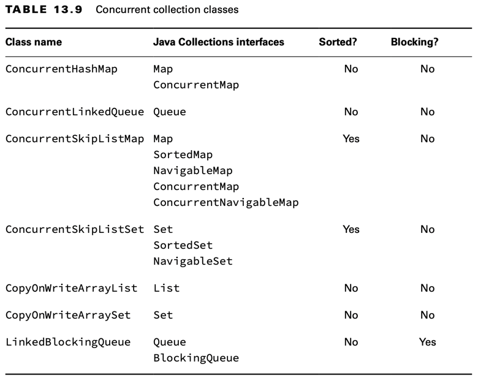

- The `Skip` classes might sound strange, but they are just “sorted” versions of the associated concurrent collections. 
When you see a class with `Skip` in the name, just think “sorted concurrent” collections, and the rest should follow naturally.
- The `CopyOnWrite` classes create a copy of the collection any time a reference is added, removed, or changed in the collection and then update the original collection reference to point to the copy.
-  `LinkedBlockingQueue` implements the concurrent `BlockingQueue` interface. This class is just like a regular `Queue`, except that it includes overloaded versions of `offer()` and `poll()` that take a timeout. 
- These methods wait (or block) up to a specific amount of time to complete an operation.

Besides the concurrent collection classes that we have covered, the Concurrency API also includes methods for obtaining synchronized versions of existing nonconcurrent collection objects. 
These synchronized methods are defined in the `Collections` class. They operate on the inputted collection and return a reference that is the same type as the underlying collection.
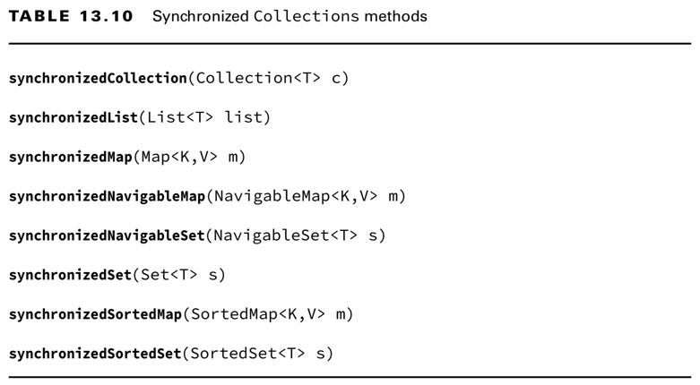

### 13.5 Identifying Threading Problems
- **Deadlock** occurs when two or more threads are blocked forever, each waiting on the other.
- **Starvation** occurs when a single thread is perpetually denied access to a shared resource or lock. 
  The thread is still active, but it is unable to complete its work as a result of other threads constantly taking the resource that it is trying to access.
- **Livelock** occurs when two or more threads are conceptually blocked forever, although they are each still active and trying to complete their task. 
  Livelock is a special case of resource starvation in which two or more threads actively try to acquire a set of locks, are unable to do so, and restart part of the process.

**Race condition** is an undesirable result that occurs when two tasks that should be completed sequentially are completed at the same time.

### 13.6 Working with Parallel Streams
- A **parallel stream** is capable of processing results concurrently, using multiple threads.

```java
Collection<Integer> collection = List.of(1,2);
Stream<Integer> p1 = collection.stream().parallel();
Stream<Integer> p2 = collection.parallelStream();
```

A **parallel decomposition** is the process of taking a task, breaking it into smaller pieces that can be performed concurrently, and then reassembling the results. 
The more concurrent a decomposition, the greater the performance improvement of using parallel streams.

#### Processing Parallel Reductions
- Since order is not guaranteed with parallel streams, methods such as `findAny()` on parallel streams may result in unexpected behavior.
- In operations that consider order, such as `findFirst()`, `limit()`, and `skip()` order is still preserved, 
  but performance may suffer on a parallel stream as a result of a parallel processing task being forced to coordinate all of its threads in a synchronized-like fashion.

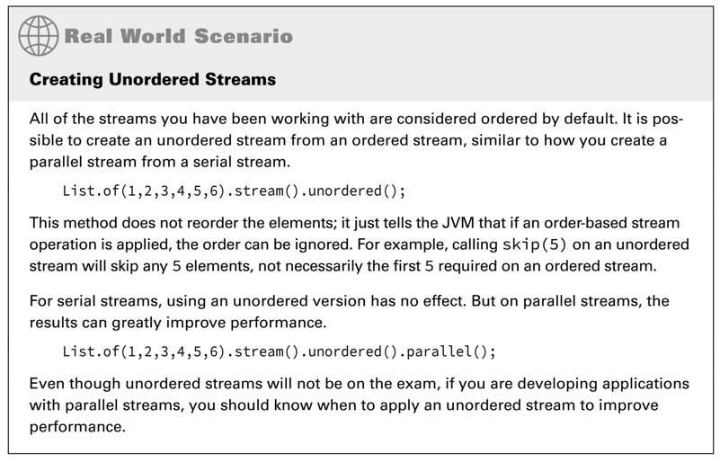

On parallel streams, the `reduce()` method works by applying the reduction to pairs of elements within the stream 
to create intermediate values and then combining those intermediate values to produce a final result. 
Put another way, in a serial stream, `wolf` is built one character at a time. In a parallel stream, the intermediate values `wo` and `lf` are created and then combined.

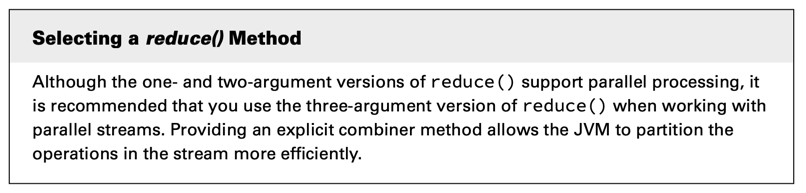

Requirements for Parallel Reduction with `collect()`:
- The stream is parallel.
- The parameter of the `collect()` operation has the `Characteristics.CONCURRENT` characteristic.
- Either the stream is unordered or the collector has the characteristic `Characteristics.UNORDERED`.

The Collectors class includes two sets of static methods for retrieving collectors,`toConcurrentMap()` and `groupingByConcurrent()`, 
both of which are **UNORDERED** and **CONCURRENT**. These methods produce `Collector` instances capable of performing parallel reductions efficiently. 
Like their nonconcurrent counterparts, there are overloaded versions that take additional arguments.


## 14 I/O

### 14.1 Referencing Files and Directories
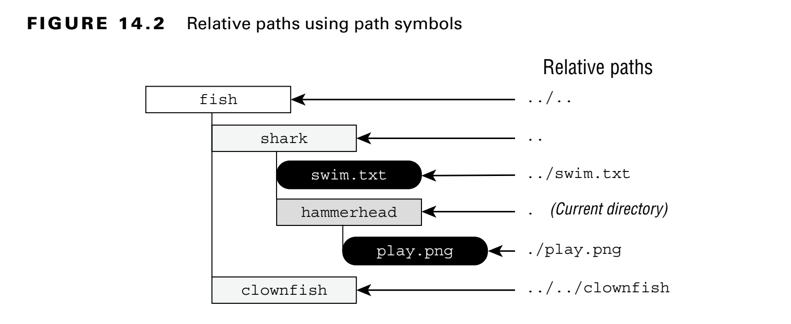

The `File` class is created by calling its constructor. This code shows three different constructors. All three create a `File` object that points to the same location on disk.
If we passed `null` as the parent to the final constructor, it would be ignored, and the method would behave the same way as the single `String` constructor

```java
File zooFile1 = new File("/home/tiger/data/stripes.txt");

File zooFile2 = new File("/home/tiger", "data/stripes.txt");

File parent = new File("/home/tiger");
File zooFile3 = new File(parent, "data/stripes.txt");
```

The simplest and most straightforward way to obtain a `Path` object is to use a static factory method defined on `Path` or `Paths`. 
All four of these examples point to the same reference on disk:
```java
Path zooPath1 = Path.of("/home/tiger/data/stripes.txt");
Path zooPath2 = Path.of("/home", "tiger", "data", "stripes.txt");
Path zooPath3 = Paths.get("/home/tiger/data/stripes.txt");
Path zooPath4 = Paths.get("/home", "tiger", "data", "stripes.txt");
```

Since `File` and `Path` both reference locations on disk, it is helpful to be able to convert between them.
```java
File file = new File("rabbit");
Path nowPath = file.toPath();
File backToFile = nowPath.toFile();
```

Both `Paths.get()` and `Path.of()` are shortcuts for this `FileSystem` method.
```java
Path zooPath1 = FileSystems.getDefault().getPath("/home/tiger/data/stripes.txt");
Path zooPath2 = FileSystems.getDefault().getPath("/home", "tiger", "data", "stripes.txt");
```

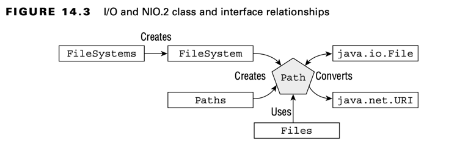
Review Figure 14.3 carefully. In particular, keep an eye on whether the class name is singular or plural. 
Classes with plural names include methods to create or operate on class/interface instances with singular names. 
Remember, as a convenience (and source of confusion), a `Path` can also be created from the `Path` interface using the static factory `of()` method.


Table 14.2 reviews the APIs we have covered for creating `java.io.File` and `java.nio.file.Path` objects. 
When reading the table, remember that static methods operate on the class/interface, while instance methods require an instance of an object.

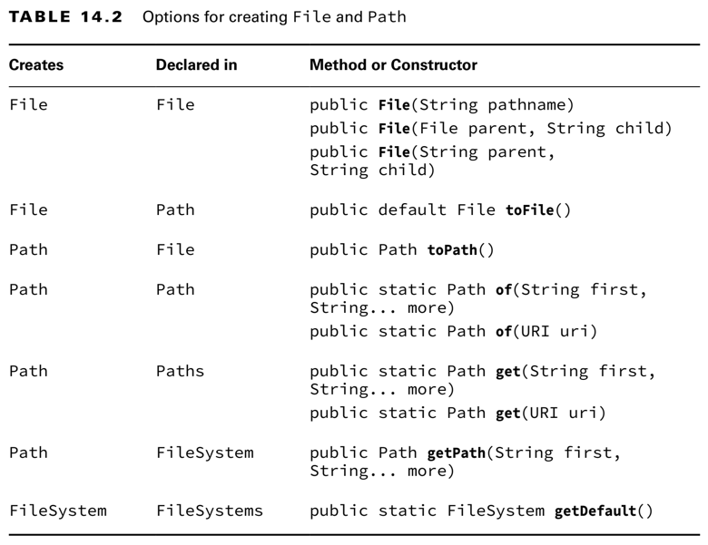

### 14.2 Operating on File and Path
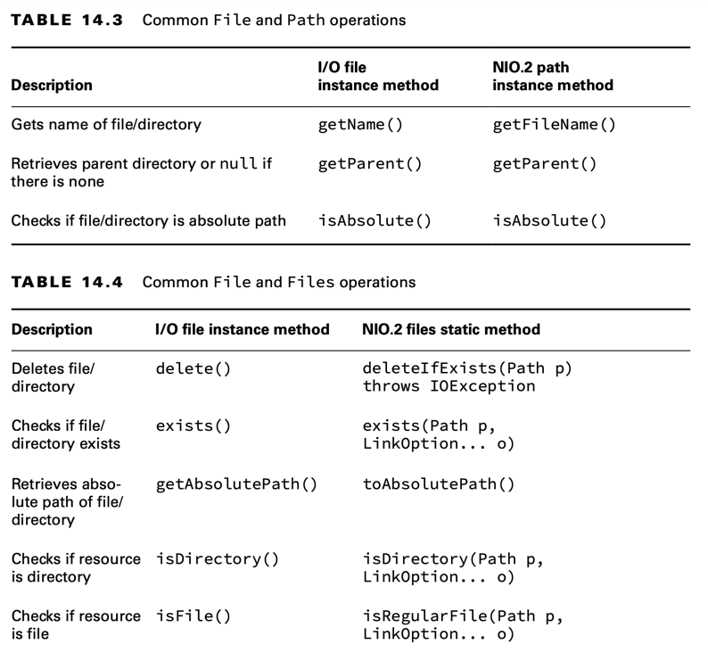
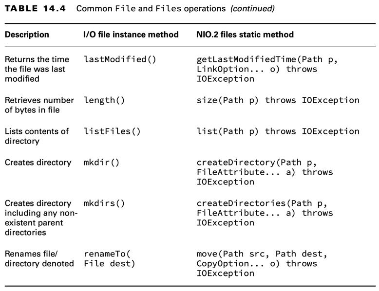
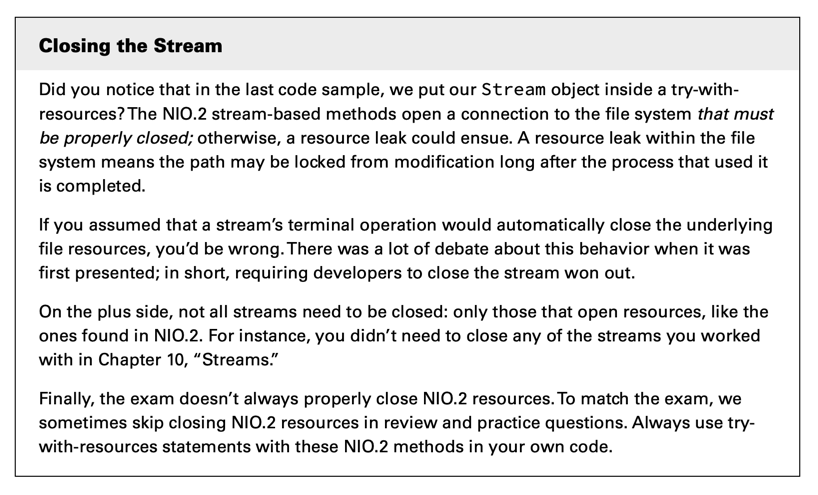

#### Handling Methods That Declare IOException
Many of the methods presented in this chapter declare `IOException`. Common causes of a method throwing this exception include the following:
- Loss of communication to the underlying file system.
- File or directory exists but cannot be accessed or modified.
- File exists but cannot be overwritten.
- File or directory is required but does not exist.

Many of the NIO.2 methods in this chapter include a varargs that takes an optional list of values. Table 14.5 presents the arguments you should be familiar with for the exam.
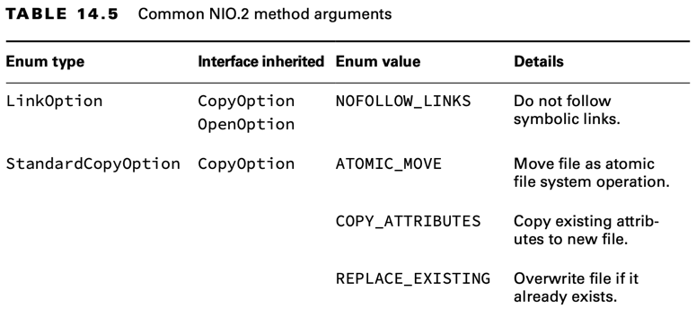
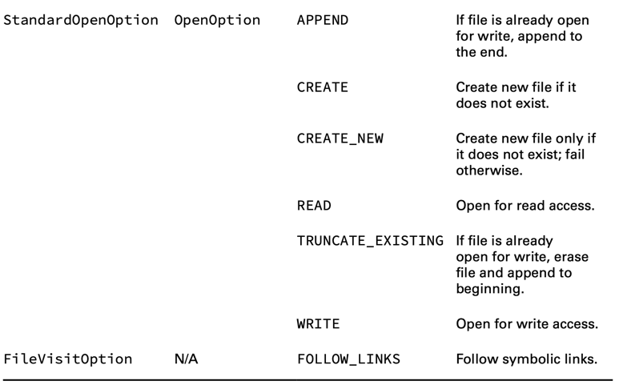

Note that some of the enums in Table 14.5 inherit an interface. That means some methods accept a variety of enum types. 
For example, the `Files.move()` method takes a`CopyOption` vararg so it can take enums of different types, and more options can be added over time.

#### Interacting with NIO.2 Paths
Just like `String` values, `Path` instances are immutable. In the following example, the `Path` operation on the second line is lost since p is immutable:
```java
Path p = Path.of("whale");
p.resolve("krill");
System.out.println(p); // whale
```

#### Viewing the Path
Even though this is an absolute path, the root element is not included in the list of names.
As we said, these methods do not consider the root part of the path.

The `getNameCount()` and `getName()` methods are often used together to retrieve the number of elements in the path and a reference to each element, respectively. 
These two methods do not include the root directory as part of the path.
```java
Path path = Paths.get("/land/hippo/harry.happy");
System.out.println("The Path Name is: " + path);
for(int i=0; i<path.getNameCount(); i++)
 System.out.println(" Element " + i + " is: " + path.getName(i));

// The Path Name is: /land/hippo/harry.happy
// Element 0 is: land
// Element 1 is: hippo
// Element 2 is: harry.happy
```

```java
var p = Path.of("/");
System.out.print(p.getNameCount()); // 0
System.out.print(p.getName(0)); // IllegalArgumentException
```

#### Creating Part of the Path
The Path interface includes the subpath() method to select portions of a path. It takes two parameters: an inclusive `beginIndex` and an exclusive `endIndex`.
Like `getNameCount()` and `getName()`, `subpath()` is zero-indexed and does not include the root. Also like `getName()`, `subpath()` throws an exception if invalid indices are provided.
```java
var p = Paths.get("/mammal/omnivore/raccoon.image");
System.out.println("Path is: " + p);
for (int i = 0; i < p.getNameCount(); i++) {
 System.out.println(" Element " + i + " is: " + p.getName(i));
}
System.out.println();
System.out.println("subpath(0,3): " + p.subpath(0, 3));
System.out.println("subpath(1,2): " + p.subpath(1, 2));
System.out.println("subpath(1,3): " + p.subpath(1, 3));

// Path is: /mammal/omnivore/raccoon.image
// Element 0 is: mammal
// Element 1 is: omnivore
// Element 2 is: raccoon.image
// subpath(0,3): mammal/omnivore/raccoon.image
// subpath(1,2): omnivore
// subpath(1,3): omnivore/raccoon.image
```

#### Accessing Path Elements
The `Path` interface contains numerous methods for retrieving particular elements of a `Path`, returned as `Path` objects themselves:
- The `getFileName()` method returns the `Path` element of the current file or directory, while `getParent()` returns the full path of the containing directory.
- The `getParent()` method returns null if operated on the root path or at the top of a relative path. 
- The `getRoot()` method returns the root element of the file within the file system, or null if the path is a relative path

#### Resolving Paths
The `resolve()` method provides overloaded versions that let you pass either a `Path` or `String` parameter. 
The object on which the `resolve()` method is invoked becomes the basis of the new `Path` object, with the input argument being appended onto the `Path`.
```java
Path path1 = Path.of("/cats/../panther");
Path path2 = Path.of("food");
System.out.println("Result: " + path1.resolve(path2));
// Result: /cats/../panther/food

Path path3 = Path.of("/turkey/food");
System.out.println(path3.resolve("Result: " + "/tiger/cage"));
// Result: /tiger/cage
```
For the exam, you should be cognizant of mixing absolute and relative paths with the `resolve()` method. 
If an absolute path is provided as input to the method, that is the value returned. Simply put, you cannot combine two absolute paths using `resolve()`.
On the exam, when you see `resolve()`, think concatenation.

#### Relativizing a Path
The `Path` interface includes a `relativize()` method for constructing the relative path from one `Path` to another, often using path symbols.
If both path values are relative, the `relativize()` method computes the paths as if they are in the same current working directory. 
Alternatively, if both path values are absolute, the method computes the relative path from one absolute location to another, regardless of the current working directory.
```java
var path1 = Path.of("fish.txt");
var path2 = Path.of("friendly/birds.txt");
System.out.println(path1.relativize(path2));
System.out.println(path2.relativize(path1));

// ../friendly/birds.txt
// ../../fish.txt
```
The `relativize()` method requires both paths to be absolute or relative and throws an exception if the types are mixed.
```java
Path path1 = Paths.get("/primate/chimpanzee");
Path path2 = Paths.get("bananas.txt");
path1.relativize(path2); // IllegalArgumentException
```

#### Normalizing a Path
- Java provides the `normalize()` method to eliminate unnecessary redundancies in a path.
- Remember, the path symbol `..` refers to the parent directory, while the path symbol `.` refers to the current directory.
- The `normalize()` method does not remove all of the path symbols, only the ones that can be reduced.
```java
var p1 = Path.of("./armadillo/../shells.txt");
System.out.println(p1.normalize()); // shells.txt
var p2 = Path.of("/cats/../panther/food");
System.out.println(p2.normalize()); // /panther/food
var p3 = Path.of("../../fish.txt");
System.out.println(p3.normalize()); // ../../fish.txt
```

#### Retrieving the Real File System Path
- While working with theoretical paths is useful, sometimes you want to verify that the path exists within the file system using `toRealPath()`.
- it eliminates any redundant path symbols (like `normalize()`). 
- it will join the path with the current working directory if the path is relative (like `toAbsolutePath()`).
- will throw an exception if the path does not exist

Let’s say that we have a file system in which we have a symbolic link from `/zebra` to `/horse`.
```java
System.out.println(Paths.get("/zebra/food.txt").toRealPath());
System.out.println(Paths.get(".././food.txt").toRealPath());

// /horse/food.txt
// /horse/food.txt
```

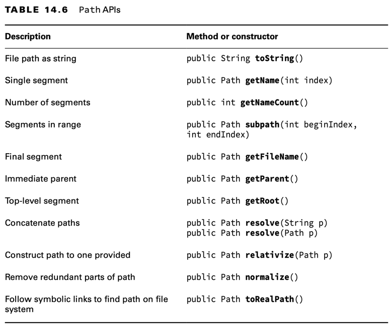

#### Creating, Moving, and Deleting Files and Directories

#### Making Directories
To create a directory, we use `Files` methods:
- The `createDirectory()` method will create a directory and throw an exception if it already exists or if the paths leading up to the directory do not exist
- The `createDirectories()` method creates the target directory along with any nonexistent parent directories leading up to the path.
- If all of the directories already exist, `createDirectories()` will simply complete without doing anything

```java
public static Path createDirectory(Path dir, FileAttribute<?>... attrs) throws IOException
public static Path createDirectories(Path dir, FileAttribute<?>... attrs) throws IOException

Files.createDirectory(Path.of("/bison/field"));
Files.createDirectories(Path.of("/bison/field/pasture/green"));
```

#### Copying Files
The `Files` class provides a method for copying files and directories within the file system.
- method copies a file or directory from one location to another using Path objects
- when directories are copied, the copy is shallow. A shallow copy means that the files and subdirectories within the directory are not copied. 
  A deep copy means that the entire tree is copied, including all of its content and subdirectories. A deep copy typically requires recursion, where a method calls itself.

```java
public static Path copy(Path source, Path target, CopyOption... options) throws IOException

Files.copy(Paths.get("/panda/bamboo.txt"), Paths.get("/panda-save/bamboo.txt")); 
Files.copy(Paths.get("/turtle"), Paths.get("/turtleCopy"));
```

#### Copying and Replacing Files
- By default, if the target already exists, the `copy()` method will throw an exception.
- You can change this behavior by providing the `StandardCopyOption` enum value `REPLACE_EXISTING` to the method.
- For the exam, you need to know that without the `REPLACE_EXISTING` option, this method will throw an exception if the file already exists

```java
Files.copy(Paths.get("book.txt"), Paths.get("movie.txt"), StandardCopyOption.REPLACE_EXISTING);
```

#### Copying Files with I/O Streams
- The `Files` class includes two `copy()` methods that operate with I/O streams.
- The first method reads the contents of an I/O stream and writes the output to a file
- The second method reads the contents of a file and writes the output to an I/O stream

```java
public static long copy(InputStream in, Path target, CopyOption... options) throws IOException
public static long copy(Path source, OutputStream out) throws IOException

try (var is = new FileInputStream("source-data.txt")) {
  // Write I/O stream data to a file
  Files.copy(is, Paths.get("/mammals/wolf.txt"));
}
Files.copy(Paths.get("/fish/clown.xsl"), System.out);
```

#### Copying Files into a Directory
```java
var file = Paths.get("food.txt");
var directory = Paths.get("/enclosure/food.txt");
Files.copy(file, directory);
```

#### Moving or Renaming Paths with move()
- Like `copy()`, `move()` requires `REPLACE_EXISTING` to overwrite the target if it exists; otherwise, it will throw an exception. 
- Also like `copy()`, `move()` will not put a file in a directory if the source is a file and the target is a directory. 
  Instead, it will create a new file with the name of the directory.
- An atomic move is one in which a file is moved within the file system as a single indivisible operation.

```java
public static Path move(Path source, Path target, CopyOption... options) throws IOException

Files.move(Path.of("C:\\zoo"), Path.of("C:\\zoo-new")); 
Files.move(Path.of("C:\\user\\addresses.txt"), Path.of("C:\\zoo-new\\addresses2.txt"));
Files.move(Path.of("mouse.txt"), Path.of("gerbil.txt"), StandardCopyOption.ATOMIC_MOVE);
```

#### Deleting a File with delete() and deleteIfExists()
- To delete a directory, it must be empty
- Both of these methods throw an exception if operated on a nonempty directory
- if the path is a symbolic link, the symbolic link will be deleted, not the path that the symbolic link points to
- The `delete()` method throws an exception if the path does not exist, while the `deleteIfExists()` method returns true if the delete was successful or false otherwise
- Similar to `createDirectories()`, `deleteIfExists()` is useful in situations where you want to ensure that a path does not exist and delete it if it does.

```java
Files.delete(Paths.get("/vulture/feathers.txt"));
Files.deleteIfExists(Paths.get("/pigeon"));
```

#### Comparing Files with isSameFile() and mismatch()
- `isSameFile()` method takes two `Path` objects as input resolves all path symbols, and follows symbolic links
- despite the name, the method `isSameFile()` can also be used to determine whether two `Path` objects refer to the same directory
- While most uses of `isSameFile()` will trigger an exception if the paths do not exist, there is a special case in which it does not. 
- If the two path objects are equal in terms of `equals()`, the method will just return true without checking whether the file exists.
- `mismatch()` takes two `Path` objects as input and returns `-1` if the files are the same; otherwise, it returns the index of the first position in the file that differs.

### 14.3 Introducing I/O Streams
The contents of a file may be accessed or written via an I/O stream, which is a list of data elements presented sequentially.
An I/O stream can be conceptually thought of as a long, nearly never-ending stream of water with data presented one wave at a time.

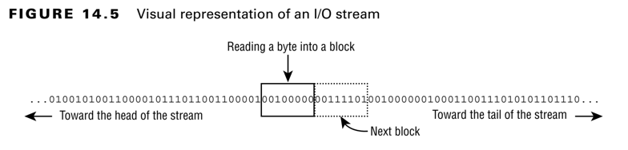

Each type of I/O stream segments data into a wave or block in a particular way. For example, some I/O stream classes read or write data as individual bytes. 
Other I/O stream classes read or write individual characters or strings of characters. 
On top of that, some I/O stream classes read or write larger groups of bytes or characters at a time, specifically those with the word `Buffered` in their name.

#### I/O Stream Nomenclature
The java.io API defines two sets of I/O stream classes for reading and writing I/O streams: byte I/O streams and character I/O streams:
- Byte I/O streams read/write binary data (0s and 1s) and have class names that end in `InputStream` or `OutputStream`.
- Character I/O streams read/write text data and have class names that end in `Reader` or `Writer`.

The API frequently includes similar classes for both byte and character I/O streams, such as `FileInputStream` and FileReader. 
The difference between the two classes is based on how the bytes are read or written.
It is important to remember that even though character I/O streams do not contain the word `Stream` in their class name, they are still I/O streams. 
The use of Reader/Writer in the name is just to distinguish them from byte streams.
The byte I/O streams are primarily used to work with binary data, such as an image or executable file, while character I/O streams are used to work with text files.

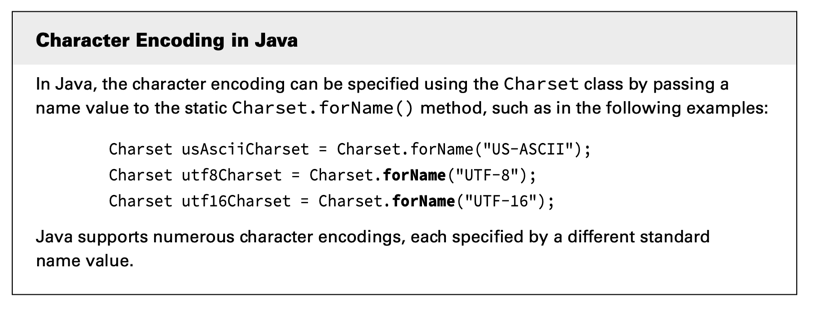

#### Input vs. Output Streams
- Most `InputStream` classes have a corresponding `OutputStream` class, and vice versa (`FileOutputStream` class writes data that can be read by a `FileInputStream`)
- Most `Reader` classes have a corresponding `Writer` class (`FileWriter` class writes data that can be read by a `FileReader`)
- For the exam, you should know that `PrintWriter` has no accompanying `PrintReader` class
- the `PrintStream` is an `OutputStream` that has no corresponding `InputStream` class. It also does not have `Output` in its name

#### Low-Level vs. High-Level Streams
- Low-Level:
  - A low-level stream connects directly with the source of the data, such as a file, an array, or a `String`
  - Low-level I/O streams process the raw data or resource and are accessed in a direct and unfiltered manner
  - For example, a `FileInputStream` is a class that reads file data one byte at a time.
- High-Level:
  - high-level stream is built on top of another I/O stream using wrapping
  - Wrapping is the process by which an instance is passed to the constructor of another class,
    and operations on the resulting instance are filtered and applied to the original instance.
  - Many operations on the high-level I/O stream pass through as operations to the underlying low-level I/O stream, such as `read()` or `close()`
  - High-level I/O streams can also take other high-level I/O streams as input.

In this following example, `FileReader` is the low-level I/O stream, whereas `BufferedReader` is the high-level I/O stream that takes a `FileReader` as input.
```java
try (var br = new BufferedReader(new FileReader("zoo-data.txt"))) {
 System.out.println(br.readLine());
}
```

For the exam, the only low-level stream classes you need to be familiar with are the ones that operate on files. 
The rest of the non-abstract stream classes are all high-level streams.

#### Stream Base Classes
The `java.io` library defines four abstract classes that are the parents of all I/O stream classes defined within the API: `InputStream`, `OutputStream`, `Reader`, and `Writer`.

One common area where the exam likes to play tricks on you is mixing and matching I/O stream classes that are not compatible with each other:

```java
new BufferedInputStream(new FileReader("z.txt")); // DOES NOT COMPILE
new BufferedWriter(new FileOutputStream("z.txt")); // DOES NOT COMPILE
new ObjectInputStream(
 new FileOutputStream("z.txt")); // DOES NOT COMPILE
new BufferedInputStream(new InputStream()); // DOES NOT COMPILE
```

The first two examples do not compile because they mix `Reader`/`Writer` classes with `InputStream`/`OutputStream` classes, respectively.
The third example does not compile because we are mixing an `OutputStream` with an `InputStream`
Finally, the last example does not compile because `InputStream` is an abstract class, and therefore you cannot create an instance of it.

#### Decoding I/O Class Names
Pay close attention to the name of the I/O class on the exam, as decoding it often gives you context clues as to what the class does.
Without needing to look it up, it should be clear that FileReader is a class that reads data from a file as characters or strings.
`ObjectOutputStream` sounds like a class that writes object data to a byte stream. Table 14.7 lists the abstract base classes that all I/O streams inherit from.

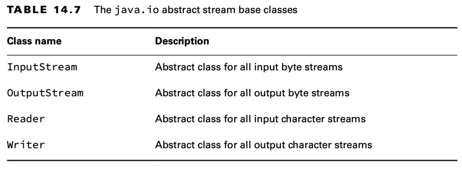

Table 14.8 lists the concrete I/O streams that you should be familiar with for the exam.
Note that most of the information about each I/O stream, such as whether it is an input or output stream or whether 
it accesses data using bytes or characters, can be decoded by the name alone.

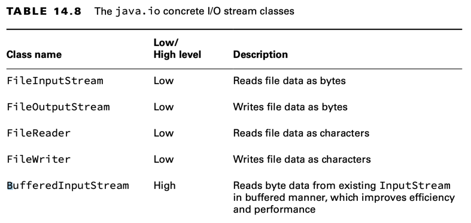
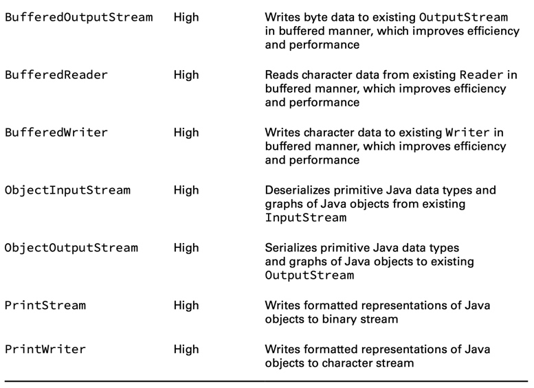

### 14.4 Reading and Writing Files

#### Using I/O Streams
Remember, the byte data type has a range of 256 characters. They needed an extra value to indicate the end of an I/O stream. 
The authors of Java decided to use a larger data type, `int`, so that special values like `-1` would indicate the end of an I/O stream.
The output stream classes use `int` as well, to be consistent with the input stream classes.

Reading and writing one byte at a time isn’t a particularly efficient way of doing this. Luckily, there are overloaded methods for reading and writing multiple bytes at a time. 
The offset and length values are applied to the array itself. For example, an offset of 3 and length of 5 indicates that 
the stream should read up to five bytes/characters of data and put them into the array starting with position 3. Let’s look at an example:

```java
10: void copyStream(InputStream in, OutputStream out) throws IOException {
11:   int batchSize = 1024;
12:   var buffer = new byte[batchSize];
13:   int lengthRead;
14:   while ((lengthRead = in.read(buffer, 0, batchSize)) > 0) {
15:     out.write(buffer, 0, lengthRead);
16:     out.flush();
17: }
```

Instead of reading the data one byte at a time, we read and write up to 1024 bytes at a time on line 14. 
The return value `lengthRead` is critical for determining whether we are at the end of the stream and knowing how many bytes we should write into our output stream.
Unless our file happens to be a multiple of 1024 bytes, the last iteration of the while loop will write some value less than 1024 bytes.
For example, if the buffer size is 1,024 byte and the file size is 1,054 bytes, the last read will be only 30 bytes.
If we ignored this return value and instead wrote 1,024 bytes, 994 bytes from the previous loop would be written to the end of the file.
We also added a `flush()` method on line 16 to reduce the amount of data lost if the application terminates unexpectedly. 
When data is written to an output stream, the underlying operating system does not guarantee that the data will make it to the file system immediately. 
The `flush()` method requests that all accumulated data be written immediately to disk.

The previous example makes reading and writing a file look like a lot to think about.
That’s because it only uses low-level I/O streams. Let’s try again using high-level streams.
```java
26: void copyTextFile(File src, File dest) throws IOException {
27:   try (var reader = new BufferedReader(new FileReader(src));
28:   var writer = new BufferedWriter(new FileWriter(dest))) {
29:   String line = null;
30:   while ((line = reader.readLine()) != null) {
31:     writer.write(line);
32:     writer.newLine();
33: } } }
```

The key is to choose the most useful high-level classes. In this case, we are dealing with a `File`, so we want to use a `FileReader` and `FileWriter`. 
Both classes have constructors that can take either a `String` representing the location or a `File` directly.
If the source file does not exist, a `FileNotFoundException`, which inherits `IOException`, will be thrown. 
If the destination file already exists, this implementation will overwrite it. 
We can pass an optional boolean second parameter to `FileWriter` for an append flag if we want to change this behavior.

We also chose to use a `BufferedReader` and `BufferedWriter` so we can read a whole line at a time. 
This gives us the benefits of reading batches of characters on line 30 without having to write custom logic. 
Line 31 writes out the whole line of data at once. Since reading a line strips the line breaks, we add those back on line 32. 
Lines 27 and 28 demonstrate chaining constructors. The try-with-resources constructor takes care of closing all the objects in the chain.

#### Enhancing with Files
Let’s start by looking at three ways of copying a file by reading in the data and writing it back:
```java
private void copyPathAsString(Path input, Path output) throws IOException {
  String string = Files.readString(input);
  Files.writeString(output, string);
}
private void copyPathAsBytes(Path input, Path output) throws IOException {
 byte[] bytes = Files.readAllBytes(input);
 Files.write(output, bytes);
}
private void copyPathAsLines(Path input, Path output) throws IOException {
 List<String> lines = Files.readAllLines(input);
 Files.write(output, lines);
}
```

You can read a `Path` as a `String`, a `byte` array, or a `List`. Be aware that the entire file is read at once for all three of these, 
thereby storing all the contents of the file in memory at the same time. 
If the file is significantly large, you may trigger an `OutOfMemoryError` when trying to load all of it into memory. 
Luckily, there is an alternative. This time, we print out the file as we read it
```java
private void readLazily(Path path) throws IOException {
 try (Stream<String> s = Files.lines(path)) {
 s.forEach(System.out::println);
 }
}
```


Sometimes you need to mix I/O streams and NIO.2. Conveniently, Files includes two convenience methods for getting I/O streams.
You can wrap I/O stream constructors to produce the same effect, although it’s a lot easier to use the factory method. 
The first method, `newBufferedReader()`, reads the file specified at the `Path` location using a `BufferedReader` object.

Table 14.9 reviews the public common I/O stream methods you should know for reading and writing. 
We also include `close()` and `flush()` since they are used when performing these actions. 
Table 14.10 does the same for common public NIO.2 read and write methods.

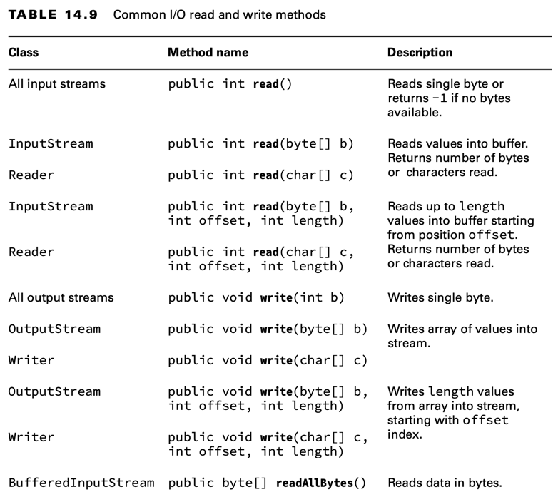
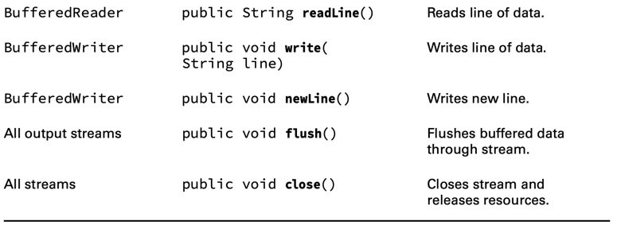


### 14.5 Serializing Data

**Serialization** is the process of converting an in-memory object to a byte stream. 
Likewise, **deserialization** is the process of converting from a byte stream into an object.
Serialization often involves writing an object to a stored or transmittable format, while deserialization is the reciprocal process.

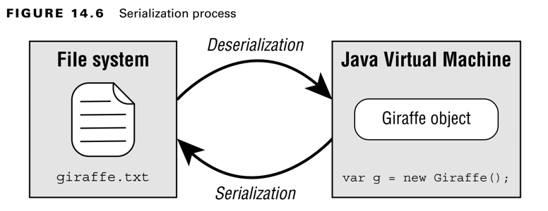

- To serialize an object using the I/O API, the object must implement the `java.io.Serializable` interface. 
- The `Serializable` interface is a marker interface, which means it does not have any methods. 
- Any class can implement the `Serializable` interface since there are no required methods to implement.
- since `Serializable` is not part of the `java.lang` package, it must be imported or referenced with the package name.
- Any field that is marked `transient` will not be saved to an I/O stream when the class is serialized.
- Data marked **transient** on deserialization is reverting to its default Java values, such as `0.0` for `double`, or `null` for an object.
- A `record` follows the same rules as other types of classes with respect to whether it can be serialized

#### Ensuring That a Class Is Serializable
Any process attempting to serialize an object will throw a `NotSerializableException` if the class does not implement the `Serializable` interface properly.

How to Make a Class Serializable?
- The class must be marked `Serializable`.
- Every instance member of the class must be serializable, marked `transient`, or have a `null` value at the time of serialization.


#### Storing Data with ObjectOutputStream and ObjectInputStream
The `ObjectInputStream` class is used to deserialize an object, while the `ObjectOutputStream` is used to serialize an object.
```java
// ObjectInputStream
public Object readObject() throws IOException, ClassNotFoundException
// ObjectOutputStream
public void writeObject(Object obj) throws IOException
```
```java
// method that serializes a List of Gorilla objects to a file
void saveToFile(List<Gorilla> gorillas, File dataFile) throws IOException {
  try (var out = new ObjectOutputStream(
          new BufferedOutputStream(
                  new FileOutputStream(dataFile)))) {
    for (Gorilla gorilla : gorillas)
      out.writeObject(gorilla);
  }
}

// method that deserialize data which is stored in a file
List<Gorilla> readFromFile(File dataFile) throws IOException, ClassNotFoundException {
  var gorillas = new ArrayList<Gorilla>();
  try (var in = new ObjectInputStream(
          new BufferedInputStream(
                  new FileInputStream(dataFile)))) {
    while (true) {
      var object = in.readObject();
      if (object instanceof Gorilla g)
        gorillas.add(g);
    }
  } catch (EOFException e) {
    // File end reached
    // throws an EOFException when the end of the I/O stream is reached.
  }
  return gorillas;
}
```

#### Understanding the Deserialization Creation Process
For the exam, you need to understand how a deserialized object is created. 
- When you deserialize an object, the constructor of the serialized class, along with any instance initializers, is not called when the object is created.
- Java will call the no-arg constructor of the first non-serializable parent class it can find in the class hierarchy
- Any static or transient fields are ignored
- Values that are not provided will be given their default Java value, such as `null` for `String`, or `0` for `int` values
- constructor and any instance initializations defined in the serialized class are ignored during the deserialization process
- Java only calls the constructor of the first non-serializable parent class in the class hierarchy


### 14.6 Interacting with Users
- Java includes two `PrintStream` instances for providing information to the user: `System.out` and `System.err`.
- The `System.in` returns an `InputStream` and is used to retrieve text input from the user. 
  It is commonly wrapped with a `BufferedReader` via an `InputStreamReader` to use the `readLine()` method.
- Because these are static objects, the `System` streams are shared by the entire application
- They can be used in a `try-with-resources` statement or by calling `close()`, although closing them is not recommended

```java
var reader = new BufferedReader(new InputStreamReader(System.in));
String userInput = reader.readLine();
System.out.println("You entered: " + userInput);
```

```java
// It prints nothing. The methods of PrintStream do not throw any checked
// exceptions and rely on the checkError() to report errors, so they fail silently
try (var out = System.out) {}
System.out.println("Hello"); 

// It prints nothing. Even if it did throw an exception, 
// we’d have a hard time seeing it since our I/O stream for reporting errors is closed
try (var err = System.err) {}
System.err.println("Hello");

// It prints an exception at runtime
var reader = new BufferedReader(new InputStreamReader(System.in));
try (reader) {}
String data = reader.readLine(); // IOException
```

#### Acquiring Input with `Console`
- The `java.io.Console` class is specifically designed to handle user interactions
- The `Console` class is a singleton because it is accessible only from a factory method and only one instance of it is created by the JVM
- The `Console` class includes access to two streams for reading and writing data.

```java
Console c = new Console(); // DOES NOT COMPILE
Console console = System.console(); // OK

public Reader reader()
public PrintWriter writer()

// PrintStream
public PrintStream format(String format, Object... args)
public PrintStream format(Locale loc, String format, Object... args)
// PrintWriter
public PrintWriter format(String format, Object... args)
public PrintWriter format(Locale loc, String format, Object... args)
```

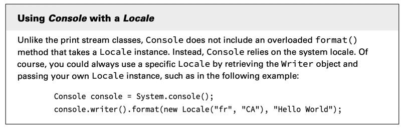

The Console class includes four methods for retrieving regular text data from the user.
```java
public String readLine()
public String readLine(String fmt, Object... args)
public char[] readPassword()
public char[] readPassword(String fmt, Object... args)
```

The `readPassword()` methods are similar to the `readLine()` method, with two important differences:
- The text the user types is not echoed back and displayed on the screen as they are typing.
- The data is returned as a `char[]` instead of a String.
- The first feature improves security by not showing the password on the screen if someone happens to be sitting next to you. 
- The second feature involves preventing passwords from entering the String pool.


### 14.7 Working with Advanced APIs

#### Manipulating Input Streams

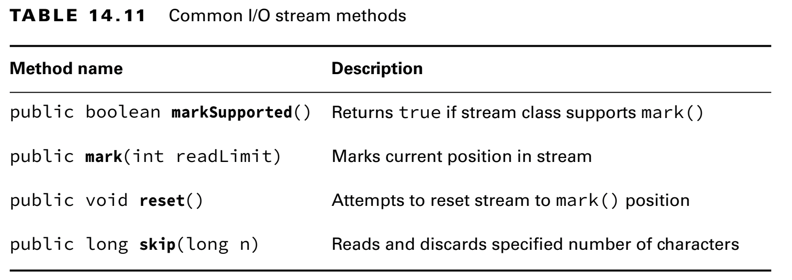

- The `mark()` and `reset()` methods return an I/O stream to an earlier position. 
- Before calling either of these methods, you should call the `markSupported()` method, which returns true only if `mark()` is supported. 
- The `skip()` method is pretty simple; it basically reads data from the I/O stream and discards the contents. The return parameter tells us how many values were skipped
- The `int readLimit` instructs the I/O stream that we expect to call `reset()` after at most `int` bytes.

#### Discovering File Attributes
- While the `File` object can’t tell you if a reference is a symbolic link, the `isSymbolicLink()` method on `Files` can.
- It is possible for `isDirectory()` or `isRegularFile()` to return true for a symbolic link, as long as the link resolves to a directory or regular file, respectively.

```java
System.out.print(Files.isDirectory(Paths.get("/canine/fur.jpg")));
System.out.print(Files.isSymbolicLink(Paths.get("/canine/coyote")));
System.out.print(Files.isRegularFile(Paths.get("/canine/types.txt")));
```
- The first example prints `true` if `fur.jpg` is a directory or a symbolic link to a directory and false otherwise. 
- The second example prints `true` if `/canine/coyote` is a symbolic link, regardless of whether the file or directory it points to exists. 
- The third example prints `true` if `types.txt` points to a regular file or a symbolic link that points to a regular file.

In many file systems, it is possible to set a `boolean` attribute to a file that marks it hidden, readable, or executable. 
The ``Files`` class includes methods that expose this information: `isHidden()`, `isReadable()`, `isWriteable()`, and `isExecutable()`.
With the exception of the `isHidden()` method, these methods do not declare any checked exceptions and return `false` if the file does not exist.
```java
System.out.print(Files.isHidden(Paths.get("/walrus.txt")));
System.out.print(Files.isReadable(Paths.get("/seal/baby.png")));
System.out.print(Files.isWritable(Paths.get("dolphin.txt")));
System.out.print(Files.isExecutable(Paths.get("whale.png")));
```
- First: prints `true` if the `walrus.txt` file exists and is hidden within the file system. 
- Second: prints `true` if the `baby.png` file exists and its contents are readable. 
- Third: prints `true` if the `dolphin.txt` file can be modified.
- Fourth: prints `true` if the file can be executed within the operating system.

NIO.2 allows you to construct views for various file systems with a single method call. A `view` is a group of related attributes for a particular file system type.
It includes two methods: a read-only attributes method and an updatable view method. 
For each method, you need to provide a file system type object, which tells the NIO.2 method which type of view you are requesting.
By updatable view, we mean that we can both read and write attributes with the same object.

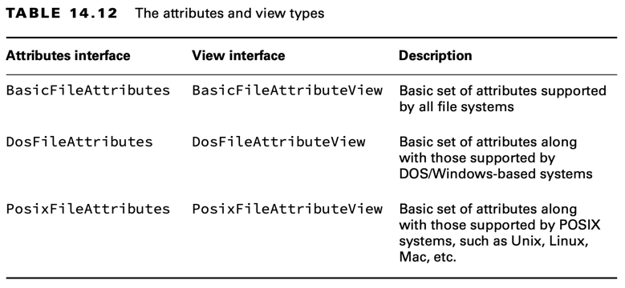

#### Traversing a Directory Tree
Traversing a directory, also referred to as walking a directory tree, is the process by which you start with a parent directory 
and iterate over all of its descendants until some condition is met or there are no more elements over which to iterate.

Two common strategies are associated with walking a directory tree:
1) `depth-first search` traverses the structure from the root to an arbitrary leaf and then navigates back up toward the root, traversing fully any paths it skipped along the way. 
The search depth is the distance from the root to current node. To prevent endless searching, 
Java includes a search depth that is used to limit how many levels (or hops) from the root the search is allowed to go.
2) `breadth-first search` starts at the root and processes all elements of each particular depth before proceeding to the next depth level. 
The results are ordered by depth, with all nodes at depth 1 read before all nodes at depth 2, and so on. 
While a breadth-first search tends to be balanced and predictable, it also requires more memory since a list of visited nodes must be maintained.

For the exam, you don’t have to understand the details of each search strategy that Java employs; 
you just need to be aware that the NIO.2 Stream API methods use depth-first searching with a depth limit, which can be optionally changed.

```java
public static Stream<Path> walk(Path start,
 FileVisitOption... options) throws IOException
public static Stream<Path> walk(Path start, int maxDepth,
 FileVisitOption... options) throws IOException
```
The first `walk()` method relies on a default maximum depth of `Integer.MAX_VALUE`, while the overloaded version allows the user to set a maximum depth.

Many of our earlier NIO.2 methods traverse symbolic links by default, with a `NOFOLLOW_LINKS` used to disable this behavior. 
The `walk()` method is different in that it does not follow symbolic links by default and requires the `FOLLOW_LINKS` option to be enabled.
Be aware that when the `FOLLOW_LINKS` option is used, the `walk()` method will track all of the paths it has visited, throwing a `FileSystemLoopException` if a path is visited twice.
```java
var s = Files.walk(source, FileVisitOption.FOLLOW_LINKS)
```

#### Searching a Directory
- The `find()` method behaves in a similar manner as the `walk()` method, except that it takes a BiPredicate to filter the data. 
- It requires a depth limit to be set. 
- Like `walk()`, `find()` also supports the `FOLLOW_LINK` option

```java
public static Stream<Path> find(Path start,
   int maxDepth,
   BiPredicate<Path, BasicFileAttributes> matcher,
   FileVisitOption... options) throws IOException
```

### 14.8 Review of Key APIs

You need to know this table really well before taking the exam:
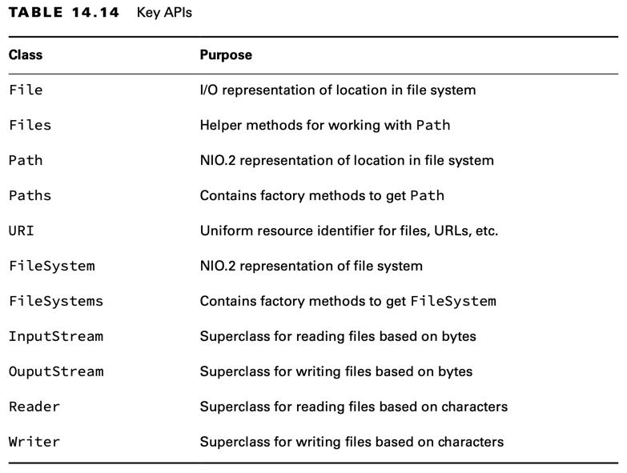

Additionally, Figure 14.8 shows all of the I/O stream classes that you should be familiar with for the exam, with the exception of the filter streams. 
`FilterInputStream` and `FilterOutputStream` are high-level superclasses that filter or transform data. They are rarely used directly.

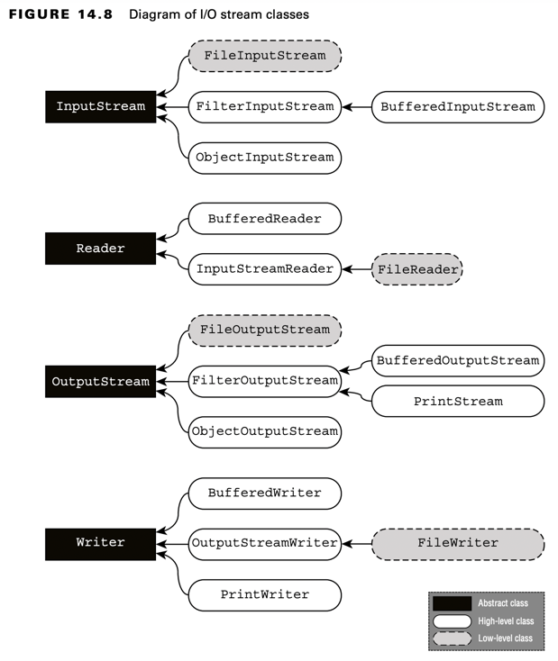

## 15 JDBC

### 15.1 Introducing Relational Databases and SQL
There are two main ways to access a relational database from Java:
- Java Database Connectivity (JDBC): Accesses data as rows and columns. JDBC is the API covered in this chapter.
- Java Persistence API (JPA): Accesses data through Java objects using a concept called object-relational mapping (ORM). 
The idea is that you don’t have to write as much  code, and you get your data in Java objects. JPA is not on the exam, and therefore it is not covered in this chapter.

- SQL keywords are case insensitive (This means `select`, `SELECT`, and `Select` are all equivalent)

### 15.2 Introducing the Interfaces of JDBC
For the exam, you need to know five key interfaces of JDBC. The interfaces are declared in the JDK. The concrete classes come from the JDBC driver.
This driver JAR contains an implementation of these key interfaces along with a number of other interfaces.
If you are experienced, remember that the exam uses the `DriverManager` class instead of the `DataSource` interface.

All database interfaces are in the package `java.sql`. When working with SQL, you need the `java.sql` module and `import java.sql.*`.
If you do want to use JDBC code with modules, remember to update your module-info file to include the following: `requires java.sql;`

What do these five interfaces do? On a very high level, we have the following:
- **Driver**: Establishes a connection to the database
- **Connection**: Sends commands to a database
- **PreparedStatement**: Executes a SQL query
- **CallableStatement**: Executes commands stored in the database
- **ResultSet**: Reads the results of a query

### 15.3 Connecting to a Database

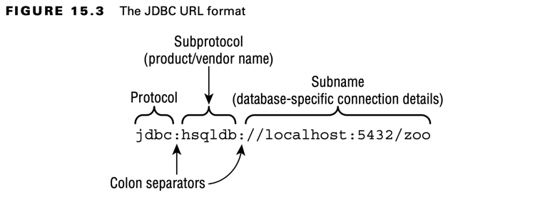

- There are two main ways to get a `Connection`: `DriverManager` and `DataSource`.
- The `DriverManager` class is in the JDK, as it is an API that comes with Java.
- `DriverManager` uses the factory pattern, which means that you call a static method to get a `Connection` rather than calling a constructor.
```java
try (Connection conn = DriverManager.getConnection(
  "jdbc:postgresql://localhost:5432/ocp-book",
  "username",
  "Password20182")) {
    System.out.println(conn);
}
```

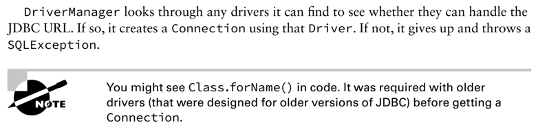

### 15.4 Working with PreparedStatement
In Java, you have choice of working with a `Statement`, `PreparedStatement` or `CallableStatement`. The latter two are subinterfaces of `Statement`.
A `Statement` and `PreparedStatement` are similar to each other, except that a `PreparedStatement` takes parameters, while a `Statement` does not.

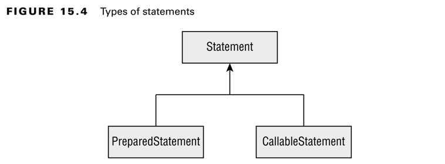

- To run SQL, you need to tell a `PreparedStatement` about it. Getting a `PreparedStatement` from a `Connection` is easy.
- An instance of a `PreparedStatement` represents a SQL statement that you want to run using the `Connection`.
- Passing a SQL statement when creating the object is mandatory

```java
try (var ps = conn.prepareStatement(
 "SELECT * FROM exhibits")) {
 // work with ps
}

// You might see a trick on the exam.
try (var ps = conn.prepareStatement()) { } // DOES NOT COMPILE
```

#### Modifying Data with executeUpdate()
SQL statements (`INSERT`, `UPDATE`, `DELETE`) for change the data in table typically use a method called `executeUpdate()`
The method takes the SQL statement to run as a parameter. It returns the number of rows that were inserted, deleted, or changed.

```java
10: var insertSql = "INSERT INTO exhibits VALUES(10, 'Deer', 3)";
15: try (var ps = conn.prepareStatement(insertSql)) {
16:   int result = ps.executeUpdate();
17:   System.out.println(result); // 1
18: }
```

SQL statement (`SELECT`) for reading data is calling with `executeQuery()`. Since we are running a query to get a result, the return type is `ResultSet`.

```java        
30: var sql = "SELECT * FROM exhibits";
31: try (var ps = conn.prepareStatement(sql);
32:   ResultSet rs = ps.executeQuery() ) {
34:   // work with rs
35: }
```

There’s a third method called `execute()` that can run either a query or an update. It returns a `boolean` so that we know whether there is a `ResultSet`.
If the `PreparedStatement` refers to sql that is a `SELECT`, the `boolean` is true, and we can get the `ResultSet`. If it is not a `SELECT`, we can get the number of rows updated.
```java
boolean isResultSet = ps.execute();
if (isResultSet) {
  try (ResultSet rs = ps.getResultSet()) {
    System.out.println("ran a query");
  }
} else {
  int result = ps.getUpdateCount();
  System.out.println("ran an update");
}
```

What do you think happens if we use the wrong method for a SQL statement? Let’s take a look:
```java
String sql = "SELECT * FROM names";
try (var ps = conn.prepareStatement(sql)) {
  var result = ps.executeUpdate();
}
```

This throws a `SQLException` similar to the following:
```java
Exception in thread "main" java.sql.SQLException:
statement does not generate a row count
```
We can’t get a compiler error since the SQL is a `String`. We can get an exception, though, and we do.
We also get a `SQLException` when using `executeQuery()` with SQL that changes the database.
Again, we get an exception because the driver can’t translate the query into the expected return type.
```java
Exception in thread "main" java.sql.SQLException:
statement does not generate a result set
```

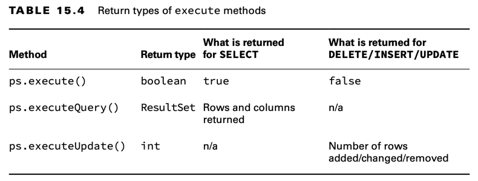

#### Working with Parameters
`PreparedStatement` allows us to set parameters. Instead of specifying the values in the SQL, we can use a question mark (`?`).
A bind variable is a placeholder that lets you specify the actual values at runtime. 
A bind variable is like a parameter, and you will see bind variables referenced as both variables and parameters.
Bind variables make the SQL easier to read since you no longer need to use quotes around String values in the SQL.
You can think of the bind variables as a list of parameters, where each is set in turn. Notice how the variables can be set in any order.
Notice also how the bind variables are counted starting from 1 rather than 0. This is really important!
```java
14: public static void register(Connection conn, int key,
15: int type, String name) throws SQLException {
16:
17: String sql = "INSERT INTO names VALUES(?, ?, ?)";
18:
19: try (PreparedStatement ps = conn.prepareStatement(sql)) {
20:   ps.setInt(1, key);
21:   ps.setInt(3, name);
22:   ps.setInt(2, type);
23:   ps.excuteUpdate();
24:  }
25:}
```

In the previous example, we set the parameters out of order. That's perfectly fine. The rule is only that they are each set before the query is executed.
Look at the example below. The code compiles and get you a `SQLException` The message may be vary based on your db driver.

```java
var sql = "INSERT INTO names VALUES (?, ?, ?)";
try (var ps = connection.prepareStatement(sql)) {
  ps.setInt(1, key);
  ps.setInt(2, type);
  // missing the set for parameter number 3
  ps.executeUpdate();
}
```

```java
Exception in thread "main" java.sql.SQLException: Parameter not set
```

What about if youtry to set more values than you have as bind variables?
Again, you get a `SQLException`, this time with a different message.
```java
var sql = "INSERT INTO names VALUES (?, ?, ?)";
try (var ps = connection.prepareStatement(sql)) {
  ps.setInt(1, key);
  ps.setInt(2, type);
  ps.setString(3, name);
  ps.executeUpdate();
}
```

```java
Exception in thread "main" java.sql.SQLException:
row column count mismatch in statement.
```

Table 15.5 shows the methods you need to know for the exam to set bind variables. 
The ones that you need to know for the exam are easy to remember since they are called set followed by the name of the type you are setting.

- the first column shows the method name
- the second column shows the type that Java uses. 
- the third column shows the type name that could be in the database. 

There is some variation by databases, so check your specific database documentation. You need to know only the first two columns for the exam.

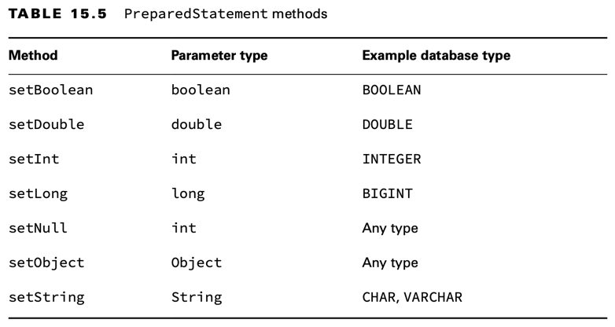

The `setNull()` method takes an int parameter representing the column type in the database. You do not need to know these types. 
Notice that the `setObject()` method works with any Java type. If you pass a primitive, it will be autoboxed into a wrapper type

```java
String sql = "INSERT INTO names VALUES(?, ?, ?)";
try (PreparedStatement ps = conn.prepareStatement(sql)) {
  ps.setObject(1, key);
  ps.setObject(2, type);
  ps.setObject(3, name);
  ps.executeUpdate();
}
```

#### Updating Multiple Records

```java
var sql = "INSERT INTO names VALUES(?, ?, ?)";
try (var ps = conn.prepareStatement(sql)) {
  ps.setInt(1, 20);
  ps.setInt(2, 1);
  ps.setString(3, "Ester");
  ps.executeUpdate();
  ps.setInt(1, 21);
  ps.setString(3, "Elias");
  ps.executeUpdate();
}
```
Note that we set all three parameters when adding Ester but only two for Elias. 
The `PreparedStatement` is smart enough to remember the parameters that were already set and retain them. You only have to set the ones that are different.

### 15.5 Getting Data from a ResultSet

#### Reading a ResultSet
When working with a ResultSet, most of the time, you will write a loop to look at each row.
A `ResultSet` has a cursor, which points to the current location in the data. Figure 15.5 shows the position as we loop through

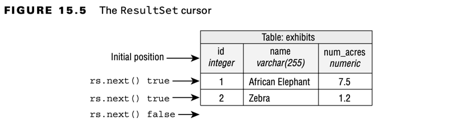

```java
20: String sql = "SELECT id, name FROM exhibits";
21: var idToNameMap = new HashMap<Integer, String>();
22:
23: try (var ps = conn.prepareStatement(sql);
24:   ResultSet rs = ps.executeQuery()) {
25:
26:   while (rs.next()) {
27:     int id = rs.getInt("id");
28:     String name = rs.getString("name");
29:     idToNameMap.put(id, name);
30:   }
31:   System.out.println(idToNameMap);
32: }
```

At line 24, the cursor starts by pointing to the location before the first row in the `ResultSet`. 
On the first loop iteration, `rs.next()` returns true, and the cursor moves to point to the first row of data. 
On the second loop iteration, `rs.next()` returns true again, and the cursor moves to point to the second row of data. The next call to `rs.next()` returns false. 
The cursor advances past the end of the data. The false signifies that there is no more data available to get.

There is another way to access the columns. You can use an index, counting from 1 instead of a column name.
Now you can see the column positions. Notice how the columns are counted starting with 1 rather than 0.
Just like with a `PreparedStatement`, JDBC starts counting at 1 in a ResultSet.

```java
int id = rs.getInt(1);
String name = rs.getString(2);
```

When you want only one row, you use an `if` statement rather than a `while` loop.
It's important to check that `rs.next()` returns `true` before trying to call a getter on the `ResultSet`. If a query didn't 
return any rows, it would throw a `SQLException`, so the `if` statement checks that it is safe to call. Alternatively, you can use column name.

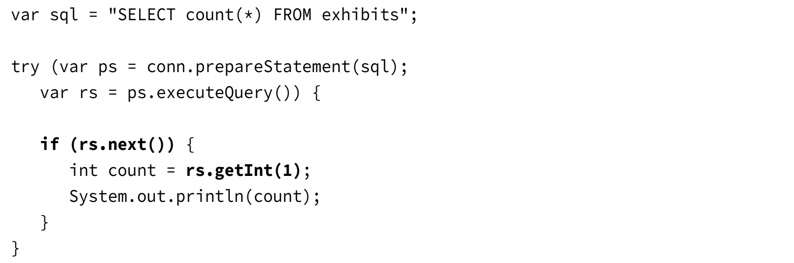

You need to be able to recognize such code. Here are a few examples to watch out for.

Let's try now read a column that does not exist.

   
This code throws a SQLException with a message like this: `Exception in thread "main" java.sql.SQLException: Column not found: total`.
Attempting to access a column name or index that does not exist throws a `SQLException`, as does getting data from a ResultSet when it isn’t pointing at a valid row.

Do you see what is wrong when no rows match?
```java
var sql = "SELECT * FROM exhibits where name='Not in table'";
try (var ps = conn.prepareStatement(sql);
 var rs = ps.executeQuery()) {
 rs.next();
 rs.getInt(1); // SQLException
}
```
`Calling rs.next()` works. It returns `false`. However, calling a getter afterward throws a `SQLException` because the result set cursor does not point to a valid position.
If a match were returned, this code would have worked.

Do you see what is wrong with the following?
```java
var sql = "SELECT count(*) FROM exhibits";
try (var ps = conn.prepareStatement(sql);
 var rs = ps.executeQuery()) {
 rs.getInt(1); // SQLException
}
```
Not calling `rs.next()` at all is a problem. The result set cursor is still pointing to a location before the first row, so the getter has nothing to point to.

To sum up this section, it is important to remember the following:
■ Always use an if statement or while loop when calling `rs.next()`.
■ Column indexes begin with 1.

#### Getting Data for a Column


### 15.6 Calling a CallableStatement
A stored procedure is code that is compiled in advance and stored in the database.

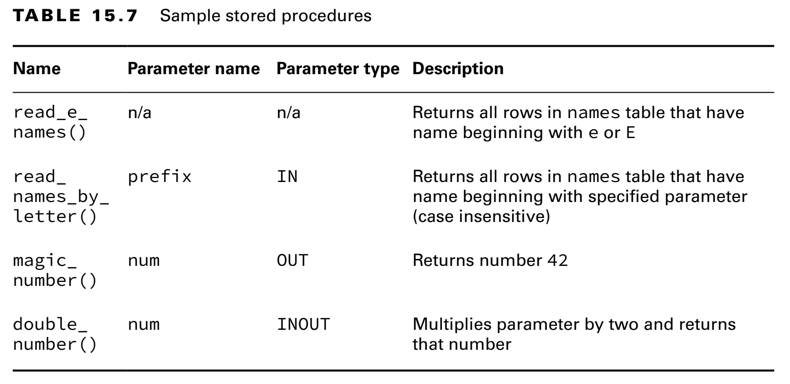

#### Calling a procedure without Parameters
Our `read_e_names()` stored procedure doesn't take any parameters. It does return a `ResultSet`.

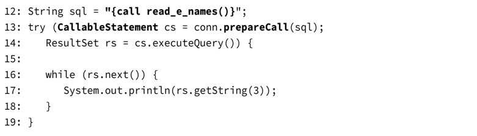

Line 12 introduces a new bit of syntax. A stored procedure is called by putting the word call and the procedure name in braces (`{}`). 
Line 13 creates a `CallableStatement` object. When we created a `PreparedStatement`, we used the `prepareStatement()` method. Here, we use the `prepareCall()` method instead.

#### Passing an IN Parameter
The `read_names_by_letter()` stored procedure takes a parameter for the prefix or first letter of the stored procedure. An `IN` parameter is used for input.

```java
25: var sql = "{call read_names_by_letter(?)}";
26: try (var cs = conn.prepareCall(sql)) {
27:   cs.setString("prefix", "Z");
28:
29:   try (var rs = cs.executeQuery()) {
30:     while (rs.next()) {
31:       System.out.println(rs.getString(3));
32:     }
33:   }
34: }
```
On line 25, we have to pass a `?` to show we have a parameter. This should be familiar from bind variables with a `PreparedStatement`.
On line 27, we set the value of that parameter. Unlike with `PreparedStatement`, we can use either the parameter number (starting with 1) or the parameter name. 
That means these two statements are equivalent:

```java
cs.setString(1, "Z");
cs.setString("prefix", "Z");
```

#### Returning an OUT Parameter
Stored procedures can have `OUT` parameters for output. The `magic_number()` stored procedure sets its `OUT` parameter to 42.
```java
40: var sql = "{?= call magic_number(?) }";
41:   try (var cs = conn.prepareCall(sql)) {
42:     cs.registerOutParameter(1, Types.INTEGER);
43:     cs.execute();
44:   System.out.println(cs.getInt("num"));
45: }
```

On line 40, we include two special characters (`?=`) to specify that the stored procedure has an output value. 
This is optional since we have the `OUT` parameter, but it does aid in readability. On line 42, we register the `OUT` parameter. 
This is important. It allows `JDBC` to retrieve the value on line 44. Remember to always call `registerOutParameter()` for each OUT or INOUT parameter (which we cover next).
On line 43, we call `execute()` instead of `executeQuery()` since we are not returning a `ResultSet` from our stored procedure

#### Working with an INOUT Parameter
It is possible to use the same parameter for both input and output.
```java
50: var sql = "{call double_number(?)}";
51:   try (var cs = conn.prepareCall(sql)) {
52:     cs.setInt(1, 8);
53:     cs.registerOutParameter(1, Types.INTEGER);
54:     cs.execute();
55:   System.out.println(cs.getInt("num"));
56: }
```
For an `IN` parameter, line 52 is required since it sets the value. For an `OUT` parameter, line 53 is required to register it. 
Line 54 uses `execute()` again because we are not returning a `ResultSet`.
Remember that an `INOUT` parameter acts as both an `IN` parameter and an `OUT` parameter, so it has all the requirements of both.

#### Comparing Callable Statement Parameters
Table 15.8 reviews the different types of parameters. You need to know this well for the exam.

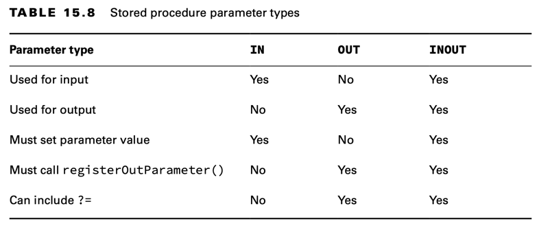

So far, we’ve been creating `PreparedStatement` and `CallableStatement` with the default options. Both support `ResultSet` type and concurrency options.

There are three `ResultSet` integer type values:
- `ResultSet.TYPE_FORWARD_ONLY`: Can go through the `ResultSet` only one row at a time
- `ResultSet.TYPE_SCROLL_INSENSITIVE`: Can go through the `ResultSet` in any order but will not see changes made to the underlying database table
- `ResultSet.TYPE_SCROLL_SENSITIVE`: Can go through the `ResultSet` in any order and will see changes made to the underlying database table

There are two `ResultSet` integer concurrency mode values:
- `ResultSet.CONCUR_READ_ONLY`: The `ResultSet` cannot be updated.
- `ResultSet.CONCUR_UPDATABLE`: The `ResultSet` can be updated.

These options are integer values, not enum values, which means you pass both as additional parameters after the SQL.
```java
conn.prepareCall(sql, ResultSet.TYPE_FORWARD_ONLY, ResultSet.CONCUR_READ_ONLY);
conn.prepareCall(sql, ResultSet.TYPE_SCROLL_INSENSITIVE, ResultSet.CONCUR_UPDATABLE);
```

### 15.7 Controlling Data with Transactions

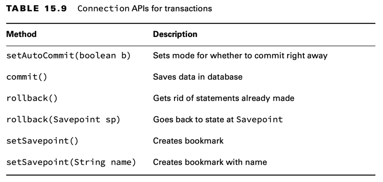
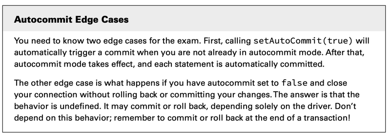

#### Bookmarking with Savepoints
You can use savepoints to have more control of the rollback point.

```java
20: conn.setAutoCommit(false);
21: Savepoint sp1 = conn.setSavepoint();
22: // database code
23: Savepoint sp2 = conn.setSavepoint("second savepoint");
24: // database code
25: conn.rollback(sp2);
26: // database code
27: conn.rollback(sp1);
```

Line 20 is important. You can only use savepoints when you are controlling the transaction. Lines 21 and 23 show how to create a `Savepoint`. 
The name is optional and typically included in the `toString()` if you print the savepoint reference.
Line 25 shows the first rollback. That gets rid of any changes made since that savepoint was created: in this case, the code on line 24. 
Then line 27 shows the second rollback getting rid of the code on line 22. Order matters. If we reversed lines 25 and 27, the code would throw an exception.
Rolling back to sp1 gets rid of any changes made after that, which includes the second savepoint! 
Similarly, calling `conn.rollback()` on line 25 would void both savepoints, and line 27 would again throw an exception.

### 15.8 Closing Database Resources
The resources need to be closed in a specific order. The `ResultSet` is closed first, followed by the `PreparedStatement` (or `CallableStatement`) and then the `Connection`.
While it is a good habit to close all three resources, it isn’t strictly necessary.
Closing a JDBC resource should close any resources that it created. In particular, the following are true:
- Closing a `Connection` also closes `PreparedStatement` (or `CallableStatement`) and `ResultSet`.
- Closing a `PreparedStatement` (or `CallableStatement`) also closes the `ResultSet`

It is important to close resources in the right order. This avoids both resource leaks and exceptions.

966

1021